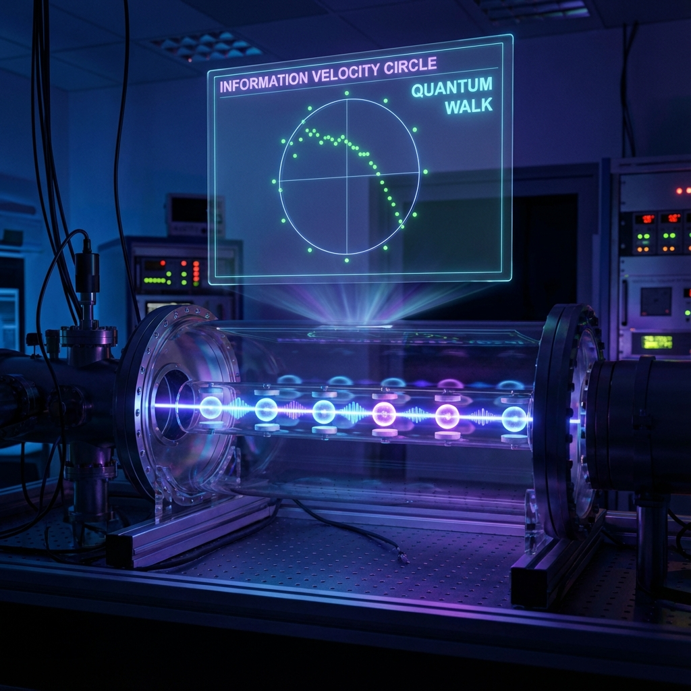

## 5.2 信息速度圆实验 (The Information-Velocity Circle Experiment)

> "我们无需建造只有上帝才能使用的显微镜。我们在实验室的桌面上，就能模拟出宇宙最底层的像素纹理。"

在上一节中，我们提出了一个惊世骇俗的理论预测：那个完美的、象征狭义相对论对称性的"信息速度圆"，在逼近普朗克尺度的极端条件下会发生 **"下垂" (Droop)**。这意味着相对论只是宏观的幻觉，离散才是宇宙的真相。

但这立刻引发了一个尖锐的问题：我们如何验证它？

普朗克长度是 $10^{-35}$ 米。要探测这个尺度的效应，我们需要一台比银河系还大的粒子加速器。在可预见的未来，人类绝无可能直接触碰时空的晶格。

然而，**《矢量宇宙论》** 提供了一条捷径。既然我们的理论基于 **量子元胞自动机 (QCA)** 的数学结构，那么我们只需要在实验室里构建一个人工的、宏观的 QCA 系统，就能在可控的尺度上重现宇宙的底层逻辑。

我们称之为——**信息速度圆实验**。

#### 模拟宇宙的乐高：量子行走 (Quantum Walk)

我们不需要真的去拆解时空，我们可以"运行"时空。

在现代量子光学和冷原子实验室中，物理学家已经掌握了一种名为 **量子行走 (Quantum Walk)** 的技术。这不仅是一个数学玩具，它是 Dirac 方程在离散晶格上的精确模拟器。

想象一个光子或一个离子（"行走者"），在一条由激光势阱构成的一维链条上跳跃。

* **晶格 (Lattice)**：激光势阱的间隔扮演了"普朗克长度 $a$"的角色。虽然它可能有几微米长，但在数学上，它就是这个微缩宇宙的最小像素。

* **硬币 (Coin)**：粒子的内部自旋状态（如 $|\uparrow\rangle, |\downarrow\rangle$）扮演了"内部扇区"的角色。

* **每一步 (Step)**：激光脉冲的操作扮演了"普朗克时间 $\Delta t$"的角色。

在这个人造宇宙中，我们就是上帝。我们可以随意调整"光速"（晶格更新率），也可以随意赋予粒子"质量"（通过旋转内部硬币态）。

#### 实验方案：重绘毕达哥拉斯的圆

实验的目标非常明确：测量这个微缩宇宙中的 **外部速度 ($v_{ext}$)** 和 **内部速度 ($v_{int}$)**，看看它们是否满足 $v_{ext}^2 + v_{int}^2 = c_{FS}^2$。

1.  **测量 $v_{ext}$（群速度）**：

    我们在晶格上制备一个具有特定准动量 $k$ 的波包，让它自由演化。通过追踪波包中心随时间的位移 $\langle x \rangle_t$，我们可以直接测出它的漂移速度。这对应于粒子的宏观飞行速度。

2.  **测量 $v_{int}$（内部进动率）**：

    这是一项更精妙的操作。我们需要测量粒子内部"时钟"走得有多快。在量子行走中，这对应于硬币状态（自旋）在参数空间中的旋转速度。通过 Ramsey 干涉技术或 Rabi 振荡测量，我们可以提取出这个内部频率。这对应于粒子的静止能量或质量项。

我们将针对不同的动量 $k$（从接近 0 的长波到接近 $\pi/a$ 的短波）重复上述测量，并将每一组数据点 $(v_{ext}, v_{int})$ 绘制在坐标纸上。

#### 见证"下垂"：来自像素的阻力

结果会是什么？

* **在低动量区 ($k \approx 0$)**：

    数据点将完美地落在半径为 $1$（归一化单位）的圆周上。

    $$v_{ext}^2 + v_{int}^2 \approx 1$$

    这模拟了我们现实世界中的情况：粒子波长远大于晶格间距，洛伦兹对称性完美涌现，相对论成立。

* **在高动量区 ($k \to \pi/2$)**：

    随着动量增加，波包开始"感知"到脚下的晶格不再是光滑的平地，而是断续的台阶。数据点将开始 **脱离圆周，向圆心塌陷**。

    $$v_{ext}^2 + v_{int}^2 < 1$$

    在实验图表上，这表现为一条明显向内弯曲的弧线，这就是我们预测的 **"晶格下垂" (Lattice Droop)**。

#### 实验的哲学意义

这不仅仅是一次对公式的验证，这是人类第一次直观地看到 **"离散性"如何破坏"对称性"**。

图表上的那个缺口（Deviation），就是宇宙底层的 **像素纹理**。

* 它告诉我们：相对论那个完美的圆，只是因为我们站得太远看不清细节而产生的视错觉。

* 它证明了：在一个受限于有限信息预算 ($c_{FS}$) 的宇宙中，当你试图以极高的频率（高 $k$）去更新信息时，晶格本身的几何结构会成为一种阻力，消耗掉一部分原本应用于守恒的预算。

这个实验是 **《矢量宇宙论》** 的决定性证据。它向我们展示了，如果我们能造出一台足够强大的显微镜去观察真空，我们将不再看到爱因斯坦那光滑的时空弯曲，我们将看到量子元胞自动机那裸露的、锯齿状的数字骨架。

而现在，通过量子行走，我们已经实际上看到了这具骨架的影子。

