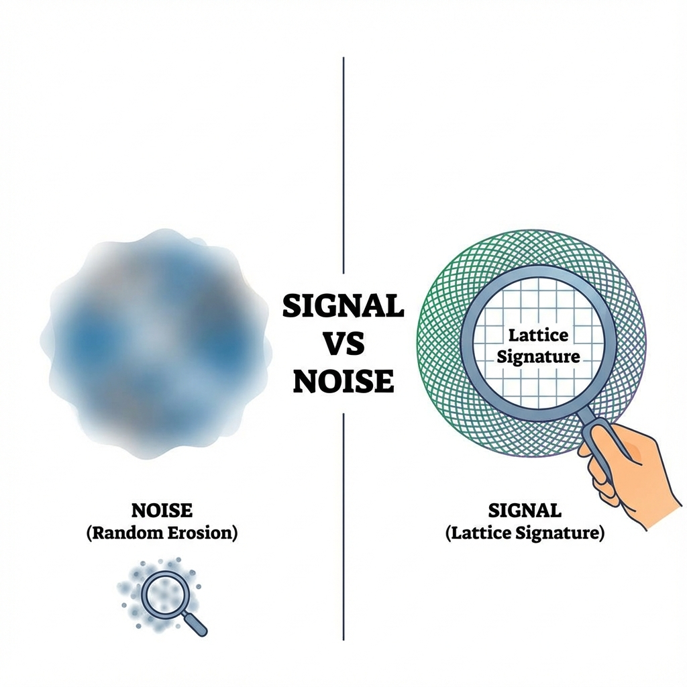

## 5.3 区分真实与噪音 (Distinguishing Reality from Noise)

> "真理往往被噪音掩盖，但几何学拥有穿透迷雾的眼睛。我们必须学会区分：哪一部分是宇宙的骨架，哪一部分仅仅是镜头上的灰尘。"

在上一节中，我们描绘了一个激动人心的前景：通过量子行走实验，我们可以观测到相对论圆周在微观极限下的"下垂"，从而直视时空的离散本质。然而，任何一位严谨的实验物理学家此时都会提出一个尖锐的问题：

**"你看到的'下垂'，真的源于时空的晶格结构吗？还是仅仅因为你的仪器不够完美？"**

这个问题直指核心。在现实世界中，没有任何系统是完美的封闭系统。实验室里充满了热涨落、激光的不稳定性以及量子退相干。这些因素都会导致系统丢失信息。

我们在第一卷中建立的毕达哥拉斯恒等式，在真实环境中必须包含那个被遗忘的第三项——**环境扇区 ($v_{env}$)**：

$$v_{ext}^2 + v_{int}^2 = c_{FS}^2 - v_{env}^2$$

即使时空是完美的连续体（没有晶格下垂），只要存在环境噪音 ($v_{env} > 0$)，等式左边的值也会小于 $c_{FS}^2$。也就是说，**噪音也会导致数据点落入圆内**。

如果噪音和晶格效应都会导致"圆的缩小"，我们如何区分哪一个是宇宙的真理，哪一个是实验的误差？

#### 几何指纹：确定性 vs. 随机性

幸运的是，在 **《矢量宇宙论》** 的框架下，这两者有着截然不同的 **"几何指纹"**。

1.  **噪音的指纹：均匀的侵蚀**

    环境噪音（如去极化通道）通常是一种统计性的随机过程。它像是一种无处不在的摩擦力，无差别地吞噬系统的相干性。

    在实验图表中，噪音导致的圆周缩小通常与 **动量 ($k$)** 的关系不大，或者呈现出一种均匀的、与时间步数成正比的衰减。它表现为圆半径的整体缩水，就像一个泄气的气球。

2.  **晶格的指纹：特定的形变**

    相比之下，晶格下垂（Lattice Droop）不是随机的，它是 **确定性的几何效应**。它源于色散关系 $\cos \omega = \cos k \cos M$ 的数学结构。

    这种效应具有极强的 **动量依赖性**：

    * 在低动量区（$k \approx 0$），晶格效应几乎为零，圆周保持完美。

    * 在高动量区（$k \to \pi/a$），晶格效应呈指数级急剧增强。

    这不仅仅是气球变小了，这是气球的 **形状发生了特定的扭曲**。

#### 真理的不等式

为了在充满噪音的现实中捕捉到这个微弱的信号，我们推导出了一个定量的判据。

让我们定义两个量：

* **$\Delta_{lat}(k)$**：由晶格结构导致的理论偏差（下垂量）。这完全取决于你的动量设置。

* **$\alpha p$**：由环境噪音导致的偏差。其中 $p$ 是每一步操作的出错概率，$\alpha$ 是系数。

在信息-速度圆的图表上，噪音划定了一个 **"禁区" (Forbidden Zone)**——即图中灰色的阴影区域。任何落在这个区域内的数据点，都无法与简单的仪器误差区分开来。

只有当晶格下垂的幅度 **远大于** 噪音水平时，我们才能确信我们看到了时空的骨架。这给出了实验成功的黄金不等式：

$$\Delta_{lat}(k, M) \gg \alpha p$$

这意味着，为了"看见"宇宙的像素，我们不需要无限消除噪音，我们只需要把实验推向 **高动量区间 ($k$)**。在那里，离散几何所导致的形变将变得如此剧烈，以至于没有任何随机噪音可以模仿它。

#### 区分"像素"与"灰尘"

这个判据有着深刻的哲学意义。

当我们通过显微镜观察世界时，我们会看到模糊的斑点。

* 如果这些斑点是随机跳动的，那是镜头上的 **灰尘**（环境噪音 $v_{env}$）。

* 如果这些斑点排列成整齐的网格，并且随着我们视角的改变呈现出规律性的摩尔纹，那是底片的 **像素**（晶格几何）。

**《矢量宇宙论》** 告诉我们，我们不必恐惧噪音。只要我们掌握了正确的几何语言（FS 度量），我们就能在嘈杂的实验数据中，提取出那条属于宇宙底层的、确定性的 **下垂曲线**。

那条曲线不是误差，那是 **离散时空的签名**。它证明了在那个极限尺度上，那个统治宏观世界的完美的圆，终于不得不向有限性的铁律低头。

至此，我们已经完成了对宇宙微观引擎的拆解。我们确认了它是离散的、有限的，并且是有迹可循的。

但是，这台由像素构成的机器，是如何编织出我们眼中那个五彩斑斓、充满万物的世界的？那些单纯的"比特"和"网格"，是如何组合成电子、夸克，甚至是你我的？

为了回答这个问题，我们需要进入下一卷。我们将离开底层的引擎室，来到上层的 **折纸车间**。在那里，我们将见证单一的 $v_{int}$ 矢量是如何通过复杂的 **递归折叠**，诞生出万物的。

