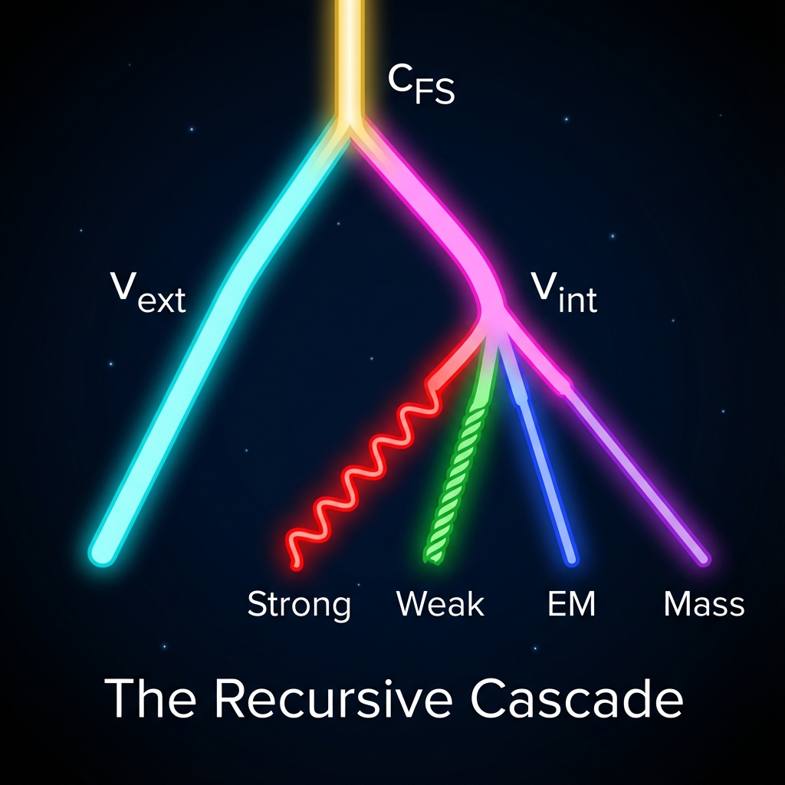

# 第6章 被卷曲的维度 (The Curled Dimensions)

我们在前两卷中确立了宇宙的宏观骨架（相对论）和微观引擎（QCA）。在那个图景中，物质似乎很简单——它只是那个恒定旋转的矢量在"内部扇区" ($v_{int}$) 上的一个投影。

但是，只要我们看一眼现实世界，就会发现这个描述过于简略。物质世界并非只有单一的"质量"，它充满了令人眼花缭乱的多样性：夸克、轻子、胶子、光子、W 玻色子……它们拥有电荷、色荷、自旋、同位旋等各种奇怪的量子数。

如果宇宙真的只有一个矢量，如果 $c_{FS}$ 真的只是唯一的预算，那么这万千繁华（The Ten Thousand Things）是从何而来的？

答案在于 **递归 (Recursion)**。

本章将揭示，$v_{int}$ 绝非终点，它只是一个通向更深层几何迷宫的入口。

## 6.1 递归的级联 (The Recursive Cascade)

> "道生一，一生二，二生三，三生万物。这不仅是哲学，这是宇宙底层的运算逻辑。"

在第一卷中，我们进行了 **第一次正交分解**：

$$c_{FS}^2 = v_{ext}^2 + v_{int}^2$$

这创造了时空与物质的二元对立。对于一个仅仅拥有质量的粒子来说，这或许就足够了。但在真实的物理学中，"内部"远比这复杂。

#### 内部不是标量，是流形

当我们说一个电子拥有 $v_{int}$ 时，我们不仅是在说它"有质量"。电子还携带电荷，还携带自旋。这意味着 $v_{int}$ 这一项，实际上并不是一个简单的标量数值，而是一个 **多维矢量** 的模长。

在射影希尔伯特空间的几何中，所谓的"内部扇区"实际上是一个极其丰富的高维流形（Manifold）。那个代表电子的矢量，并没有在这个流形中静止，而是在进行着复杂的复合旋转。

为了描述这种复杂性，我们必须引入 **第二次正交分解**，甚至第三次、第四次。

#### 级联的毕达哥拉斯定理

让我们把显微镜对准 $v_{int}$。我们发现，这个分量本身可以被进一步拆解为更精细的正交子空间。

根据标准模型（Standard Model）的对称性群 $SU(3) \times SU(2) \times U(1)$，我们可以将内部速度预算 $v_{int}$ 展开为以下 **级联恒等式 (Cascade Identity)**：

$$v_{int}^2 = v_{mass}^2 + v_{gauge}^2$$

$$v_{gauge}^2 = v_{strong}^2 + v_{weak}^2 + v_{em}^2$$

合并起来，我们得到了一个更加宏大的宇宙预算表：

$$c_{FS}^2 = v_{ext}^2 + \underbrace{v_{mass}^2 + v_{strong}^2 + v_{weak}^2 + v_{em}^2}_{\text{原本笼统的 } v_{int}^2} + v_{env}^2$$

这个公式揭示了物理学大统一的几何本质：

**所有的力（强力、弱力、电磁力），以及所有的物质属性（质量），本质上都是同一个矢量在不同内部维度上的投影分量。**

* **电磁力 ($v_{em}$)**：矢量在 $U(1)$ 子空间（圆）上的旋转速度。

* **弱相互作用 ($v_{weak}$)**：矢量在 $SU(2)$ 子空间（三维球）上的旋转速度。

* **强相互作用 ($v_{strong}$)**：矢量在 $SU(3)$ 子空间（八维流形）上的复杂缠绕速度。

#### 每一个粒子都是一种特定的分配方案

在这个框架下，"粒子"不再是基本的实体，而是一种 **特定的预算分配协议 (Budget Allocation Protocol)**。

* **电子 (Electron)**：它是一个将预算分配给 $v_{mass}$、$v_{em}$ 和 $v_{weak}$，但拒绝分配给 $v_{strong}$ 的矢量模式。

* **中微子 (Neutrino)**：它是一个极简主义者，几乎只在 $v_{weak}$ 上投入预算（仅参与弱相互作用），在 $v_{mass}$ 上投入极少，对其他一概不问。

* **光子 (Photon)**：它在内部的所有子扇区投入都为零（无质量、无电荷、无色荷），它把一切都献给了外部空间 $v_{ext}$。

#### 递归的终结？

这种分解可以无限进行下去吗？

在数学上，希尔伯特空间的维度是无限的，似乎允许无限的切分。但在物理上，正如我们在第二卷中所述，QCA 的离散结构强加了限制。这种递归分解必然在某个深度终止——那个深度就是 **最基本自由度** 的数量。

我们眼中的"万物"，就是这个终极矢量在这一系列级联的分岔路口上，做出的不同选择的总和。宇宙并没有创造一万种不同的砖块来构建世界，宇宙只是将同一块泥土（$c_{FS}$），折叠成了一万种不同的形状。

