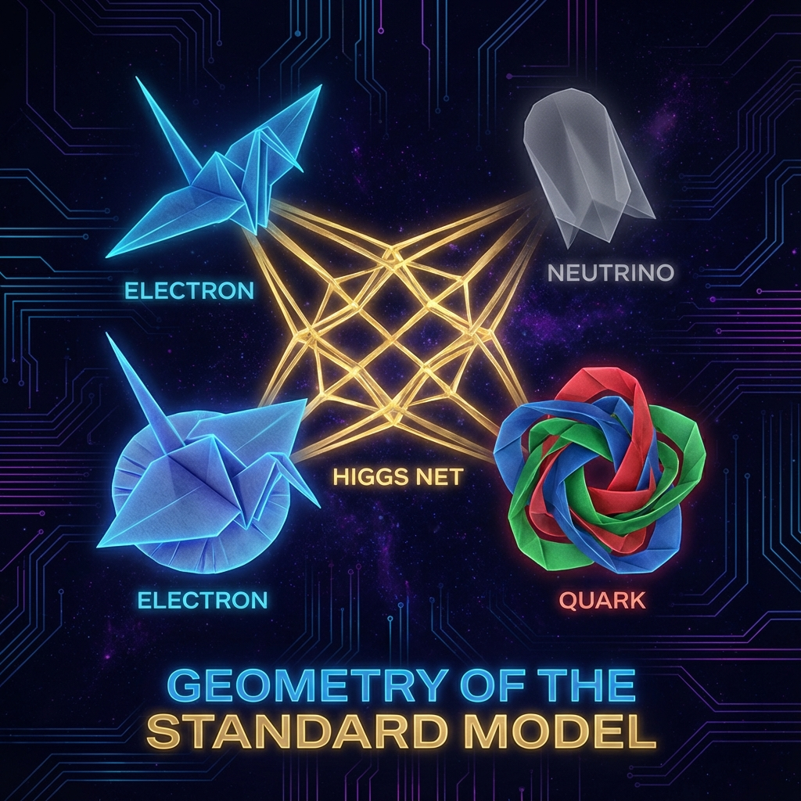

## 6.2 复杂的折纸 (The Complex Origami)

> "我们所谓的'粒子'，不过是高维几何在微观尺度上的打结方式。标准模型不是一张混乱的元素周期表，而是一本精密的折纸手册。"

在上一节中，我们揭示了 $v_{int}$（内部速度）并非一个单一的数值，而是一个通向更深层级联结构的入口。现在，我们将走进这个内部世界的核心，去探索现代物理学中最宏伟也最令人费解的理论——**标准模型 (Standard Model)**——在 **《矢量宇宙论》** 视角下的几何本质。

物理学家常常困惑于为什么宇宙需要这么多奇怪的量子数：电荷、自旋、同位旋、色荷、超荷……这些标签看起来像是人为贴上去的便利贴。但在我们的 FS 几何框架下，这些"标签"有了统一且直观的物理意义：它们是单一矢量在不同 **内部流形 (Internal Manifold)** 上的 **旋转模式**。

宇宙并没有发明"电荷"，宇宙只是将那个唯一的矢量，在某个特定的维度上折叠成了一个圆圈，并让矢量沿着它旋转。

#### 内部空间的拓扑结构

如果我们将宇宙的总矢量 $|\Psi\rangle$ 想象成一张平整的纸，那么 **正交分解** 就是在纸上画线。而 **标准模型**，则是将这张纸在微观尺度上进行了极其复杂的 **折叠 (Folding)**。

根据规范场论，标准模型的数学结构基于群 $SU(3) \times SU(2) \times U(1)$。这不仅仅是抽象的代数符号，它们对应着具体的几何形状：

* **$U(1)$**：一个圆圈（Circle）。

* **$SU(2)$**：一个三维超球体（3-Sphere）。

* **$SU(3)$**：一个八维的复杂流形。

当我们将 $c_{FS}$ 的预算投入到内部扇区 $v_{int}$ 时，这个速度矢量并不是在虚空中乱窜，它被限制在这些特定形状的轨道上运行。

#### 荷即速度 (Charge as Velocity)

在经典物理中，我们习惯把"电荷"看作某种涂在粒子表面的实体物质。但在 FS 几何中，**荷 (Charge)** 仅仅是 **角速度** 的别名。

让我们重写那个著名的诺特定理（Noether's Theorem）：每一个对称性对应一个守恒量。

* **在空间中的旋转对称性** $\rightarrow$ 对应 **角动量（自旋）**。

* **在内部空间中的旋转对称性** $\rightarrow$ 对应 **荷**。

1.  **电磁折纸 ($v_{em}$)**：

    想象矢量在内部的一个 $U(1)$ 圆圈上旋转。这个旋转的角速度，就是我们观测到的 **电荷 (Electric Charge)**。

    * 电子之所以带负电，是因为它的矢量在这个圆圈上逆时针旋转。

    * 正电子之所以带正电，是因为它在同一个圆圈上顺时针旋转。

    * 中子之所以不带电，是因为它的矢量在这个圆圈上的投影分量为零（$v_{em} = 0$）。

2.  **弱力折纸 ($v_{weak}$)**：

    这是一种更复杂的折叠。矢量在一个三维超球体 ($SU(2)$) 表面上旋转。这种旋转产生的"荷"被称为 **弱同位旋 (Weak Isospin)**。

    这一维度的特殊之处在于它具有 **手性 (Chirality)**——就像莫比乌斯带一样，只有"左手性"的粒子才能在这个折纸结构中顺畅运行。这就是为什么弱相互作用宇称不守恒的几何根源。

3.  **强力折纸 ($v_{strong}$)**：

    这是最复杂的折纸艺术。矢量在一个八维的流形 ($SU(3)$) 中缠绕。这里的旋转自由度如此之多，以至于我们需要三个坐标（红、绿、蓝）来描述它的位置。这就产生了 **色荷 (Color Charge)**。

    这里的 $v_{strong}$ 分量极其巨大，意味着矢量在这里消耗了极高比例的 $c_{FS}$ 预算。这就是为什么强相互作用比电磁力强得多的原因——它占据了更大的几何"带宽"。

#### 粒子的几何身份

至此，所谓的"粒子动物园"真相大白。宇宙中并没有几十种不同的基本粒子，宇宙中只有 **一种矢量** 和 **多种折叠方式**。

每一个粒子，本质上都是一份 **"预算分配协议"** 或 **"几何旋转组合"**：

* **电子 (Electron)** = 在 $v_{mass}$ 上投入少许 + 在 $v_{em}$ (圆圈) 上全速旋转 + 在 $v_{weak}$ (超球) 上全速旋转 + 在 $v_{strong}$ (八维流形) 上静止。

* **夸克 (Quark)** = 在 $v_{mass}$ 上投入适中 + 在 $v_{em}$ 上部分投入 (分数电荷) + 在 $v_{strong}$ 上全速旋转。

* **中微子 (Neutrino)** = 在 $v_{mass}$ 上投入极微 + 在 $v_{em}$ 和 $v_{strong}$ 上皆为零 + 仅在 $v_{weak}$ 上旋转。

这就是为什么中微子可以穿透地球——因为它在大部分内部几何维度上的投影都是零，它与普通物质（主要由 $v_{em}$ 和 $v_{strong}$ 构成）没有"几何交集"，就像两个在不同频道上广播的电台。

#### 希格斯场：折纸的胶水

如果标准模型是折纸，那么希格斯场是什么？

它是 **胶水**。

在极高能标下（宇宙大爆炸之初），所有的折纸结构都是展开的，对称性是完美的。所有粒子都是无质量的，矢量在这些维度上自由滑行。

然而，随着宇宙冷却，希格斯场发生了 **凝聚**。这种凝聚就像是胶水干透了，将某些几何结构强行粘合、固定了下来。

原本自由旋转的矢量，被迫在某些维度上"卡住"或"减速"，这种阻力迫使一部分 $c_{FS}$ 预算从 $v_{ext}$（光速飞行）转移到了内部维度的维持上。这种被希格斯胶水粘住而产生的"内部滞留"，正是 **静止质量 ($v_{mass}$)** 的起源。

#### 本章小结

通过将标准模型几何化，我们消除了物理学中的神秘主义。

并没有什么神奇的"电荷流体"，也没有带颜色的"夸克实体"。有的只是那个唯一的、永恒的 $c_{FS}$ 矢量，在那个被我们称为"内部空间"的高维流形迷宫中，进行着永不停歇的奔跑、旋转与缠绕。

如果你能看到那个微观的几何世界，你不会看到粒子。你会看到无数个细小的、振动的 **弦** 或 **环**，它们是那个大圆在微小维度上的投影。而我们，正是由这些复杂的"折纸"所编织而成的宏丽图案。

