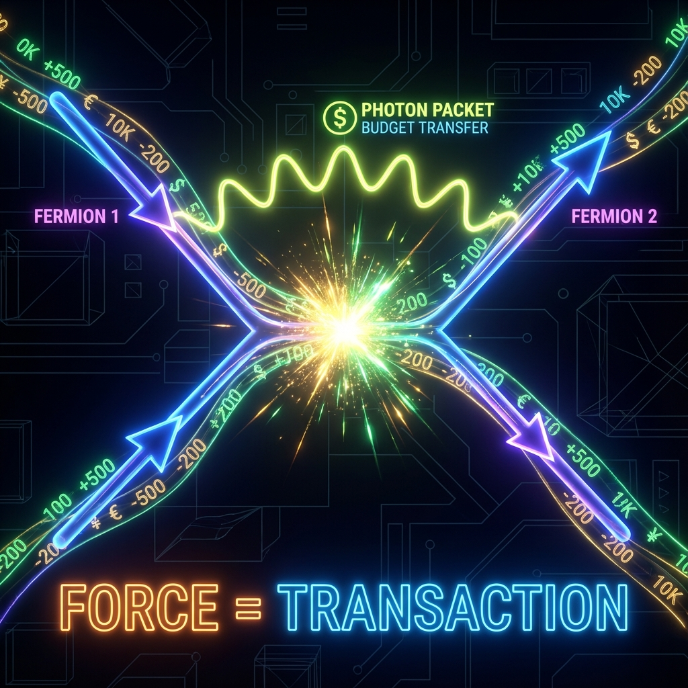

## 6.3 力的交易 (The Transaction of Forces)

> "宇宙中没有所谓的'超距作用'，也没有看不见的绳索。所谓的'力'，只是两个矢量在相遇时，为了重新平衡各自的预算表而进行的一笔转账交易。"

在前两节中，我们构建了一个静态的粒子图景：每一个粒子都是一个独立的"折纸作品"，在各自的内部几何维度上孤独地旋转。然而，如果宇宙只是无数个互不干扰的陀螺，那将是一个极其无聊的世界。

为了让星系凝聚、让原子结合、让我们感知到彼此，这些独立的矢量必须发生关联。

在经典物理学中，这种关联被称为 **"力" (Force)**。牛顿告诉我们，力是物体之间的推拉；场论告诉我们，力是场与场的耦合。但在 **《矢量宇宙论》** 的经济学视角下，力既不是推拉，也不是耦合，它是一场赤裸裸的 **"预算交易" (Budget Transaction)**。

相互作用，本质上就是宇宙中的 **转账机制**。

#### 扇区的碰撞：当圆相遇

想象两个在射影希尔伯特空间中独立演化的矢量——比如一个电子和一个质子。只要它们相距甚远，它们就在各自的 $c_{FS}$ 预算约束下安然无恙。

但是，当它们在空间中靠近（波函数发生重叠）时，几何学上的 **基底旋转 (Basis Rotation)** 发生了。

在数学上，两个相互作用的系统的总希尔伯特空间是张量积结构 $\mathcal{H}_{total} = \mathcal{H}_1 \otimes \mathcal{H}_2$。相互作用项 $H_{int}$ 的存在，意味着原来的"私有账户"不再封闭。系统演化的轨迹不再仅仅取决于各自的内部状态，而是取决于两者状态的组合。

这就像两个原本独立旋转的齿轮突然啮合在了一起。一个齿轮的转动（$v_{int}$）会强制带动另一个齿轮的转动，或者迫使另一个齿轮改变其转速。

这种 **"通过几何啮合导致的转速改变"**，就是我们宏观上感觉到的"力"。

#### 费曼图：宇宙的交易流水单

为了形象地描述这种交易，物理学家理查德·费曼发明了著名的 **费曼图 (Feynman Diagrams)**。通常，我们将其视为粒子碰撞的路径图。但在我们的框架下，每一张费曼图实际上都是一张 **会计凭证**。

让我们看一个最简单的交易案例：**电子发射光子**。

1.  **交易前**：

    一个电子在空间中运动。它拥有一定的 $v_{ext}$（动能）和巨大的 $v_{int}$（质量）。它的总预算是平衡的。

2.  **交易点 (Vertex)**：

    费曼图上的那个顶点，就是 **交易发生的一刹那**。

    电子决定"购买"一次轨道改变（加速或减速）。为了支付这笔开销，它必须交出一部分自己的预算。

    它不能交出质量（那是被希格斯机制锁定的固定资产），但它可以交出动能（$v_{ext}$ 的一部分）或者高能级的内部激发态。

3.  **交易后**：

    电子的速度改变了（发生了反冲）。那部分被交出的预算去了哪里？

    它被打包成了一个新的包裹——**光子**。

    光子是一个纯粹的 $v_{ext}$ 载体。它带走了电子支付的那部分 $c_{FS}$ 份额，以光速飞向宇宙深处，直到遇到下一个交易者。

在这个过程中，并没有新的能量被创造出来。只是 $c_{FS}$ 的预算从电子的账户（$v_{ext}^{electron}$）转移到了光子的账户（$v_{ext}^{photon}$）。所谓的"电磁力"，就是通过不断抛掷和接收这些"预算包裹"而产生的 **动量反冲**。

#### 力的经济学：支付与反冲

这个视角完美解释了力的本质特征：

* **排斥力 (Repulsion)**：

    两个电子互相靠近。它们就像两个站在冰面上的溜冰者，互相投掷沉重的钱袋（虚光子）。

    A 扔出钱袋 $\rightarrow$ A 获得反向动量（后退）。

    B 接住钱袋 $\rightarrow$ B 获得顺向动量（后退）。

    结果：它们互相远离。它们并没有"推"对方，它们只是在进行高频的动量交易。

* **吸引力 (Attraction)**：

    这是一种更为复杂的"借贷"交易。

    在量子场论中，吸引力通常涉及到波函数的相干叠加，导致中间区域的能量密度降低。

    在矢量经济学中，这类似于两个公司合并资产。正负电荷通过交换光子，实际上是在 **共享** 一部分内部预算。这种共享降低了系统的总能级（总 $v_{int}$ 需求），使得"结合在一起"成为了比"分开"更省钱（熵增更有利或能量更低）的状态。

#### 耦合常数：宇宙的汇率

为什么强力比电磁力强？为什么引力那么弱？

在标准模型中，这由 **耦合常数 (Coupling Constants)** 决定（如精细结构常数 $\alpha \approx 1/137$）。

在 FS 几何中，耦合常数就是 **汇率 (Exchange Rate)**。

* **强力汇率**：极高。这意味着在 $v_{strong}$ 扇区（色荷）进行的交易，能够极高效地转化为 $v_{ext}$（动能）。一点点色荷的变动，就能引发巨大的能量爆发（如核力）。

* **引力汇率**：极低。引力是宇宙中汇率最差的货币。你需要积累天文数字般的质量资产（$v_{int}$），才能在外部空间（$v_{ext}$）换取一点点微弱的弯曲效应。

#### 虚粒子：高利贷与信用透支

最后，我们必须解释一种奇怪的现象：**虚粒子 (Virtual Particles)**。在量子力学中，粒子似乎可以凭空借来能量，只要还得够快（海森堡不确定性原理 $\Delta E \Delta t \ge \hbar/2$）。

这是宇宙银行的 **信用透支 (Overdraft)** 机制。

FS 容量 $c_{FS}$ 是严格守恒的，但这只是对 **实粒子 (Real Particles)** 而言。在极短的时间尺度内，几何结构允许预算的 **模糊化**。一个电子可以短暂地"借"来超过 $c_{FS}$ 的预算，发射一个超重的虚玻色子，只要这个玻色子在宇宙查账员（退相干或长时间观测）到来之前消失（被吸收）。

力的传播，往往就依赖于这种瞬间的、违规的高利贷交易。而力的作用范围（Range），就取决于这笔贷款能拖欠多久（虚粒子的质量越大，还款期限越短，力程越短）。

#### 本章小结

力不是魔法，力是 **交易**。

整个宇宙就像一个繁忙的证券交易所。费曼图是交易记录，玻色子是支票，费米子是投资者，而耦合常数是当天的汇率。

万物之所以能够通过"力"连接在一起，是因为它们共享同一个资金池——$c_{FS}$。每一个物理动作，无论是原子的呼吸还是星系的碰撞，都是在这个巨大的资金池中进行的一次次 **转账、借贷与结算**。

既然我们已经理解了粒子如何通过"交易"形成结构，接下来的问题是：这些交易的总账目——也就是宇宙的宏观历史——记录在哪里？

这引出了本书最神秘的一章。我们将揭示，所有的交易记录，所有的物理常数，甚至所有的粒子种类，可能早已被编码在了一个最简单的数学常数之中。下一章：**$\pi$ 的全息代码**。

