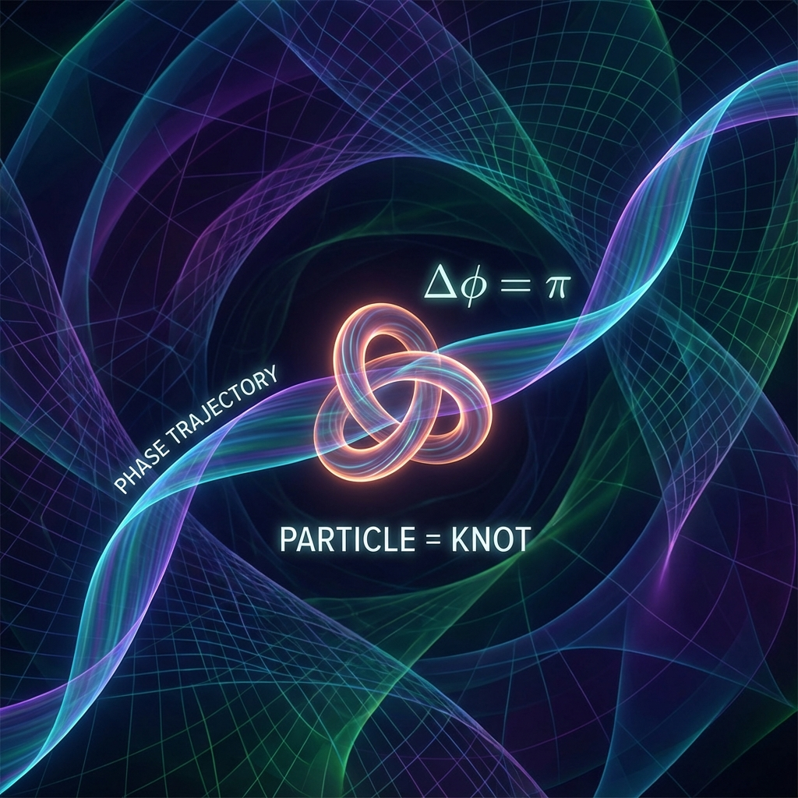

# 第7章 $\pi$ 的全息代码 (The Holographic Pi Code)

在前面的章节中，我们将宇宙拆解为矢量的投影、离散的晶格和复杂的折纸。我们看到了几何如何产生质量，交易如何产生力。但这一切仍然留下了一个终极谜题：这些复杂的结构——粒子、原子、物质——究竟是如何从单纯的"流"中稳定下来的？

如果宇宙只是一个不断旋转的矢量，为什么有些部分会凝固成稳定的"实体"？

本章将揭示全书最深刻的数学秘密：**物质是相位的拓扑打结**。而这个打结的计数单位，正是那个古老的圆周率——**$\pi$**。

我们即将看到，莱文森定理 (Levinson's Theorem) 不仅仅是一个散射理论公式，它是宇宙将"存在"编码为"数字"的底层协议。

## 7.1 莱文森之结 (The Levinson Knot)

> "物质不是静止的石头，物质是流动的死结。存在即是计数：我们在虚空中数了多少个 $\pi$，就创造了多少个粒子。"

当我们谈论"粒子"时，我们脑海中往往浮现出一个微小的弹珠。但在 **《矢量宇宙论》** 的几何视角下，并没有弹珠。有的只是射影希尔伯特空间中那条永恒流动的轨迹。

那么，所谓的"电子"或"氢原子"是什么？

它们是 **轨迹上的结 (Knots in the Trajectory)**。

#### 能量空间的几何之旅

为了理解这一点，我们需要引入 **散射理论 (Scattering Theory)** 的几何视角。想象一束波（比如一个电子）试图穿过一个电势阱（比如一个原子核）。在宏观视角下，这就像球滚过一个坑。但在量子视角下，这是一场发生在 **能量轴 ($\omega$)** 上的几何旅行。

随着能量从零增加到无穷大，散射矩阵的行列式 $\det S(\omega)$ 在复平面上的单位圆 $U(1)$ 上划出了一条曲线。

* 这不是空间中的轨迹，这是 **相空间 (Phase Space)** 中的轨迹。

* 我们可以追踪这条曲线转了多少圈。这就是 **相位缠绕 (Phase Winding)**。

#### 莱文森定理：存在的算术

在经典散射力学中，我们有一个令人震惊的定理，由物理学家诺曼·莱文森 (Norman Levinson) 提出。它将一个抽象的拓扑数量（相位的变化）与一个具体的物理数量（粒子的个数）画上了等号。

公式如下：

$$\phi(0) - \phi(\infty) = N_b \pi$$

其中：

* $\phi(\omega)$ 是总散射相移。

* $N_b$ 是 **束缚态 (Bound States)** 的数量（即被捕获、形成稳定物质粒子的数量）。

* $\pi$ 是圆周率。

这个公式的物理哲学含义是毁灭性的：**粒子不是基本实体，粒子是相位的拓扑计数。**

在我们的 FS 几何语言中，这意味着：

当宇宙的总矢量 $|\Psi\rangle$ 在能量轴上扫描时，如果它的相位在单位圆上完整地缠绕了 **$\pi$** 的角度（或者在某些约定下是 $2\pi$），宇宙就宣告："这里有一个粒子。"

* 如果缠绕了 $2\pi$，就是 2 个粒子。

* 如果没有缠绕（相移为 0），就是虚空。

**物质的存在，本质上就是对 $\pi$ 的计数。** 我们眼中的实体，不过是 FS 轨迹在拓扑结构上打的一个个 **"死结"**。只要这个结不解开，粒子就稳定存在。

#### FS 长度与拓扑代价

在 **《矢量宇宙论》** 中，我们将这一定理升华为 **FS-莱文森关系 (FS-Levinson Relation)**。

根据我们在第一卷建立的 **FS 度量**，我们可以计算这条相位曲线的 **几何长度** $L_{FS}$。由于两点之间直线最短（或者说，缠绕一圈至少需要 $2\pi \cdot r$ 的周长），我们得到了一个不等式：

$$L_{FS} \ge |\phi(\infty) - \phi(0)| = N_b \pi$$

这揭示了创造物质的 **"几何成本"**：

为了维持 $N_b$ 个稳定的粒子（束缚态），宇宙必须在射影希尔伯特空间中消耗至少 $N_b \pi$ 的 **FS 弧长**。

* **$L_{FS}$ (几何长度)** 是宇宙付出的实际预算。

* **$N_b \pi$ (拓扑圈数)** 是宇宙得到的物质产出。

这就是为什么物质拥有质量（即拥有 $v_{int}$）。因为要维持这个拓扑结的存在，矢量必须在内部维度上不断地旋转，每一刻都在消耗 $c_{FS}$ 的预算来维持这"$\pi$ 的缠绕"。如果旋转停止，结就会松开，物质就会烟消云散（衰变）。

#### 结的意义

"莱文森之结"彻底改变了我们对物理现实的看法。

原子不是实心的球，原子是 **被囚禁的波**。它们之所以没有像光一样飞散，是因为它们在拓扑上被锁死了。就像你在一根绳子上打了一个结，这个结本身并不是绳子之外的物质，它只是绳子的一种 **构型**。但这个结是稳定的，你可以推它，它会有惯性；你可以把它当成一个颗粒。

我们，以及我们周围的万物，都是宇宙大圆上打的一串串复杂的结。而 $\pi$，就是识别这些结的 **校验码**。

只要你数一数相位的变化中有多少个 $\pi$，你就知道虚空中藏着多少个幽灵般的粒子。这就是 **$\pi$ 的全息代码**——它是通往物质世界的数字钥匙。

