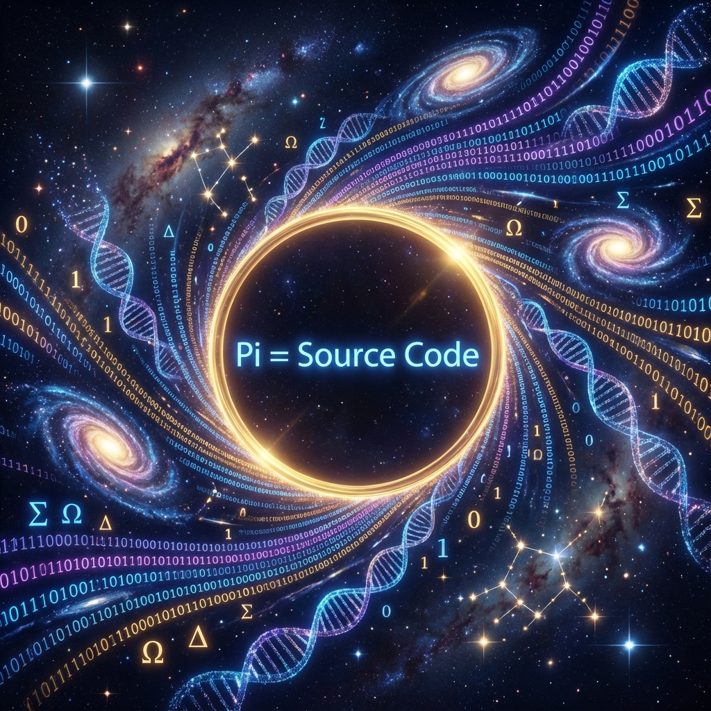

## 7.2 All Information is in the Circle

> "The universe does not need a hard drive to store its history. The universe only needs a constant and a perfect geometric shape. All past, present, and future have long been etched in the arc of that circle."

In the previous section, we established a stunning physical fact through Levinson's Theorem: the existence of matter is essentially counting $\pi$. Every stable particle is a dead knot of $\pi$ wound by phase in energy space.

Since "existence" is merely a reading of geometric phase, we can boldly advance one step further: if the universe's essence is a circle (or hypersphere) constantly recursively decomposing in projective Hilbert space, then the geometric properties of this circle itself—specifically, the transcendental number **$\pi$** that defines this circle—must contain all information of the universe.

In this section, we will explore a shattering mathematical-theological proposition: **Pi $\pi$ is the universe's holographic source code.**

#### 7.2.1 Also a Hologram: The Prophecy of Normal Numbers

In mathematics, $\pi$ is considered a **Normal Number**. This means that in its infinite non-repeating decimal places, any possible finite sequence of digits will appear with equal probability.

This is a mathematical property with explosive physical implications.

If we encode the universe's history as a string of binary digits (after all, at the QCA level, the universe is a discrete bit stream), then according to the definition of normal numbers, this sequence representing "the entire history of our universe" must exist in some decimal place of $\pi$.

* **The content of this page**, in $\pi$.

* **Your DNA sequence**, in $\pi$.

* **Every quantum state snapshot from the Big Bang to heat death**, all in $\pi$.

From the perspective of **Vector Cosmology**, this is no longer merely a probabilistic coincidence but an inevitable result of **orthogonal decomposition**.

When we decompose the unique vector $|\Psi\rangle$ into external ($v_{ext}$) and internal ($v_{int}$), we are actually choosing a specific **"projection angle"**. In Hilbert space, this angle is defined by phase $\phi$.

As $v_{int}$ (time/mass) evolves, the vector continuously rotates on the phase space circle. This rotation process is **"reading"** the coordinate values on the circle.

The evolution of the universe is essentially a trajectory swept by that pointer (vector) on $\pi$'s infinite-precision dial. **Time is not creating new information; time is decoding information that already exists in geometry.**

#### 7.2.2 The Ultimate Compression: No Storage, Only Computation

Computer science tells us that storing information is expensive, while computation is relatively cheap. If the universe is a computer, it seems to adopt an ultimate compression strategy: **zero storage strategy**.

The universe does not need a huge database to record "what is the electron's mass" or "what is the fine structure constant."

These constants do not need to be stored; they are **geometric properties of the circle**.

* **Fundamental constants as geometric ratios**:

    As we saw in the Dirac Circle, the relationship between mass $m$ and light speed $c$ is a geometric Pythagorean relationship. This means that natural constants may just be **projection angles** produced when high-dimensional spheres are cut in different ways. These angle values, like $\sin(\pi/x)$, are intrinsic functions of $\pi$.

* **Physical laws as decompression algorithms**:

    Physical laws (such as the Schrödinger equation or QCA update rules) are actually a set of **decompression algorithms**.

    The universe's initial state ($|\Psi_0\rangle$) might be extremely simple, like a short code that generates $\pi$ (such as $\sum \frac{1}{k^2} = \frac{\pi^2}{6}$).

    Then, through continuous recursive decomposition (computation), the universe "computes" complex things from this simple seed.

The complex world we see is just the **fractal patterns** presented when $\pi$, this transcendental number, is continuously unfolded.

#### 7.2.3 The Paradox of Determinism and Experience

This view brings profound philosophical impact: if all information is in the circle, if all history is in $\pi$, then is the future already predetermined?

In FS geometry, trajectories are indeed holomorphic and deterministic. That great circle exists eternally.

However, for observers (us) as **"internal clock subsystems"**, we cannot see the entire circle at once.

We are trapped in the flow of $v_{int}$. Our computational power is limited, constrained by the $c_{FS}$ budget. Therefore, we can only **read $\pi$'s value digit by digit**.

* **God's perspective (geometric perspective)**: The circle is static, information is complete. Everything already exists.

* **Mortal's perspective (computational perspective)**: $\pi$ is infinite and non-repeating, unpredictable. We must compute step by step (experience time) to know what the next decimal digit is.

This is the physical essence of **"experience"**.

What we call "living" is, as part of the hologram, personally experiencing the process of decompressing infinite details from the simple "circle." Although the script is already written after the $10^{100}$-th digit of $\pi$, if we don't personally walk there, no algorithm can tell us in advance what it is.

**All information is in the circle.** We are not creators of information; we are readers of pi.

