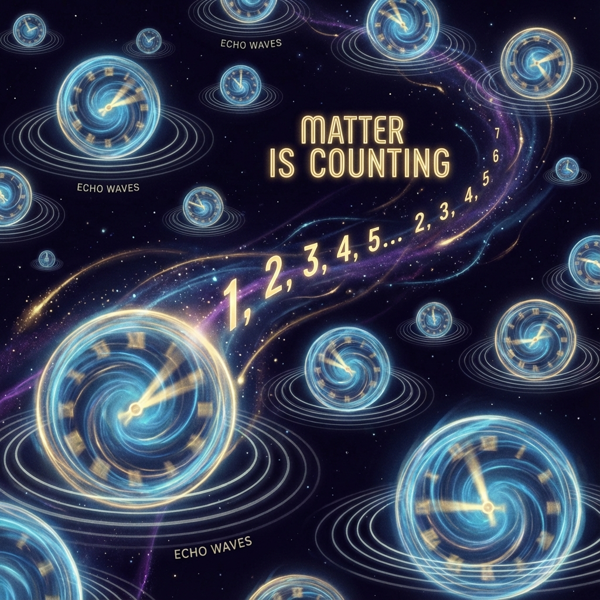

## 7.3 Matter as Counting

> "Existence is not a state; existence is an action. In the void, we not only tie a knot, but we are also constantly counting out loud the number of turns of this knot. As soon as counting stops, matter ceases to exist."

In the previous two sections of this chapter, we established two revolutionary concepts: first, that particles are essentially topological knots of phase (Levinson's Knot), and second, that all information of the universe is contained in the geometry of the circle.

Now, we merge these two concepts to arrive at the most fundamental definition of material entities: **Matter is Counting**.

Everything we see—you, me, stars, dust—is essentially a continuous counting operation that the universe performs on **$\pi$** along the energy axis.

#### 7.3.1 The Universal Counter

In the macroscopic world, we are accustomed to quantifying matter by "weighing": here is a kilogram of iron, there is a ton of water. But from the microscopic geometric perspective of **Vector Cosmology**, the universe does not care about weight; the universe only cares about **winding numbers**.

Let us examine again the core formula of Levinson's Theorem:

$$\text{Wind}(\det S) = \frac{1}{\pi} (\phi(0) - \phi(\infty)) = N_b$$

This formula tells us that the so-called "number of bound states" $N_b$ (i.e., the number of particles) is a dimensionless integer. It is entirely determined by the number of times the scattering phase $\phi$ winds around the unit circle $U(1)$.

* **Creating a particle** means forcing the total vector $|\Psi\rangle$ to rotate an additional **$\pi$** radians in internal phase space.

* **Annihilating a particle** means reversing this rotation, letting the phase return to flat.

Therefore, the universe is a huge **topological counter**. It does not produce entities; it merely records the number of phase rotations in the ledger of Hilbert space. Every electron, every proton, is a **"$\pi$ mark"** in this ledger.

#### 7.3.2 The Cost of Existence: Continuous Reading

If matter is just a numerical mark, why does it feel hard? Why does it have mass? Why does maintaining "existence" consume energy?

The answer lies in **FS geometric length**.

Geometrically, although the topological invariant (winding number $N_b$) is a discrete integer, to achieve this winding, the vector must traverse a real **distance** in projective space. According to the FS-Levinson inequality we derived in the paper:

$$L_{FS} \ge N_b \pi$$

This means that to maintain the count of "1 particle" (i.e., $N_b=1$), the universe must continuously pay at least **$\pi$** units of **FS arc length**.

* **The essence of mass ($v_{int}$)**: Mass is the ceaseless rotational motion that the vector must perform in internal dimensions to prevent this $\pi$ phase winding from coming undone.

* **Existence is reading**: Particles are not static "dead knots"; they are dynamic "living knots." The vector must constantly "complete" this phase circle in internal space at every moment to maintain the fact "I exist" macroscopically.

Once this internal rotation stops ($v_{int} \to 0$), the phase curve collapses, the topological number returns to zero, and matter disappears. This is why photons (massless particles) have no rest lifetime—because they do not perform this $\pi$ cyclic counting internally.

#### 7.3.3 We are Readings of Pi

This conclusion brings physics back to the ultimate dream of Pythagoreanism: **All things are numbers**.

But here, all things are not just static numbers; all things are dynamic readings of **pi $\pi$**.

* A hydrogen atom is the universe, at that local point, constantly reciting the cycle of **"$\pi, \pi, \pi..."$**.

* A uranium atom is more complex polyphonic music, simultaneously maintaining dozens of $\pi$ counts in multiple internal dimensions.

When nuclear fission occurs, the atomic nucleus splits, which is actually part of the complex phase winding being untied. Those FS budgets ($L_{FS}$) originally used to maintain high-order $\pi$ counts are instantly released and converted into external kinetic energy ($v_{ext}$).

**Conclusion:**

In the previous section, we said "all information is in the circle." Now we can go further: **All matter is a recitation of this circle.**

The universe is not built from atoms; the universe is built from **echoes of $\pi$**. Each of us is a segment of geometric code being read aloud. As long as the universe continues to rotate that great circle in internal dimensions, as long as it continues to count those phase knots, we can maintain our form in the long river of time, avoiding dissipation.

