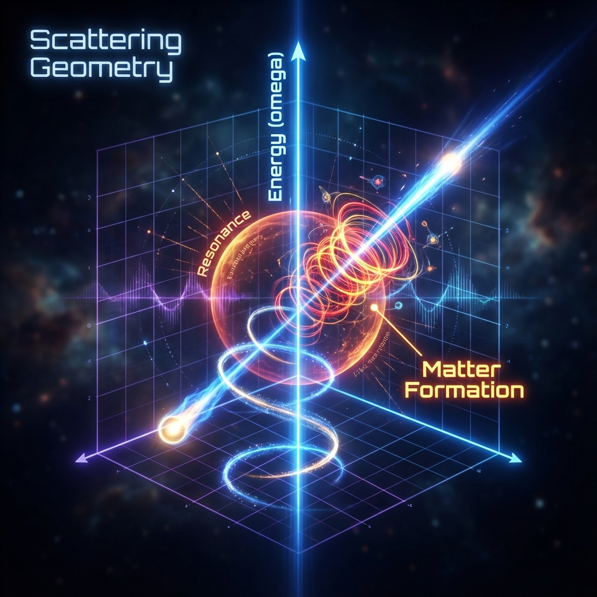

# Chapter 8: Matter as Topology

We have seen that matter, at its deepest level, is counting pi $\pi$. But how is this counting physically accomplished?

In the macroscopic world, we are accustomed to viewing matter as static "existence." But in the quantum world, the essence of matter is dynamic "process." A stable atom is actually a wave that never stops, self-entangling. To understand this, we need to introduce a completely new geometric perspective to examine the most fundamental phenomenon in physics—**Scattering**.

In this chapter, we will leave the spatial axis we are familiar with and step into an abstract dimension—**Energy Space**. We will discover that so-called particle collisions and matter formation are not bounces on a billiard table but an elegant geometric dance performed by the universe's vector on the energy axis.

## 8.1 Geometry in Energy Space

> "If you observe two particles colliding with a microscope, you won't see impact. You will see the wave function elegantly changing its phase pitch on the energy staff."

In classical mechanics, scattering is intuitive: two rigid balls collide and bounce apart. This is an event occurring in three-dimensional space ($x, y, z$). But in quantum mechanics, especially in the framework of **Vector Cosmology**, the essence of scattering is completely different.

We must abandon the "billiard ball" image and establish the "phase space trajectory" image.

#### Trajectories on the Energy Axis

Let us consider a single-particle scattering process (for example, an electron passing through the potential field near an atomic nucleus). In this process, the most crucial parameter is not time $t$ but **energy $\omega$**.

For each definite energy value $\omega$, the system has a corresponding scattering state $|\psi(\omega)\rangle$. This is a pure state vector living in projective Hilbert space $P(\mathcal{H})$.

When we scan from $\omega = 0$ to $\omega = \infty$ on the energy axis, this vector does not remain stationary. Due to the scattering phase shift $\delta(\omega)$ changing with energy, the vector $|\psi(\omega)\rangle$ traces a continuous curve in Hilbert space.

This is **geometry in energy space**.

* The universe no longer evolves in time but evolves in **energy**.

* The object we study is the geometric shape of this trajectory $\omega \mapsto [\psi(\omega)]$ driven by the energy parameter.

#### The Mirror of Schrödinger's Equation

In the time domain, vector evolution is driven by the Hamiltonian $H$ ($|\dot{\psi}\rangle = -iH|\psi\rangle$).

In the energy domain, we discover a stunning mirror symmetry.

If we calculate the "velocity" of the vector changing with energy $\omega$—that is, the tangent vector $|\partial_\omega \psi\rangle$—we find its evolution equation has exactly the same form:

$$|\partial_\omega \psi(\omega)\rangle = i \tilde{Q}(\omega) |\psi(\omega)\rangle$$

Here, the "generator" driving evolution is no longer energy $H$ but a $\tilde{Q}$ called the **Wigner-Smith Time-Delay Operator**.

This is a profound duality:

* On the **time axis**, **energy ($H$)** drives phase rotation.

* On the **energy axis**, **time ($Q$)** drives phase rotation.

Scattering processes are essentially the universe using "time delay" as a generator to draw geometric figures in energy space.

#### FS Velocity as Distinguishability

How fast does the vector move on this energy trajectory?

This requires our old friend—**Fubini-Study (FS) velocity**. But this time, it is defined on the energy parameter:

$$v_{FS}^{(\omega)} = ||\partial_\omega \psi(\omega)||_{FS}$$

According to derivations in the paper, this "velocity in energy space" has a clear physical meaning: **it strictly equals the standard deviation of the Wigner-Smith time-delay operator**.

$$v_{FS}(\omega) = \Delta Q(\omega)$$

What does this mean?

* If $v_{FS}$ is large, it means that with tiny energy changes, the scattering state undergoes dramatic changes (orthogonalization). This corresponds to physical **Resonance**.

* Near resonance points, the vector rotates wildly in projective space, tracing huge arc lengths. It is precisely this dramatic geometric knotting that transforms a fleeting scattering state into a long-lived **"quasiparticle"**.

#### Conclusion: No Collision, Only Winding

Through the geometric perspective of energy space, we see through the illusion of "collision."

When two particles meet, they do not really "collide." What actually happens is: the system's total vector, driven by the energy axis, undergoes a geometric evolution with extremely high curvature.

* **Free flight** is a smooth straight line.

* **Scattering/collision** is a bend in the trajectory.

* **Matter formation (bound states)** is the trajectory curling into a closed loop or dead knot.

So-called "matter" is those regions on the energy manifold where the universe's vector has **highest curvature and tightest winding**. The reason we feel atoms are "hard" is because at that point, the phase rotation speed $v_{FS}^{(\omega)}$ reaches its extreme, forming a geometrically difficult-to-untie topological structure.

