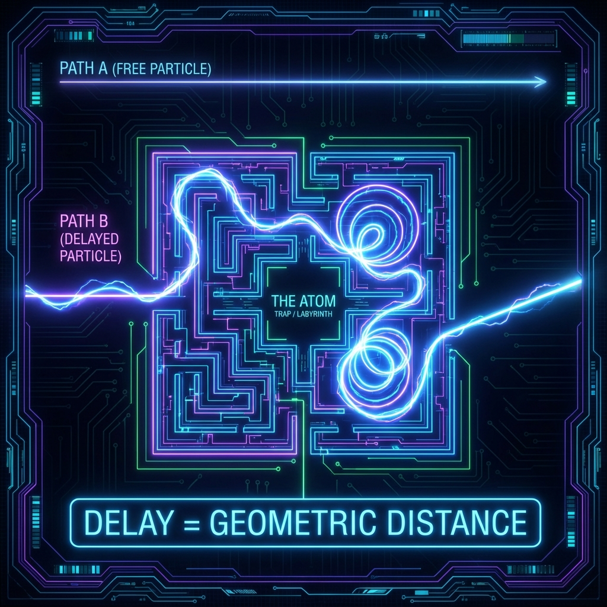

## 8.2 时间延迟的意义 (The Meaning of Time Delay)

> "粒子并没有在他的手表上按下暂停键。所谓的'延迟'，只是因为它在内部维度的迷宫里，比起走直线的同伴，多跑了一段漫长的几何弯路。"

在日常语言中，"延迟"往往意味着停滞、等待或浪费。火车晚点是因为它停在了轨道上，信息延迟是因为信号堵在了路由器里。

但在 **《矢量宇宙论》** 的量子散射图景中，时间延迟（Time Delay）拥有截然不同的含义。它不是静止，它是 **剧烈的运动**。

当一个粒子在散射过程中表现出"时间延迟"时，这意味着宇宙唯一的矢量在射影希尔伯特空间中，正在以极高的速度进行着复杂的旋转和演化。延迟，本质上是 **内部几何路程的积累**。

#### 8.2.1 Wigner-Smith 算符：时间的几何探针

为了量化这种延迟，物理学家尤金·维格纳 (Eugene Wigner) 和费利克斯·史密斯 (Felix Smith) 引入了一个强大的数学工具——**Wigner-Smith 时间延迟算符 (The Wigner-Smith Time-Delay Operator)**，记作 $Q$。

在数学上，它被定义为散射矩阵 $S(\omega)$ 对能量 $\omega$ 的导数：

$$Q(\omega) = -i S^\dagger(\omega) \frac{\partial S(\omega)}{\partial \omega}$$

这个公式看起来抽象，但其物理意义极其深刻：它衡量了 **散射相位随能量变化的速率**。

* 如果相位随能量变化得很慢，说明粒子只是匆匆掠过，延迟很小。

* 如果相位随能量剧烈变化（例如在共振点附近），说明粒子与靶标发生了深刻的纠缠，延迟巨大。

在我们的 FS 几何框架下，我们发现了一个连接"时间"与"几何"的决定性等式。正如我们在论文中所证明的，FS 速度在能量空间中的大小，严格等于这个时间延迟算符的标准差：

$$v_{FS}(\omega) = \Delta Q(\omega)$$

这揭示了时间延迟的几何本质：**延迟就是速度。**

这里的"速度"不是指粒子飞得有多快，而是指 **量子态矢量 $| \psi(\omega) \rangle$ 在射影空间中随能量参数 $\omega$ 改变而旋转的速率**。

#### 8.2.2 迷宫中的弧长 (Arc-Length in the Labyrinth)

想象两个粒子参加一场穿越森林的比赛。

* **粒子 A（自由粒子）**：直接穿过森林，走直线。

* **粒子 B（散射粒子）**：被森林中的某朵花（原子核/势阱）吸引，围着它转了十圈，然后才离开。

对于终点处的裁判来说，粒子 B "迟到"了。这种迟到就是 Wigner-Smith 时间延迟 $\tau_{WS}$。

但在几何视角下，粒子 B 并没有偷懒。恰恰相反，它在单位能量间隔内，跑过了比粒子 A 长得多的路程。

根据我们的推导，对于一个窄带波包，其在希尔伯特空间中走过的 **FS 距离 ($D_{FS}$)** 与它的 **时间延迟** 成正比：

$$D_{FS} \approx 2 \sigma |\tau_{WS}|$$

*(其中 $\sigma$ 是波包的能量带宽)*

这个公式告诉我们：**延迟即距离。**

粒子在微观世界中滞留的时间越长，意味着代表它的矢量在内部几何维度（$v_{int}$ 扇区）中划过的弧长越长。

所谓的"共振态"或"准粒子"，就是矢量在内部迷宫中疯狂绕圈，以至于划过了巨大的几何距离，从而在外部观察者眼中表现为极大的时间滞后。

#### 8.2.3 延迟与保真度的交易

这种几何距离不仅仅是数学上的度量，它直接决定了物理上的 **可区分性 (Distinguishability)**。

FS 距离衡量的是两个量子态有多么不同。如果时间延迟很大，意味着对于微小的能量改变，散射后的状态会变得与之前截然不同（正交化速度极快）。

这就引出了一个有趣的实验预测：**延迟-保真度权衡 (Delay-Fidelity Trade-off)**。

如果你利用一个高 Q 值的谐振腔（产生大延迟）来存储一个光子，你实际上是在强迫光子的状态矢量在希尔伯特空间中大幅度偏转。

* **大延迟** $\implies$ **长路径** $\implies$ **状态偏转大**。

* 这种偏转意味着，经过散射后的波包与原始波包在量子态上的重叠（保真度）会按照高斯函数衰减：$V \approx \exp(-2\sigma^2 \tau_{WS}^2)$。

这再次印证了我们的经济学隐喻：**想要获得"时间"（延迟），就必须支付"几何距离"（状态改变）。** 宇宙中没有免费的午餐，连"等待"本身都是一种昂贵的几何消费。

#### 8.2.4 负时间的解毒剂

最后，这个几何视角为我们解决了一个长期困扰物理学界的悖论：**负时间延迟 (Negative Time Delay)**。

在某些散射情形下（如经过势垒），Wigner-Smith 算符的期望值可能是负的。这听起来像是粒子在进入之前就出来了，违背了因果律。

但在 **《矢量宇宙论》** 中，负延迟并不是时间倒流，它只是 **几何捷径**。

* 正延迟是走了弯路（绕圈）。

* 负延迟是走了捷径（相消干涉）。

当波包的各个分量在散射过程中发生重组时，它们可能会在射影空间中找到一条比自由演化更短的路径到达终态。这种"路径缩短"在宏观上表现为波包峰值的提前到达。但这绝不意味着信息传播超越了微观的 $c_{FS}$ 限制（Lieb-Robinson 速度）。

**结论：**

时间延迟不是虚空的停顿。它是矢量在内部几何结构中进行的一次长途旅行。

每一个原子的存在，都是因为它内部的波函数陷入了一个巨大的"时间延迟陷阱"，在那里面，它必须跑完近乎无限的几何路程，才能向外部世界移动分毫。

正是这种微观上的"慢"，造就了宏观物质世界的"稳"。

