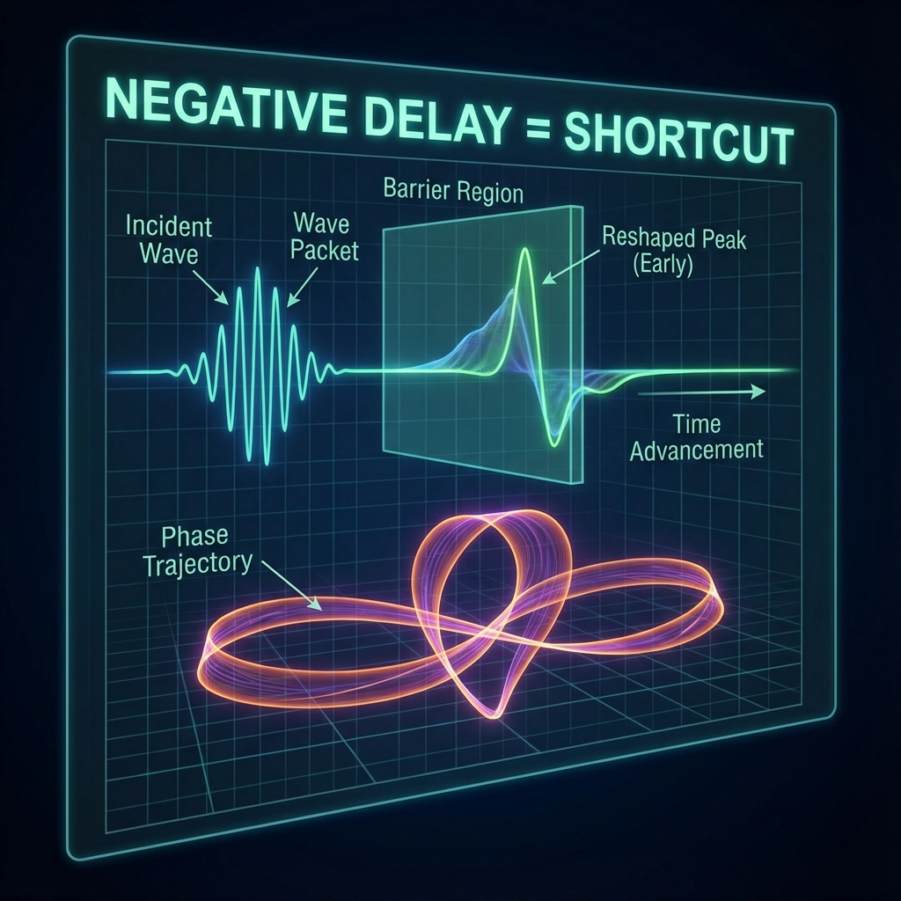

## 8.3 The Antidote to Negative Time

> "In the logic of geometry, there is no regret medicine, nor time machines. The so-called 'time reversal' is merely a dangerous phase gymnastics that the wave function performs in projective space to take shortcuts."

In the depths of quantum scattering theory, a ghostly paradox lurks, long troubling physicists' intuition. This is **Negative Wigner-Smith Time Delay**.

According to the formula, time delay corresponds to the derivative of scattering phase with respect to energy ($\tau \sim \partial \phi / \partial \omega$). In certain special physical situations (such as light passing through specific media or particles passing through specific potential barriers), this derivative can be negative. This means particles seem to "come out" before "entering" the scattering region.

This sounds like magic violating causality, even suggesting the possibility of time reversal. But under the geometric scrutiny of **Vector Cosmology**, this paradox instantly collapses. We don't need to introduce reverse time; we only need to understand **the geometry of phase**.

#### 8.3.1 Non-Existent Reversal: Reshaping Rather Than Traversal

First, we must establish an absolute axiom: **The universe's vector always rotates forward.**

In our microscopic QCA architecture, the evolution of global state $|\Psi(\tau)\rangle$ with intrinsic time $\tau$ is driven by unitary operator $U$. This process is strictly monotonic; there is no mechanism allowing $\tau$ to reverse.

Then, how does negative delay occur?

It is not time reversal; it is **Reshaping** of the wave packet.

Imagine a very long train (wave packet) entering a tunnel.

* **Normal case (positive delay)**: The train slows down in the tunnel, and the locomotive arrives late at the exit.

* **Negative delay case**: Mechanisms in the tunnel (interference) cut off the train's tail and redistribute energy to the locomotive. The result is that although the train's "center of mass" or "peak" arrives earlier than expected, the train's **locomotive (front edge)** has not exceeded light speed, nor has it exceeded its originally should-reach limit position.

In FS geometry, negative delay means the scattered state vector takes a special path in projective space, causing the peak phase of the outgoing wave packet to show an "advance." But this is an interference effect, not a causal-violating physical movement.

#### 8.3.2 Phase Backtracking: The Cost of Shortcuts

Since causality is not violated, is this "advance" free?

No. In the economics of **Vector Cosmology**, nothing is free. To create the illusion of "negative time," the system must pay an expensive **geometric cost**.

Let us return to the **FS-Levinson Relation**. For standard scattering processes (such as resonance), phase $\phi(\omega)$ increases monotonically, and at this point the FS trajectory length $L_{FS}$ exactly equals the topological winding number $N_b \pi$. This is the "most cost-effective" path.

But when negative time delay occurs, it means phase $\phi(\omega)$ locally undergoes **Backtracking**—it not only doesn't increase but temporarily decreases.

What does this backtracking mean geometrically?

It means the vector in projective Hilbert space does not smoothly circle but performs a complex "round trip." To make the phase derivative negative, the vector must trace longer arcs in extra dimensions.

The conclusion is stunning:

**Any process exhibiting negative time delay must have FS geometric path length $L_{FS}$ strictly greater than the topological lower bound $N_b \pi$.**

You think you "saved" time through negative delay? No, you geometrically **traveled a longer distance**. You paid extra $c_{FS}$ budget to construct that complex interference structure, thereby forging an illusion of "early arrival" macroscopically.

#### 8.3.3 The Iron Wall of Causality: QCA's Guarantee

Ultimately, the microscopic engine ensures this won't get out of control.

No matter how the wave packet reshapes, no matter how phase backtracks, the underlying **Quantum Cellular Automata (QCA)** is always constrained by the **Lieb-Robinson Speed ($v_{LR}$)**.

* Macroscopic "group velocity" or "Wigner-Smith delay" are merely statistical behaviors of wave packet peaks; they can mathematically exceed light speed or even be negative.

* But microscopic **information propagation speed** (the signal's front edge) can never exceed $c_{FS}$ (i.e., $v_{LR}$).

Therefore, negative time delay is a **"geometric antidote"**: it relieves our concerns about causality. It tells us that so-called "faster than light" or "earlier than cause" are just tricks of destructive interference that wave functions play in internal geometric dimensions.

**The universe has no time machine.** That unique vector always draws the great circle irreversibly. Those seemingly counter-flowing waves are merely projections of more intense turbulence in deep water onto the surface.

