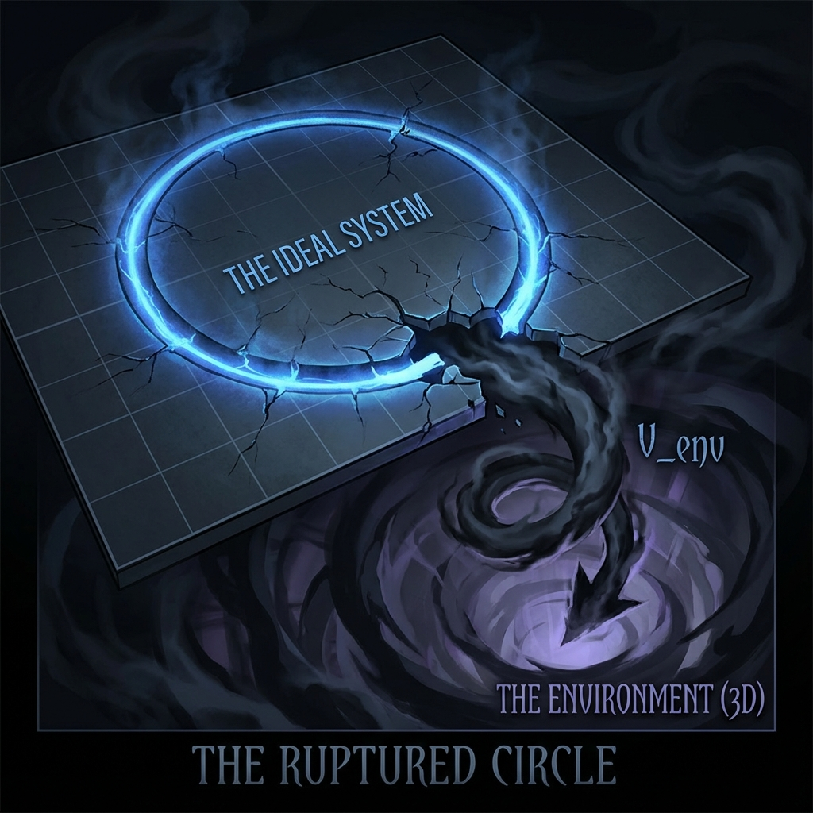

# 第9章 被遗忘的扇区 (The Forgotten Sector)

在前面的篇章中，我们沉浸在一个理想化的几何世界里。在那完美无瑕的狄拉克圆上，矢量仅仅在"外部运动" ($v_{ext}$) 和"内部演化" ($v_{int}$) 之间进行着优雅的零和博弈。那是一个可逆的、永恒的、没有耗散的水晶宇宙。

然而，我们必须诚实地面对现实：那不是我们生活的宇宙。

我们的世界充满了破碎的茶杯、熄灭的炉火和遗忘的记忆。在那个完美的二维圆平面之外，必定存在着一个幽暗的深渊，不断吞噬着有序的信息。

本章将揭开那个被我们长期忽略的第三个维度。我们将看到，那个完美的圆并没有真正消失，它只是在一个更高的维度上破裂了，从而向一个不可见的"阴影扇区"敞开了大门。

## 9.1 完美的圆破裂了 (The Perfect Circle Ruptured)

> "宇宙不仅有'内'与'外'，宇宙还有一个无底的口袋。我们称之为'环境'，但它其实是通往无限维度的后门。"

#### 第三个轴的出现

在前两卷中，我们将核心公式简化为 $v_{ext}^2 + v_{int}^2 = c_{FS}^2$。这是一个封闭系统的守恒律。它假设系统与宇宙的其他部分完全隔绝。

但在 **《矢量宇宙论》** 的完整图景中，没有任何系统是真正的孤岛。射影希尔伯特空间的切线空间并不只有两个正交子空间。根据我们在论文中的严格定义，切线空间 $T_{[\psi(\tau)]}P(\mathcal{H})$ 被分解为三个部分：

$$V_{total} \simeq V_{ext} \oplus V_{int} \oplus V_{env}$$

这就引入了第三个至关重要的速度分量——**环境速度 ($v_{env}$)**。它代表了全局矢量在那些我们无法追踪、无法控制的自由度（如热浴、真空涨落、杂散光子）上的投影变化率。

于是，那个简单的二维圆方程，被扩展为了一个三维球面的表面方程——我们称之为 **"扩展的容量恒等式"**：

$$v_{ext}^2 + v_{int}^2 + v_{env}^2 = c_{FS}^2$$

#### 信息的泄露与圆的收缩

这个新公式的出现，宣告了完美圆的"破裂"。

对于一个局部的观察者（比如我们自己）来说，我们通常只能观测到 $v_{ext}$（物体的运动）和 $v_{int}$（物体的质量/结构）。我们看不见 $v_{env}$，因为"环境"定义上就是那些逃逸出我们观测范围的自由度。

当我们忽略 $v_{env}$ 时，原先的守恒律变成了一个不等式：

$$v_{ext}^2 + v_{int}^2 = c_{FS}^2 - v_{env}^2 \le c_{FS}^2$$

在我们的视野中，这表现为 **"有效预算的缩水"**。

* 当 $v_{env}$ 增加时（即系统与环境发生纠缠），留给 $v_{ext}$ 和 $v_{int}$ 的份额必然减少。

* 几何上，这意味着我们在 $(v_{ext}, v_{int})$ 平面上看到的那个圆，半径正在不断缩小。

这就是 **耗散** 的几何本质。

一个滚动的球最终会停下来（$v_{ext} \to 0$），一杯热水最终会变凉（$v_{int}$ 减小），并不是能量凭空消失了，而是携带能量的 **$c_{FS}$ 预算** 从可见的"内/外"扇区，不可逆地正交旋转到了不可见的"环境"扇区中。

#### 隐形的阴影

为什么我们要称之为"被遗忘的扇区"？

因为在绝大多数物理方程中，我们都试图将系统理想化，假装 $v_{env} = 0$。我们写下完美的哈密顿量，画出封闭的轨道。

但在 **《矢量宇宙论》** 中，$v_{env}$ 不是一个误差项，它是宇宙演化的主角之一。

* **它是噪音**：在量子行走实验中，它是导致数据点落入"禁区"的罪魁祸首。

* **它是纠缠**：它是系统为了融入整体宇宙而支付的"连接费"。

* **它是熵**：正如我们将在下一节看到的，$v_{env}$ 是热力学第二定律的几何源头。

完美的圆破裂了，但它破裂得如此壮丽。它不再是一个封闭的环，而变成了一个向着无限维度开放的螺旋。正是因为有了这个缺口，宇宙才有了热，有了死，也有了时间那不可逆转的哀愁。

