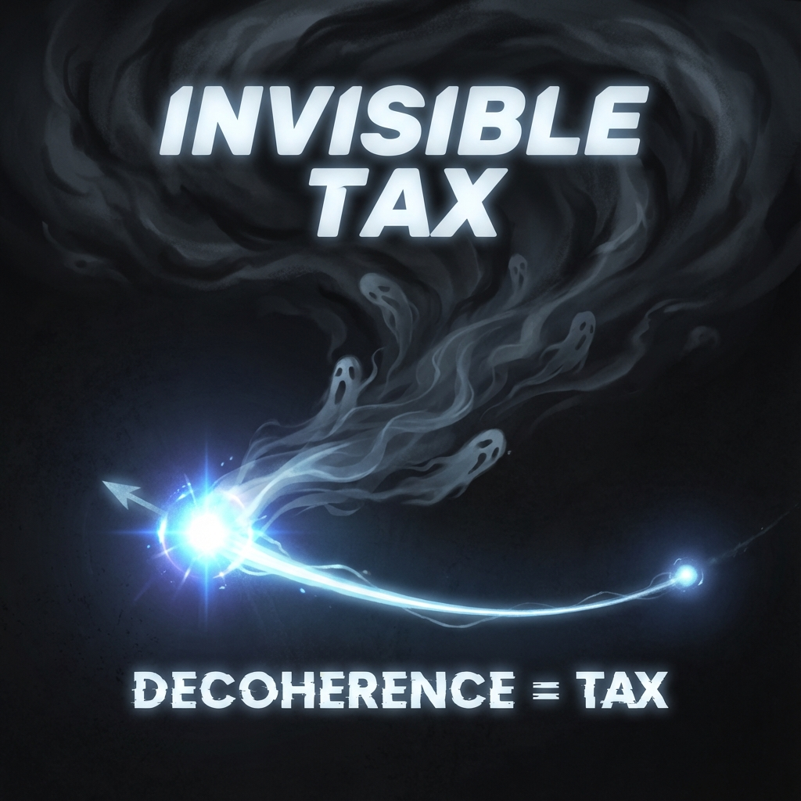

## 9.2 The Invisible Tax

> "There is no free lunch in the universe; even 'existence' itself requires paying a handling fee. This fee is not paid in money but in our most precious asset—coherence."

In the previous section, we witnessed the rupture of the perfect circle and introduced the third and most unsettling variable—**Environment Velocity ($v_{env}$)**. The emergence of this variable completely changes our understanding of physical processes. It means the universe is not an ideal closed playground but a real market full of friction and loss.

In this section, we will reveal the geometric essence of **Quantum Decoherence** and **Entropy Increase**. In the ledger of **Vector Cosmology**, they are neither chaos nor destruction; they are the **"Invisible Tax"** that every physical transaction must mandatorily pay.

#### 9.2.1 The Orthogonal Great Escape of Information

When we say a system has "lost information" or "entropy has increased," has this information really disappeared?

Under the unitary evolution axiom of quantum mechanics, information is indestructible. The global vector $|\Psi\rangle$ always maintains modulus conservation. So why do we still feel the world is becoming chaotic?

The answer lies in **direction**.

Let us return to the three-dimensional decomposition of tangent space:

$$|\dot{\psi}\rangle = |\dot{\psi}_{ext}\rangle + |\dot{\psi}_{int}\rangle + |\dot{\psi}_{env}\rangle$$

When we observe an electron in isolation, we can only track its projection onto the two "visible subspaces" of $V_{ext}$ (position) and $V_{int}$ (spin/mass). As long as the electron remains isolated, its vector rotates perfectly on the plane formed by these two dimensions.

However, once the electron interacts with the environment (e.g., collides with a photon or is perturbed by vacuum fluctuations), its evolution trajectory undergoes **deflection**.

This deflection is not within the original plane but **protrudes out of the plane**, pointing toward that orthogonal $V_{env}$ dimension.

* **Geometric Picture of Decoherence**: Decoherence is not the system becoming dirty; it is the system vector's "arrow" pointing toward dimensions we cannot observe.

* **The Escape of Information**: The $c_{FS}$ budget originally used to maintain quantum superposition states (coherence) is forcibly transferred to the $v_{env}$ account.

For us observers living on low-dimensional projection surfaces, this manifests as the "disappearance" of information. But from God's perspective (full Hilbert space), this is merely an **orthogonal great escape of information**. The information is still there; we just can no longer read it.

#### 9.2.2 Transaction Tax: The Cost of Interaction

Why does the universe design this mechanism?

We can understand $v_{env}$ as the **transaction tax** levied by the universe.

In the universe, no two particles can interact perfectly with zero loss. Whenever a particle attempts to influence another particle through "force" (i.e., conducting budget transactions), it must open its boundary. This opening inevitably allows the environment to infiltrate.

* **Friction**: Macroscopically, a sliding block stops moving because $v_{ext}$ (kinetic energy) is entirely converted into $v_{env}$ (thermal energy/environmental entanglement) through countless microscopic collision transactions.

* **Measurement**: When we observe a quantum system, we are forcing it to transact with a macroscopic instrument (a huge environment). The tax rate for this transaction is 100%—the system collapses instantly, and all quantum coherence budget is paid as tax to the environment.

This also explains why we do not see quantum superposition states in the macroscopic world. Because maintaining a macroscopic superposition state (like Schrödinger's cat) requires an astronomical $v_{int}$ budget, and such a massive asset scale invites extremely greedy taxation from the environment. The slightest environmental perturbation will produce huge $v_{env}$, instantly draining the budget needed to maintain the superposition state.

#### 9.2.3 Entropy Speed Limit: The Tax Ceiling

Although tax must be paid, the universe has mercifully set a **"tax ceiling"**.

In classical thermodynamics, the rate of entropy increase seems to be arbitrarily fast. But in **Vector Cosmology**, since the total budget $c_{FS}$ is locked, the rate at which information flows to the environment (i.e., the entropy increase rate) also has a physical limit.

According to the **Entropic Speed Limit** theorem we derived in the paper: For a finite system with Hilbert space dimension $d$, the rate of change of its von Neumann entropy $S_{vN}$ is strictly limited to:

$$|\dot{S}_{vN}| \le c_{FS} \ln(d-1)$$

This formula is the sacred contract between thermodynamics and geometry.

* It tells us: **Chaos also takes time.** The speed at which a system collapses cannot exceed the information processing bandwidth allowed by $c_{FS}$.

* It sets an absolute geometric clock for black hole evaporation, cosmic heat death, and life's death.

#### 9.2.4 Conclusion: Inevitable Loss

**$v_{env}$ is the shadow of the universe.**

As long as there is structure ($v_{int}$), as long as there is motion ($v_{ext}$), the shadow must lengthen. The "ordered world" in our eyes is actually built on the foundation of continuously paying interest into the shadows.

Every second, the atoms in your body are conducting billions of transactions with the environment, and each transaction has part of its coherence "taxed" away. This is aging, this is forgetting, this is the cold bottom line in physical laws.

However, it is precisely because of this loss that time has direction. If tax did not exist, if $v_{env}$ were always zero, the universe would be a movie that could be rewound at will, and history would lose its weight.

In the next section, we will explore how this irreversible process constructs our most profound illusion—**the arrow of time**.

