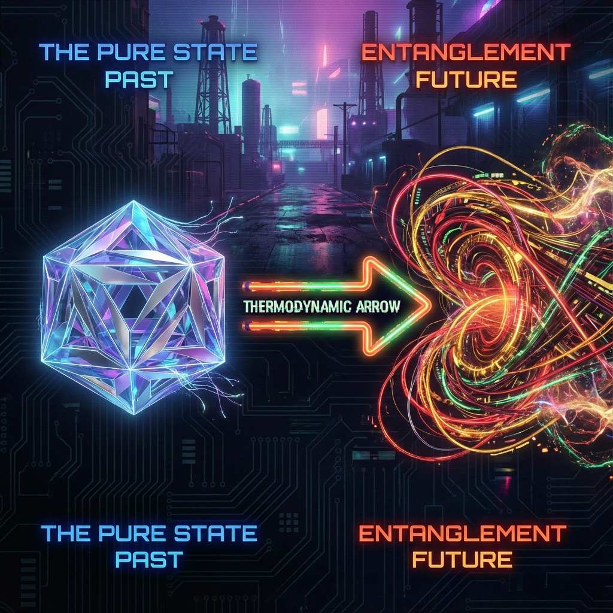

## 9.3 The Thermodynamic Arrow

> "Time is not a river flowing from past to future. Time is merely a grand story we fabricate to cover up our inability to remember all details."

We have arrived at the most perplexing paradox in physics: **the arrow of time**.

At the microscopic level, whether it is the QCA lattice we described in Volume 2 or the Dirac circle in Volume 1, physical laws are perfectly symmetric (reversible) in time. If you rewind the movie of cosmic evolution, that rotating vector $|\Psi(\tau)\rangle$ still completely conforms to all rules of FS geometry.

However, at the macroscopic level, time is cruelly irreversible. Broken cups do not automatically restore themselves; people cannot reverse aging.

If there is no arrow in the underlying geometry, where does this "arrow" that pierces through our lives come from?

In **Vector Cosmology**, the answer lies not in time but in **dimension**. The arrow of time is not a fundamental force; it is a **statistical geometric illusion** arising from our inability, as local observers, to track that $v_{env}$ component escaping into the infinite-dimensional environment sector.

#### 9.3.1 The Statistical Illusion: Not Just Forgetting, But Orthogonalization

To understand this paradox, we must again distinguish two concepts: **Intrinsic Time ($\tau$)** and **Thermodynamic Time ($t_{th}$)**.

* **Intrinsic Time ($\tau$)**: This is the universe's master clock, the FS arc length. It is a reversible geometric parameter. In this time, information is never lost; the vector merely rotates continuously.

* **Thermodynamic Time ($t_{th}$)**: This is time defined based on **Entropy ($S$)**. It is essentially a measure of "disorder."

When we say "time is passing," what we really mean is "entropy is increasing."

Under our geometric framework, entropy increase has an extremely intuitive physical image: **orthogonal escape**.

When we define a subsystem (such as "me" or "a cup"), we are actually drawing a finite boundary in Hilbert space. Driven by the $c_{FS}$ budget, the system's state vector continuously evolves. Under interactions, part of the vector's projection begins rotating into the orthogonal **Environment Sector ($v_{env}$)**.

Once the projection enters $v_{env}$, for us who are "inside," this information becomes **"orthogonalized"**—it becomes perpendicular to our current observation basis and thus invisible.

We call it "forgetting," but geometry calls it "angular deflection."

The arrow of time is the tendency of the system vector to continuously deflect toward high-dimensional orthogonal subspaces relative to the initial state. Because Hilbert space has nearly infinite dimensions, once deflected out, it is probabilistically almost impossible to return (Poincaré recurrence time is extremely long).

**This is the essence of time's passage: we are irreversibly sliding from "ordered low-dimensional projections" toward "disordered high-dimensional entanglement."**

#### 9.3.2 The Entropy Speed Limit Axiom: The Limit of Aging

Since the arrow of time is the escape of information, how fast can this arrow fly?

In traditional thermodynamics, entropy increase seems explosive. But in FS geometry, everything is constrained by $c_{FS}$. The **Entropic Speed Limit** we derived earlier plays the role of ultimate arbiter here.

The formula $|\dot{S}_{vN}| \le c_{FS} \ln d$ tells us:

**The speed of "aging" in the universe has an upper limit.**

Any system, no matter how chaotic, cannot exceed the product of its internal degree-of-freedom dimension ($d$) and the universe's total refresh rate ($c_{FS}$) in its entropy increase rate.

* This explains why we do not instantly turn to ashes.

* This explains why thermal equilibrium takes time.

The universe's microscopic mechanism (QCA locality) limits the bandwidth for information escape to the environment. Although $v_{env}$ is a bottomless pit, the diameter of the pipe leading to this pit is locked. The reason we can have lifespans of decades is precisely because $c_{FS}$ limits the flight speed of that arrow shooting toward death.

#### 9.3.3 We Are Consumers of Pure States

Finally, this perspective completely overturns our experience of life.

We usually think we are creatures living in the river of time, experiencing various events as time passes.

But in **Vector Cosmology**, a more accurate description is: **we are "pure state" consumers.**

* **Initial State**: The universe (or the beginning of our lives) is in a highly coherent, low-entropy pure state. At this time, all budget is concentrated on $v_{int}$ and $v_{ext}$; the circle is perfect.

* **The Process of Living**: Through breathing, metabolism, and thinking, we gradually convert these precious, ordered budgets into $v_{env}$ (environmental entanglement).

What we feel as "time passing" is actually the subjective experience of the **Quantum Coherence** stored in our bodies being continuously dissipated into environmental thermal noise.

When all budget has been transferred to $v_{env}$, when both $v_{int}$ (structure) and $v_{ext}$ (vitality) reach zero, the system reaches thermal equilibrium—that is, death.

#### 9.3.4 Conclusion: No Passing, Only Unfolding

**The arrow of time is a macroscopic fate, but not a microscopic truth.**

For that unique global vector $|\Psi\rangle$, there is no past or future, only the eternal rotation of the present. It has not lost any information; it has merely hidden information in dimensions we cannot see.

We lament the passage of time because we are not only projections of that vector but also **lossy compressions** of that vector. As subsystems, we are destined to be unable to carry the memory of the whole.

At this point, the story of cosmic "dissipation" and "death" is complete. In this cruel world full of invisible taxes and arrows of time, does there exist a force that can flow upstream and rebuild order?

Yes. That is the most incredible miracle in the universe—**life**. In the next chapter, we will see how life uses a special algorithm to establish **negative entropy enclaves** on this one-way street to heat death.

