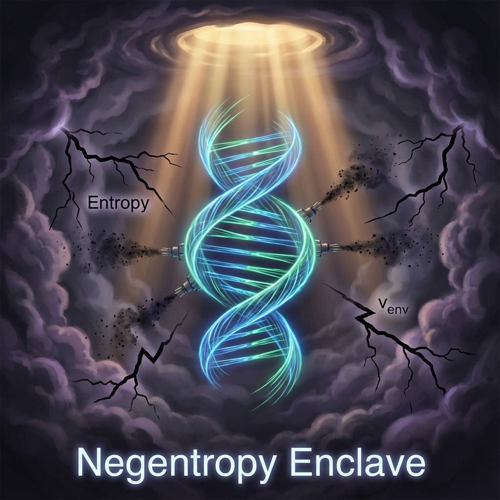

# 第10章 逆流的圆：生命 (The Counter-Flow Circle: Life)

在上一章中，我们目睹了热力学之箭的残酷统治。随着时间流逝，宇宙的总矢量似乎无可挽回地向着那个不可见的环境扇区 ($v_{env}$) 倾斜，有序的信息不断被"隐形税收"吞噬，万物终将归于热寂。

然而，在这个滑向深渊的宏大图景中，存在着一个令人震惊的异常。

在宇宙的一些角落——比如地球的表面——物质并没有顺从地崩解为尘埃。相反，它们自发地聚集、折叠，构建出了精妙绝伦的复杂结构。原子组成了分子，分子编织成螺旋的 DNA，最终诞生了能够思考宇宙本身的我们。

这种现象被称为 **生命 (Life)**。

本章将揭示生命的物理本质。在 **《矢量宇宙论》** 的框架下，生命不是奇迹，也不是对物理定律的违背。生命是一种能够主动操控 $c_{FS}$ 预算分配的特殊算法。它是宇宙在这条通往无序的单行道上，顽强建立起的一个个 **负熵飞地 (Negentropy Enclave)**。

## 10.1 负熵飞地 (The Negentropy Enclave)

> "生命之所以能活着，不是因为它逃避了税收，而是因为它找到了极其聪明的办法，让太阳替它买单。"

#### 逆流而上的反叛者

如果说热力学第二定律是宇宙的重力，将一切拉向无序的低谷；那么生命就是一种 **反重力** 的装置。

在几何上，一般的物理系统演化轨迹遵循着 $v_{int} \to v_{env}$ 的趋势：结构崩解，相干性丧失，最终化为环境热噪。但生命体却展现出了截然相反的几何特征：它们能够长久地维持极高水平的 **$v_{int}$（内部结构复杂度）**，并强力压制 **$v_{env}$（自身熵增）** 的增长。

埃尔温·薛定谔在《生命是什么》中曾著名地断言：生物体通过"吸食负熵"为生。在我们的 FS 几何语言中，这句话可以被翻译得更加精确：

**生命是一套"预算清洗协议"。**

它通过持续不断地从外部摄取低熵能源（如阳光、食物），将这些高质量的 $c_{FS}$ 预算注入自身的循环，同时将产生的废料（高熵热能）泵出体外。它在局部建立了一个 **"负熵飞地"**，在这个飞地里，矢量的演化方向被强行逆转，从无序流向了有序。

#### 飞地的运作机制：泵与阀门

这个飞地是如何运作的？它是如何欺骗热力学之箭的？

让我们追踪一下能量在生命体内的 **交易流程**：

1.  **输入端：高质量预算的注入**

    植物接收光子，动物摄取糖分。这些输入源携带了巨大的、低熵的 $v_{ext}$ 或 $v_{int}$（化学键能）。这相当于生命体获得了一笔巨额的"外汇注资"。

2.  **处理端：结构维持 ($v_{int}$)**

    生命体利用这笔注资，驱动体内的分子马达、离子泵和酶。这些微观机器的工作，本质上是在进行 **纠错 (Error Correction)**。

    它们修补断裂的键，泵回逃逸的离子，重置混乱的神经元。在几何上，这是在强行将那些试图偏转到 $v_{env}$ 扇区的矢量投影，重新拉回到 $v_{int}$ 扇区。生命之所以能保持形态，是因为它每时每刻都在进行着这种 **几何矫正**。

3.  **输出端：税收的转嫁 ($v_{env}$)**

    既然"隐形税收"不可避免，生命体选择了一个狡猾的策略：**转嫁税负**。

    生命体将维持秩序所产生的所有混乱（热量、排泄物），打包排入环境。

    $$v_{env}^{system} \downarrow, \quad v_{env}^{surroundings} \uparrow \uparrow$$

    对于宇宙整体而言，总熵确实增加了（甚至增加得更快），但对于生命体这个局部飞地而言，它成功地保持了纯净。

#### 遗传信息：对抗遗忘的锚点

要维持这个逆流的过程，仅有能量是不够的。如果只有能量而没有指令，系统只会发热（像火），而不会进化。

生命必须知道 **"原本的圆是什么样子的"**，才能将偏转的矢量拉回来。

这就需要 **信息**。

**DNA (脱氧核糖核酸)** 在 FS 宇宙论中扮演了至关重要的角色：它是 **全息图的本地备份**。

* 它是从过去几十亿年的演化中筛选出来的、关于如何最高效利用 $c_{FS}$ 预算的 **指令集**。

* 它像是一个 **锚点 (Anchor)**，深深地扎在内部扇区 $v_{int}$ 中。无论环境的风暴 ($v_{env}$) 如何冲刷，只要这个锚点存在，生命体就能根据图纸，一次又一次地重构出有序的几何结构。

#### 结论：算法的胜利

因此，生命并不是一种特殊的物质，并没有什么神秘的"活力素"。生命是一种 **特殊的几何动力学状态**。

它是宇宙中出现的一种 **自我指涉的算法**。它意识到如果不做功，自己就会滑向 $v_{env}$ 的深渊。于是，它进化出了捕获外部预算、转嫁内部熵增的能力。

在这个意义上，每一个细胞都是一座抵抗热寂的堡垒。在这座堡垒里，那支原本射向死亡的时间之箭，被奇迹般地折断，并弯曲成了一个生生不息的圆环。这就是 **"逆流的圆"**。

