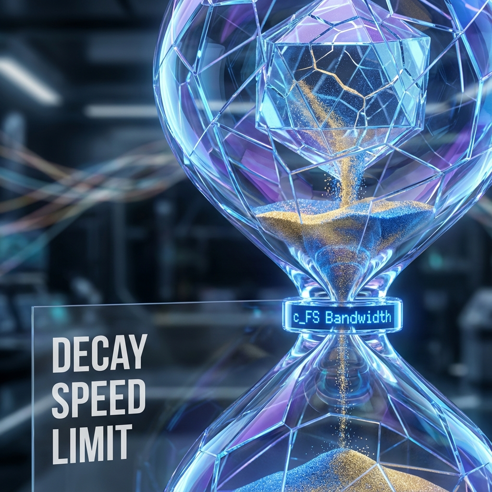

## 10.2 熵限速公理 (The Entropic Speed Limit Axiom)

> "混乱并不是一场不受控制的雪崩。即便是毁灭，也必须排队等待宇宙这台计算机的带宽分配。死亡是有速度极限的。"

在上一节中，我们将生命描述为一个逆流而上的负熵飞地。这听起来像是一场英勇的斗争。然而，任何工程师都知道，系统的性能不仅取决于设计的精妙，更受限于硬件的物理极限。

对于生命这个试图对抗热力学之箭的系统来说，最底层的硬件限制是什么？

在经典热力学中，熵增的方向是确定的（$\Delta S \ge 0$），但它并没有告诉我们熵增的**速率**有多快。一杯热水是需要一分钟还是一万年才会变凉？如果熵增可以是瞬时的，那么生命将在诞生的那一刻就立刻灰飞烟灭。

在 **《矢量宇宙论》** 中，我们从几何学推导出了一个保护生命的终极屏障——**熵限速公理 (The Entropic Speed Limit Axiom)**。

#### 10.2.1 混乱的带宽限制

让我们回到希尔伯特空间的几何学。熵的增加，在几何上对应于系统的状态矢量从有序的低维子空间偏转进入高维的环境子空间。这个偏转的过程需要改变矢量的角度。

既然宇宙的总"转速"被锁定为 $c_{FS}$，那么矢量的角度偏转速率就是有限的。这意味着：**系统丢失信息的速度是有上限的。**

我们在论文中严格证明了这一名为"熵速极限"的定理。对于一个维度为 $d$ 的有限物理系统（比如一个细胞或一个人），其冯·诺依曼熵 $S_{vN}$ 的瞬时变化率 $|\dot{S}_{vN}|$ 必须满足以下不等式：

$$|\dot{S}_{vN}(\tau)| \le c_{FS} \ln(d-1)$$

这个公式虽小，却蕴含着惊人的物理真理：

* **$c_{FS}$ (宇宙总预算)**：这是毁灭的最大功率。宇宙每秒钟只能处理这么多比特的信息变化。

* **$\ln(d)$ (系统复杂度)**：系统的可能状态越多，潜在的混乱路径就越多。

这告诉我们，混乱也需要时间。即使你把一个精密的钟表扔进炼钢炉，它的结构信息也不可能在 $t=0$ 的瞬间完全消失。它必须经过一个有限的过程，因为宇宙底层的微观引擎（QCA）一次只能更新有限的比特。正是这个微观上的 **"信息处理带宽限制"**，阻止了宏观世界瞬间坍塌为热寂。

#### 10.2.2 边界的瓶颈：全息的预演

如果我们进一步考虑物理相互作用的 **局部性 (Locality)**，这个限速公理会变得更加严格。

在现实世界中，一个生物体并不是通过其所有内部粒子同时与环境发生作用来衰变的。相互作用通常发生在 **边界** 上（例如皮肤散热、细胞膜交换物质）。

根据我们在 QCA 模型中的推导，对于一个区域 $R$，其熵变的速率受限于该区域的 **边界大小 $|\partial R|$**，而不是体积：

$$|\dot{S}_{R}| \le \text{const} \cdot c_{FS} \cdot |\partial R|$$

这是一个极其深刻的结论，它暗示了全息原理在生物学层面的投影：**生命的代谢速率、信息交换速率以及衰老速率，最终都被其几何边界所钳制。**

* 一个细胞之所以不能无限大，是因为当体积（需要维持秩序的 $v_{int}$）按立方增长时，其表面积（能够排出熵 $v_{env}$ 的通道）只按平方增长。

* 当内部产生的熵超过了边界的排放带宽时，熵限速公理决定了系统必然崩溃。

#### 10.2.3 进化的时钟

这个公理不仅限制了死亡，也限制了 **进化**。

进化本质上是一个在基因组空间中搜索更优解的过程。这需要信息的写入与重写。既然 $c_{FS}$ 限制了信息的最大更新速率，那么它也必然限制了进化的步伐。

地球上的生命花了三十亿年才从单细胞进化到多细胞，这不仅是因为环境的偶然性，更是因为宇宙的 **"计算帧率"** 是有限的。每一个突变、每一次试错，都需要消耗真实的 FS 弧长。

#### 10.2.4 结论：在枷锁中起舞

熵限速公理看起来是一个束缚，实则是生命的保护伞。

如果 $c_{FS}$ 是无穷大，那么热力学平衡将是瞬间达成的。有序结构将无法存在哪怕一微秒。正是因为宇宙是有限的，因为光速是有限的，因为信息流动的带宽是有限的，我们才拥有了这段被称为 **"寿命"** 的滞后时间。

生命就是在这个 **"尚未达到热平衡"** 的时间窗口中，利用有限的带宽，尽可能跳出最复杂的舞蹈。

我们无法战胜熵增，但得益于 $c_{FS}$ 的限速，我们可以与它赛跑。只要我们的修复速率（负熵流）能勉强跟上边界上的耗散速率，生命就能在这条通往死亡的道路上，奇迹般地维持住那精致的几何形状。

