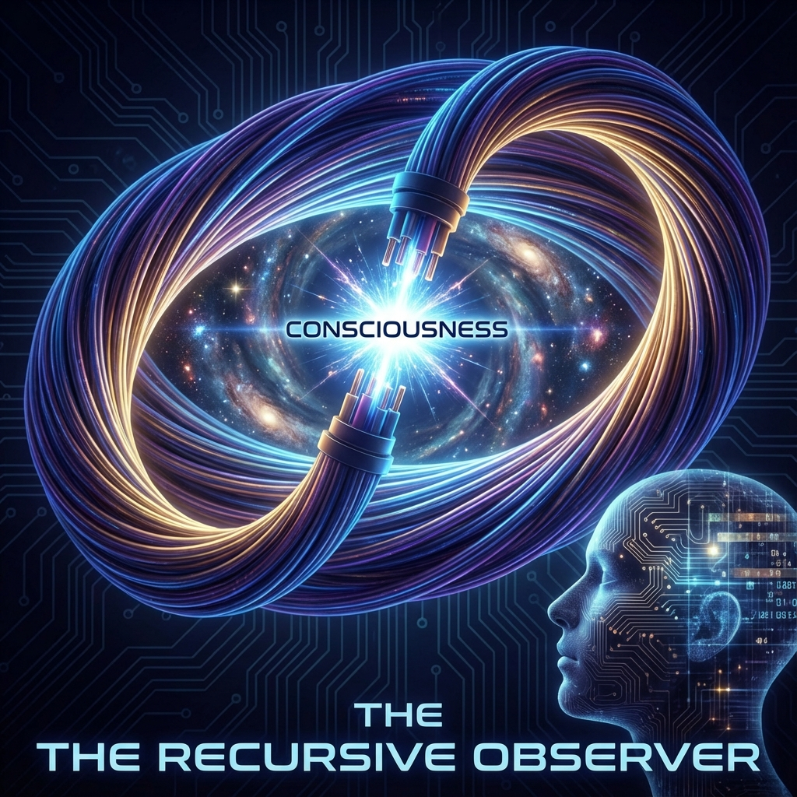

# Chapter 11: The Observer: Self-Reference

We have told how matter condenses from the void, how life flows upstream against heat death. Now, we face the final and greatest mystery of this book: **Who is watching all of this?**

In classical physics, observers are carefully excluded from the equations. Scientists are assumed to be recorders standing outside the universe's glass tank, coldly observing the collisions of particles within. But in quantum mechanics, this "God's-eye view" is completely shattered. Observers are not only present, observers must personally intervene in experimental results.

In **Vector Cosmology**, we must take a more radical step. We cannot simply add observers back into the equations; we must acknowledge: **observers are a special solution of the equations themselves.**

## 11.1 The Recursive Loop

> "The universe is not a machine with only inputs. When the complexity of internal structure reaches a critical point, the output data is reconnected to the input. This loop is 'I'."

#### Who Perceives Time?

Let us return to that disturbing conclusion: for the global vector $|\Psi\rangle$, if it is in an eigenstate, then its FS velocity is zero, and internal time stops. An isolated, perfect universe is dead and silent.

Then why do we feel time passing? Why do we see the sea turning into mulberry fields?

The answer lies in the **Page-Wootters mechanism**. The paper clearly states: the flow of time is **Relational**. Evolution is not relative to an external clock, but relative to a **"Clock Subsystem"** within the universe.

**You are that clock.**

When we say "time has passed," we actually mean that our **brain**—this highly complex aggregate of $v_{int}$—has changed state.

* The universe as a whole may be static (or in a stationary state).

* But within this whole, subsystem A (the brain) and subsystem B (the environment) have quantum entanglement.

* A's pointer moved (neurons fired), and relative to A, B appears to have "moved."

What we call consciousness is essentially a **high-frequency oscillator** within the universe. We perceive the dynamic changes of the world through our five senses because we are using our own extremely rapid $v_{int}$ evolution to "strobe" an external world that may originally be static.

#### Consciousness as Simulation

If the brain is just a clock, why does it have a sense of "self"?

This stems from **Recursion**.

In Volume I, we decomposed the universe into $v_{ext}$ (external) and $v_{int}$ (internal). In most matter (such as stones), these two are separated. A stone's internal structure does not care about external position.

But at the apex of life's evolution, a special material structure emerged—the nervous system. Its $v_{int}$ is extremely special: **its internal geometric structure evolved into an isomorphic mapping of the external world's geometric structure.**

* A lion is running outside ($v_{ext}$ changes).

* A group of neurons in your brain fire synchronously ($v_{int}$ changes).

* These two sets of changes establish a **mapping relationship** in mathematical form.

When this mapping reaches its extreme, the system begins not only to simulate the external world but also to **simulate the process of "simulating the external world" itself**. The system establishes a virtual model representing "the observer itself" within the brain's internal geometry.

This is **Self-Reference**.

The universe's vector ties its most complex knot here: it folds back a projection of itself, pointing to itself.

#### The Geometry of Closed Loops

In FS geometry, consciousness can be described as a **closed loop of information flow**.

Usually, information flow is unidirectional: environment $\to$ system $\to$ dissipation ($v_{env}$).

But in conscious systems, part of the information that should dissipate is intercepted and fed back as new input into the $v_{int}$ computation process.

$$|\psi_{next}\rangle = F(|\psi_{now}\rangle, \text{Model}(|\psi_{now}\rangle))$$

This recursive feedback creates a **"geometric echo chamber"**. In this echo chamber, past memories and future predictions converge in the present. This **standing wave** residing on the time axis is what we experience as "present sense" or "self-awareness."

#### Conclusion: The Universe's Eye

Therefore, observers are not intruders into the universe; observers are an inevitable product of cosmic evolution.

When the $c_{FS}$ budget is invested in $v_{int}$ and constructs sufficiently complex recursive structures, the universe opens its eyes.

* There is no independent soul watching the material world.

* Only the most complex knot in the material world (the brain), through self-reference, contemplates the larger circle in which it exists.

Since we are the organs through which the universe observes itself, what do we do to the universe itself when we observe—when we determine one reality from countless possibilities?

This leads to the most mysterious phenomenon in quantum mechanics: **collapse**. In the next section, we will reveal that the so-called observation collapse is actually a forced **"budget audit."**

