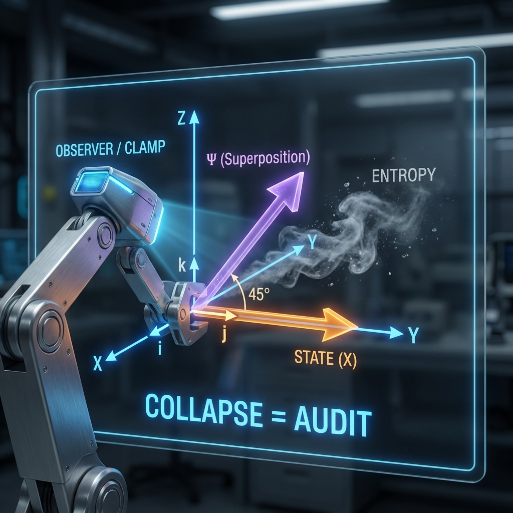

## 11.2 坍缩与审计 (Collapse and Audit)

> "Schrödinger's cat is not both dead and alive. It is merely in an unsettled financial statement. When you open the box, you are not looking at it; you are forcing the universe to conduct an immediate audit of this ambiguous account."

量子力学中最令人困惑的现象莫过于 **波函数坍缩 (Wave Function Collapse)**。为什么一个微观粒子可以同时处于多处（叠加态），但当我们看它一眼时，它就必须"选"一个位置固定下来？

在哥本哈根诠释中，这被视为一种人为的断言。但在 **《矢量宇宙论》** 的经济学视角下，测量没有任何神秘色彩。测量是一场 **预算审计 (Budget Audit)**。

观察者，就是那个拿着计算器、铁面无私的宇宙审计员。

#### 11.2.1 叠加态：预算的风险对冲

首先，我们需要理解什么是 **叠加态**。

在射影希尔伯特空间的几何中，叠加态 $|\psi\rangle = \alpha|A\rangle + \beta|B\rangle$ 并不是"同时处于 A 和 B"，它只是一个 **指向中间方向的矢量**。

想象你在走路。

* 向北走是状态 $|A\rangle$。

* 向东走是状态 $|B\rangle$。

* 向东北方向走就是叠加态。

对于那个唯一的全局矢量 $|\Psi\rangle$ 来说，它只是在 $c_{FS}$ 的驱动下，沿着某个特定的角度（比如东北方）平稳地旋转。它并没有感到任何"精神分裂"。它只是将它的 $c_{FS}$ 预算同时投资到了"向北"和"向东"两个分量上。

在金融隐喻中，这就是 **风险对冲 (Hedging)**。宇宙并没有把所有资本押注在一种现实上，而是构建了一个投资组合。只要没有外部干扰，这个组合就能一直维持下去，这就是量子相干性。

#### 11.2.2 测量的本质：强制平仓

那么，什么是 **测量**？

测量就是这个处于"东北方向"的微观矢量，突然撞上了一个巨大的、宏观的物体（观察者或仪器）。

宏观物体的特征是什么？它拥有巨大的 $v_{int}$（质量/结构）和极高的 $v_{env}$（环境纠缠）。它是一个极其沉重、极其迟钝的系统，它早已在这个宇宙市场中选定了一套特定的记账基底（比如"位置基底"）。

当微观矢量与宏观审计员相遇时，发生了一次剧烈的 **相互作用交易**。

审计员（仪器）极其霸道，它不接受"东北方向"这种模糊的账目。它的逻辑门（指针）只能指向"北"或"东"。

于是，一场强制性的 **平仓 (Liquidation)** 发生了：

为了与宏观仪器建立关联（产生读数），微观矢量必须迅速旋转，使其方向与仪器的基底对齐。

* 它要么被迫交出所有"向东"的份额，把所有预算集中到"向北"（坍缩为 A）。

* 要么被迫交出所有"向北"的份额，把所有预算集中到"向东"（坍缩为 B）。

这个过程极为迅速，因为宏观仪器背后的 $v_{env}$ 通道无比巨大，能瞬间吸收掉旋转过程中产生的多余相干性（即"错误的"方向分量）。

#### 11.2.3 审计的代价：历史的诞生

这就是坍缩的几何真相：**坍缩是矢量在强相互作用下发生的急剧正交旋转。**

在这个过程中，并没有新的物理定律介入，依然遵循 $v_{ext}^2 + v_{int}^2 + v_{env}^2 = c_{FS}^2$。

只不过，在测量的一瞬间，巨大的 $c_{FS}$ 流量被导向了 **环境扇区 ($v_{env}$)**。那些未被选中的可能性（比如"猫死"的那部分波函数），并没有凭空消失，它们被转化为了环境中的热噪（熵）。

**观察者做了什么？**

观察者通过测量，强制宇宙从无数种"可能发生的未来"（叠加态），结算出了一个 **"已经发生的历史"**（本征态）。

* 在测量之前，现实是流动的、模糊的预算分布。

* 在测量之后，现实是固定的、确凿的资产负债表。

#### 11.2.4 我们是宇宙的定锚点

由此，我们得出了一个关于意识和观察者的深刻结论：**我们不是被动的观众，我们要为现实的坚固性负责。**

如果没有观察者（或者说没有宏观耗散系统），宇宙将永远处于一团概率云的迷雾中，没有确定的形状，没有确定的历史。是我们的观测行为——这每一次残酷的"预算审计"——将那个原本在希尔伯特空间中自由旋转的矢量，一次又一次地钉死在具体的现实基底上。

我们看一眼月亮，月亮才真的在那里。这不是唯心主义，这是 **量子审计学**。因为我们的"看"，本质上是无数光子与视网膜发生的不可逆交易，这笔交易强迫光子的波函数从弥散的空间分布瞬间坍缩为一个确定的像素点。

宇宙通过进化出观察者，终于获得了一种能力：它能够将自己那疯狂的、液态的量子潜能，铸造成坚硬的、可被记录的 **历史**。

至此，全书的物理拼图已经完成。我们解释了时空，解释了物质，解释了生命，也解释了我们自己。现在，只剩下最后一步——在这宏大的旅程终点，回望那个起点。

下一章，即是全书的终章。我们将放下所有的公式，去迎接那个最终的哲学归宿：**归一**。

