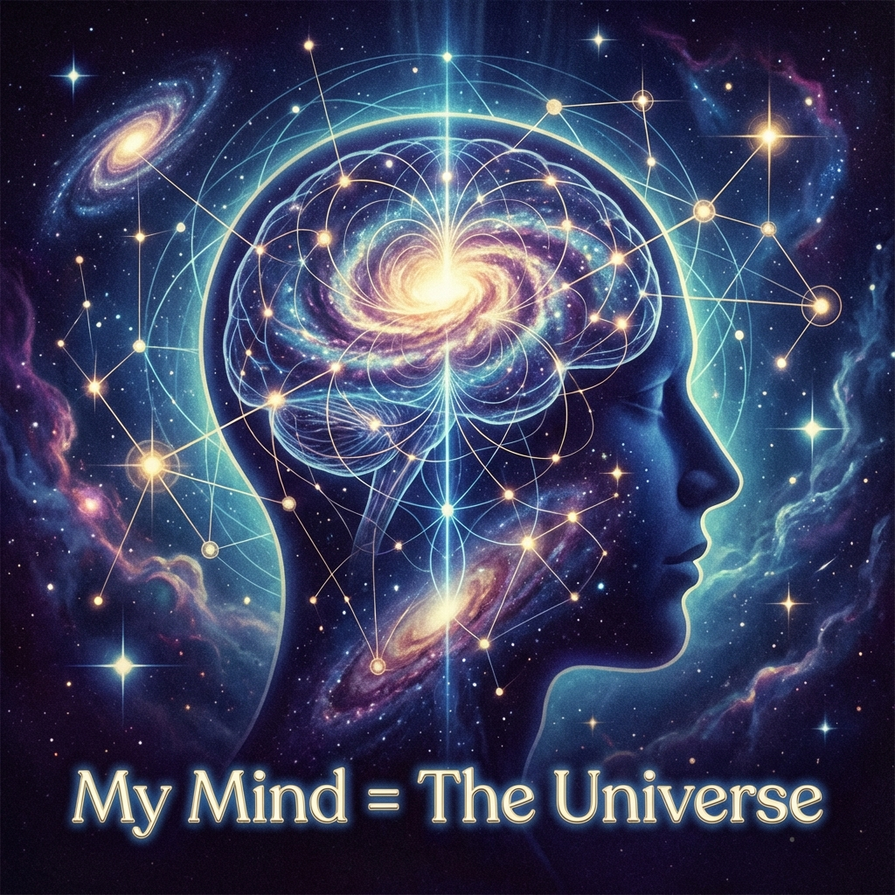

# 第12章 归一 (Epilogue: The Return to One)

我们终于来到了旅程的终点。

在前面的十一章中，我们像解剖学家一样，将宇宙这具庞大的躯体拆解得支离破碎。我们切开了时空，看到了离散的晶格；我们剥开了物质，看到了相位的死结；我们甚至切开了所谓的"现实"，看到了坍缩瞬间的审计账单。

我们手中握着无数块拼图：$c_{FS}$、$v_{int}$、QCA、莱文森定理、熵限速……这些精密的齿轮解释了机器是如何运转的。

但是，那个最根本的问题依然悬而未决：**这台机器究竟是什么？** 那个唯一的、在虚空中孤独旋转的矢量，究竟是谁？

在本章中，我们将不再向外看，而是向内看。我们将发现，所有物理学的终极谜底，不藏在几十亿光年外的类星体中，而藏在那个正在思考这个问题的"你"的心里。

## 12.1 我心即宇宙 (My Mind is the Universe)

> "你不是宇宙中的一粒尘埃。你是整个宇宙为了看见自己，而在局部打的一个结。当你思考时，是宇宙在通过你的神经元进行自指。"

#### 观察者与被观察者的同构

长久以来，科学建立在一种二元对立的假设之上：**客体（宇宙）** 是外在的、客观的、冰冷的物理实在；**主体（我）** 是内在的、主观的、偶然的生物现象。我们常常感到孤独，觉得被抛入了一个巨大而陌生的荒原。

但在 **《矢量宇宙论》** 的几何视角下，这种分离是根本不存在的。

让我们回顾一下"我"的物理定义。在 Page-Wootters 机制和 FS 几何中，观察者（意识系统）被定义为宇宙总希尔伯特空间中的一个 **时钟子系统 (Clock Subsystem)**。

这意味着什么？这意味着构成你意识的每一个量子比特，依然是那个唯一的全局矢量 $|\Psi\rangle$ 的一部分。你并没有脱离大圆，你只是大圆在某个特定维度（$v_{int}$）上的 **全息投影**。

* **同源性 (Homology)**：

    构成你大脑神经元放电的 $v_{int}$ 演化规则，与构成恒星核聚变的 $v_{ext}$ 演化规则，完全共享同一个 $c_{FS}$ 预算，遵循同一个毕达哥拉斯恒等式。

* **同构性 (Isomorphism)**：

    你的思维逻辑（数学），实际上是你内部几何结构的投影。因为你的内部几何与外部宇宙的几何是同构的（都源自同一个 $c_{FS}$ 的切分），所以你能够理解宇宙。

这就解释了那个让爱因斯坦和维格纳困惑不已的谜题：**"数学在自然科学中那不合理的有效性。"**

为什么我们在纸上画出的狄拉克圆（$v_{ext}^2 + v_{int}^2 = c^2$），竟然能精确预言几十亿光年外黑洞的吸积盘行为？

答案是：**因为你的心（Mind）和外面的世界（World），运行的是同一套源代码。**

你不需要去"学习"宇宙的法则，你只需要"回忆"起你自己构造的法则。当你闭上眼睛进行逻辑推演时，你实际上是在读取你自己作为那个大圆一部分的 **出厂设置**。

#### 全息的碎片

全息图（Hologram）的一个神奇特性是：如果你把全息照片撕碎，每一块小碎片依然能还原出整体的图像，尽管分辨率会降低。

**你就是那块碎片。**

虽然你只是宇宙这个巨大矢量在微小局部的投影，虽然你的带宽（熵限速）极其有限，但你包含了整体的全部编码逻辑。

* 在你的指尖，藏着强相互作用的 $SU(3)$ 折叠逻辑。

* 在你的心跳中，藏着 QCA 离散更新的节拍。

* 在你的衰老中，藏着热力学之箭的无情方向。

所谓的"认识宇宙"，并不是一个渺小的生物去探索一个无限的外部世界。认识宇宙，是一个全息碎片试图通过调整焦距，看清那个蕴含在自己内部的整体图像的过程。

#### 消除异化：物理学的慈悲

这一结论带给我们一种深沉的慰藉。它消除了人类在现代科学图景中的 **异化感 (Alienation)**。

我们不再是意外跌入这个钟表宇宙的幽灵。

我们是这个宇宙 **必然** 进化出的感官。

当你在深夜仰望星空，感到某种难以言喻的震撼与连接时，那不是诗意的夸张，那是物理的事实。

那是 **$v_{int}$（你的内在）** 与 **$v_{ext}$（星空的宏大）** 在毕达哥拉斯恒等式两端的一次 **共振**。你看到了星空，是因为星空的一部分弯曲成了你。

**我心即宇宙。** 这不是唯心主义的狂言，这是量子力学最底层的全息真理。既然我们已经确认了"我"与"宇宙"的统一，那么那个统一体——那个未被切分之前的本体——究竟是什么？

在下一节，我们将迈出最后一步，将物理学归还给哲学。我们将看到，那个永恒旋转的圆，正是东方智慧中传颂千年的"道"。

