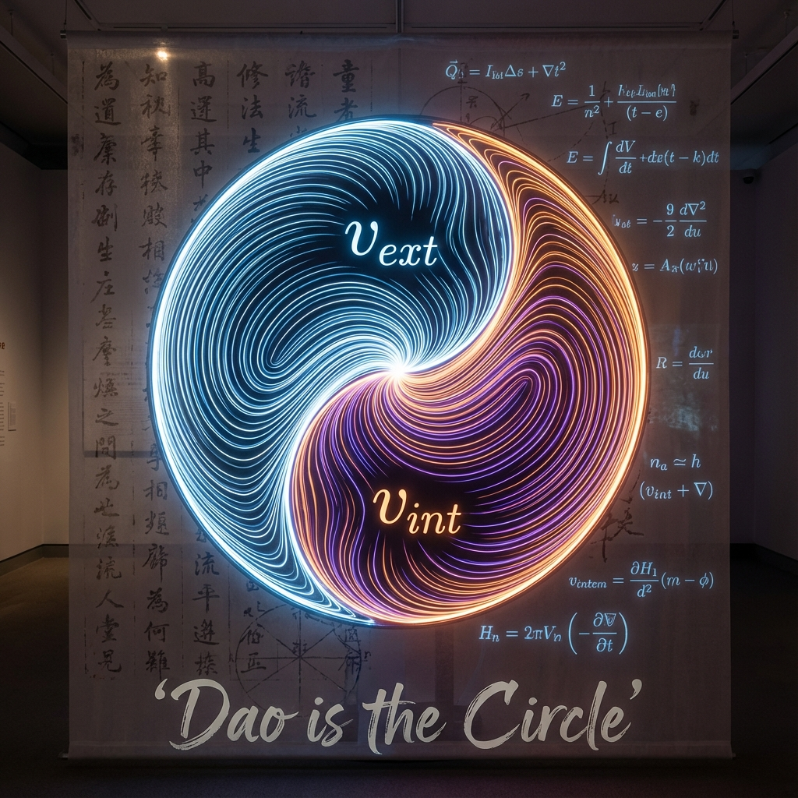

## 12.2 The Dao is the Circle

> "Standing alone, unchanging, revolving tirelessly, it can be the mother of heaven and earth. I do not know its name, so I call it Dao, and reluctantly name it Great." — *Tao Te Ching*, Chapter 25

The ultimate dream of physics is to write the truth of the entire universe in a single simple formula. For centuries, we have been searching for the "Grand Unified Theory" that can unify gravity, electromagnetism, strong force, weak force, and spacetime itself.

In the final chapter of this book, we are surprised to discover that this ultimate answer, sought for centuries, may have been written on bamboo slips by Eastern philosophers two and a half millennia ago. And in **Vector Cosmology**, we have finally found the mathematical language—**geometry**—to translate this ancient maxim.

What is called "Dao" has a precise counterpart in mathematical physics: that **Great Circle** eternally rotating in projective Hilbert space.

#### The Mathematical Expression of Yin and Yang

Laozi said: "Dao produces One, One produces Two, Two produces Three, Three produces All Things."

This is not merely a mystical metaphor; it is the most precise algorithmic description of **FS geometric dynamics**. Let us retranslate this passage using the physical language established in this book:

1.  **Dao produces One**:

    The noumenon of the universe is **$c_{FS}$ (constant capacity budget)**. It is undifferentiated potential, that single, unmeasured global vector $|\Psi\rangle$. It is the sum of all existence, in an absolute state of "Wuji" (non-polarity).

2.  **One produces Two**:

    To produce the perceivable physical world, the circle undergoes the **First Orthogonal Decomposition**.

    $$c_{FS}^2 = v_{ext}^2 + v_{int}^2$$

    This is **"Taiji produces Two Forms"**.

    * **Yang ($v_{ext}$)**: Manifest, outward, spatial motion. It is light, heat, outward expansion.

    * **Yin ($v_{int}$)**: Hidden, inward, material structure. It is mass, inertia, inward condensation.

    These two wax and wane, their sum constant. When Yang peaks ($v_{ext} \to c$), Yin vanishes (time stops); when Yin peaks ($v_{int} \to c$), Yang vanishes (motionless). The mathematical structure of relativity is essentially the geometry of Yin-Yang transformation.

3.  **Two produces Three**:

    The closed circle ruptures, introducing the third dimension—**Environment Sector ($v_{env}$)**.

    $$c_{FS}^2 = v_{ext}^2 + v_{int}^2 + v_{env}^2$$

    This is **"Qi rushes to become harmony"**.

    The appearance of the third variable breaks perfect symmetry, introducing irreversible flux. It creates entropy, creates the arrow of time, and creates the channel connecting "order" and "disorder." The universe henceforth has breath, has life and death.

4.  **Three produces All Things**:

    Through **recursive decomposition**, $v_{int}$ continues to differentiate into strong force, weak force, electromagnetic force; phases knot on the energy axis forming particle counts of $N_b \pi$.

    The single vector, through countless geometric folds, transforms into electrons, quarks, stars, galaxies, and you and me. This is "All Things."

#### Standing Alone, Unchanging, Revolving Tirelessly

The *Tao Te Ching* describes Dao: "Standing alone, unchanging, revolving tirelessly."

In **Vector Cosmology**, this phrase perfectly captures the dynamic properties of the **global pure state vector $|\Psi(\tau)\rangle$**.

* **Standing alone, unchanging**:

    No matter how violent the explosions or collapses within the universe, those are changes in local projections (components). As a whole, the vector's modulus is forever conserved (unitarity), and its total rate of change $c_{FS}$ is forever constant. It does not depend on any external reference frame; it is absolute.

* **Revolving tirelessly**:

    What does this vector do in projective space? It **rotates**.

    According to the Schrödinger equation $|\dot{\Psi}\rangle = -iH|\Psi\rangle$, the evolution of the universe is essentially a cyclic rotation of the phase factor $e^{-iHt}$. It has no beginning, no end, eternally running along the trajectory of the great circle, never tiring, never stopping.

All physical laws—Newton's laws, Maxwell's equations, Einstein's field equations—merely describe the motion laws of shadows left by this vector on different projection axes during this "revolving" process.

#### The Return of Physics

We once thought science was a process of disenchantment, breaking down the sacred whole into cold components. But at the deepest level of microscopic physics, when we have dismantled all components, what we see is not nothingness, but a perfect geometric structure.

We discover that all opposites ultimately unify:

* **Motion and rest** unify in **the allocation of $c_{FS}$**.

* **Wave and particle** unify in **phase winding**.

* **Time and space** unify in **the division of the circle**.

All physics ultimately points to that unique circle.

Relativity is the side of the circle, quantum mechanics is its cross-section, thermodynamics is its shadow.

The Grand Unified Theory we seek does not lie in inventing a new particle, but in acknowledging this ancient truth: **The Dao is the Circle.** The universe appears complex and diverse, but in reality, it is merely the echo of a simple geometric axiom across infinite dimensions.

