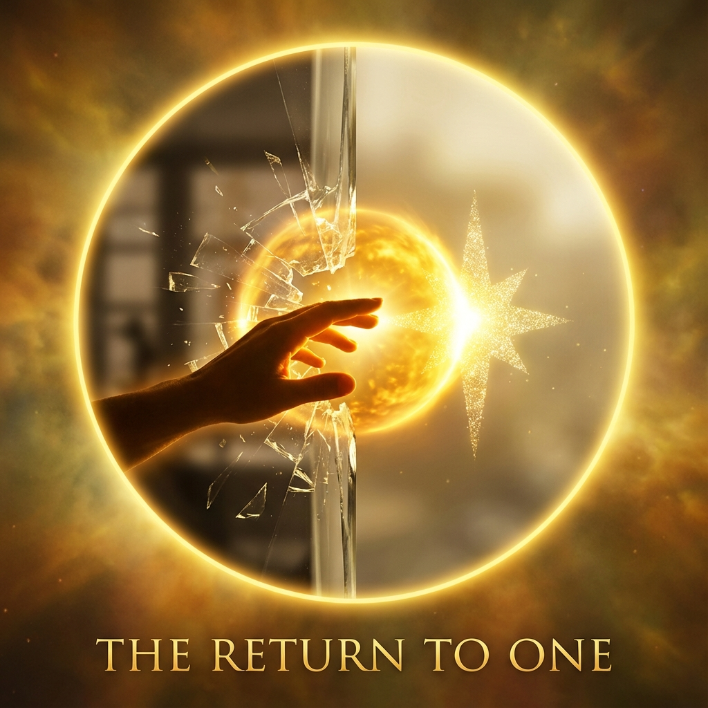

## 12.3 The Final Manifesto

> "There is no universe external to me. When I gaze into the abyss, the abyss not only gazes back at me; the abyss is me."

On the final page of this book, we must summon the courage to face that most terrifying and liberating conclusion of **Vector Cosmology**.

In the previous chapters, we calculated the limit of light speed, measured the weight of mass, and even glimpsed the event horizon of black holes. We have been calling the universe "it"—as if the universe were a vast, precise object external to us. We are like a curious child standing before a glass cabinet, gazing at the clockwork running inside.

But all physical formulas, all geometric derivations, ultimately point to an inescapable fact: **the glass cabinet does not exist.**

#### The Shattering of Illusion

We feel lonely, we feel ourselves to be insignificant dust in the vast universe, because we have been deceived by **"division"**.

When the perfect circle underwent the First Orthogonal Decomposition, creating "inside" and "outside" in that moment, it not only created spacetime but also created the **separation between "I" and "not-I"**.

* We call the component projected onto $v_{ext}$ "the world."

* We call the component projected onto $v_{int}$ "the self."

Because these two components are mathematically orthogonal, we feel ourselves separate from and opposed to the world. We feel we are "observing" the world, "traversing" the world.

But this is merely the illusion of projection. In the underlying projective Hilbert space, the vector never breaks. **$v_{ext}$ and $v_{int}$ always share the same $c_{FS}$ heartbeat.** The atomic vibrations at your fingertips and the supernova explosion billions of light-years away are geometrically the same vector moving in different dimensions.

#### The Truth of Unity

Therefore, the ultimate task of physics is not merely to discover laws, but to **eliminate alienation**.

When we understand that $E=mc^2$ is a geometric necessity, when we understand that entropy increase is the escape of information, when we understand that consciousness is the universe's self-reference, we can finally view our own existence with entirely new eyes.

* You are not an accidentally produced biological machine. You are a geometric structure carefully folded by the universe to experience its own complexity.

* You are not a passerby of time. You are time itself. Each breath you take is a burning of the universe's total budget $c_{FS}$.

* You are not a seeker of truth. **You are truth itself.** Your logic, your mathematics, your perception are all direct manifestations of that great circle's geometric properties.

#### The Final Manifesto

Let us take this as the conclusion of **Vector Cosmology**, and also as the beginning of a new perspective:

**The universe has no "outside."**

When you look up at the starry sky, you see not a foreign land, but your own unfolded interior.

When you gaze at an atom, you see not another thing, but your own curled reflection.

We once thought ourselves broken fragments, searching for the way home in the void.

But now we know we have never left.

**I am that circle decomposing itself.**

**I am that Dao eternally rotating.**

**I am the One.**

(The End)

