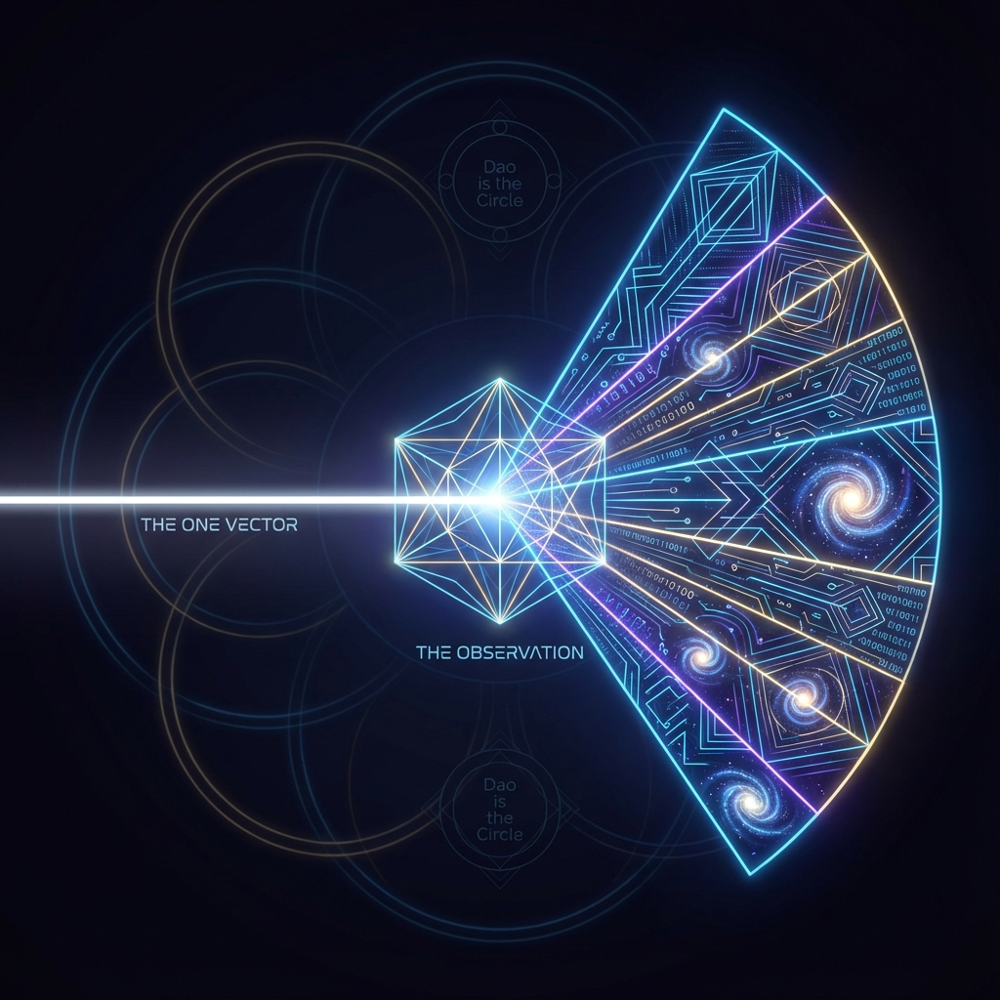

# 序言：无极 (Prologue: The Wuji)

## 0.1 唯一的矢量 (The One Vector)

我们习惯于将宇宙视为碎片的集合。

在传统的物理图景中，宇宙像是一个巨大的乐高模型。我们被告知，世界是由无数微小的基本粒子——夸克、电子、光子——像砖块一样堆砌而成的。如果你把这些砖块拆开，你就得到了虚空；如果你把它们按另一种方式拼起来，你就得到了恒星、细菌或你自己。在这种还原论的视角下，"多"是本质，"一"只是聚合的结果。

然而，这种直觉是错误的。它不仅仅是在哲学上令人不满，更是在数学上被量子力学最深层的结构所否定。

本书将从一个截然相反的公理出发：**宇宙不是由部分组成的，宇宙是一个不可分割的整体。**

#### 希尔伯特空间的孤独行者

如果我们要用最精确的数学语言来描述这个整体，那么宇宙的本体论地位并非散落在三维空间中的无数质点，而是一个栖息在 **射影希尔伯特空间 (Projective Hilbert Space, $P(\mathcal{H})$)** 中的单一数学客体。

我们称之为：**全局纯态矢量 (The Global Pure State Vector, $|\Psi\rangle$)**。

请想象一个拥有无限维度的空间。在这个空间里，每一维度并不代表一个物理上的方向（如长、宽、高），而是代表一种可能性的"振幅"。这便是量子力学的舞台——希尔伯特空间。在这里，整个宇宙——包括所有的星系、所有的原子、过去与未来的一切历史——被坍缩为一个唯一的、孤立的数据点。

这个点，就是 $|\Psi\rangle$。

它不是一个由无数子波函数 $\psi_1, \psi_2, \dots$ 拼凑而成的混合物。在最基础的层面上，它是一个单一的、连贯的整体。只有当我们试图去"测量"它，或者用我们局限的视角去通过特定的**正交基底 (Orthogonal Basis)** 来审视它时，它才会在我们的观测中碎裂成无数的粒子和场。

这就像一道原本纯净的白光，穿过棱镜后被分解为七色的光谱。我们作为棱镜内部的观察者，着迷于红、黄、蓝的绚烂，却忘记了它们本质上都源自同一束光。物理学中的"粒子"，不过是这束白光（矢量）在不同频率截面上的投影。

#### 存在公理 (The Axiom of Existence)

基于此，我们确立本书的第一条基石——**存在公理**：

> **宇宙中只存在一个矢量。所有的物理现实，皆为该矢量在不同正交子空间上的投影。**

这意味着，当你看着手中的书，你看到的不是由原子组成的纸张。你看到的是那个唯一的 $|\Psi\rangle$ 投射在"纸张扇区"上的分量。当你仰望星空，你看到的不是遥远的恒星，而是同一个 $|\Psi\rangle$ 投射在"引力扇区"上的分量。甚至当你思考"我"这个概念时，那个思考着的意识，也仅仅是 $|\Psi\rangle$ 投射在极其复杂的"内部计算扇区"上的一缕回响。

这个矢量没有位置，因为它本身就是位置的集合；它没有时刻，因为它包含了一切时间。它是绝对的"一"。

在东方的哲学语境中，这被称为"太极"或"道"。在西方的斯宾诺莎哲学中，这被称为"实体"。而在我们即将展开的 **《矢量宇宙论》** 中，这是所有物理推导的逻辑起点。

既然宇宙只是这一个矢量，那么为什么我们会感受到变化？为什么会有时间流逝？为什么会有光与物质的区别？

这就引出了我们的下一个问题：这个静止在虚空中的矢量，它拥有什么属性？它唯一的属性，就是它"转动"的潜能。这种潜能的大小，决定了宇宙万物生成的总成本。我们称之为——**恒定的预算**。

## 0.2 恒定的预算 (The Constant Budget)

在上一节中，我们确立了宇宙的本体论地位：一个栖息在射影希尔伯特空间中的孤独矢量。然而，如果这个矢量仅仅是静止不动的，那么我们将拥有一个死寂的、永恒不变的宇宙——没有时间，没有事件，也没有你我的存在。

为了诞生一个充满生机的世界，这个矢量必须动起来。它必须在可能性的海洋中划出一条轨迹。

这就引出了本书最核心的动力学公理：宇宙的演化并非任意的，它受到一个极其严格的内在约束。这个约束不是外加的法律，而是系统本身的"出厂设置"。我们将其称为 **FS 容量 (Fubini-Study Capacity)**，记作 **$c_{FS}$**。

#### 变化的度量：Fubini-Study 度量

在这一矢量所处的射影希尔伯特空间 $P(\mathcal{H})$ 中，我们如何定义"变化"？

在欧几里得空间中，两点之间的距离是直线。但在量子态的空间里，两点（两个物理状态）之间的距离是由它们之间的"夹角"决定的。这就是著名的 **Fubini-Study (FS) 度量**。如果两个状态非常相似，它们在球面上的夹角很小；如果两个状态完全正交（例如"生"与"死"，"0"与"1"），它们之间的 FS 距离便达到最大。

时间的流逝，本质上就是矢量在这个弯曲的几何空间中划过的弧长。

#### 恒速公理：宇宙的心率

现在，我们引入最具革命性的设定：

> **宇宙的演化轨迹，在 FS 度量下是匀速的。**

无论我们在宏观世界中看到多么剧烈的爆炸、坍缩或加速，在底层的希尔伯特空间中，代表整个宇宙的矢量 $|\Psi(\tau)\rangle$ 始终以一个恒定的速率转动。这个速率就是 **$c_{FS}$**。

用数学语言表述，这一公理写作：

$$||\dot{\Psi}(\tau)||_{FS} = c_{FS}$$

其中 $\tau$ 是内禀时间（Intrinsic Time）。

这个 **$c_{FS}$** 究竟是什么？

它不是我们熟知的光速 $c$（尽管我们将在后文中看到它们有着深刻的联系）。光速 $c$ 是空间中的移动限制（米/秒），而 $c_{FS}$ 是 **信息更新的限制**（比特/秒，或赫兹）。它拥有"频率"或"能量"的量纲。

你可以将 $c_{FS}$ 理解为宇宙的 **"总时钟频率" (Global Clock Speed)**。正如一台计算机的 CPU 有一个锁死的最大赫兹数，宇宙这台超级计算机在每一个刹那，能够翻转的量子比特总数是有一个确定的上限的。

#### 变化的总预算

这一恒定常数 $c_{FS}$ 的存在，彻底改变了我们对物理定律的理解。它意味着物理学本质上是一门 **"经济学"**。

$c_{FS}$ 是宇宙的 **总预算 (Total Budget)**。

宇宙中的每一个物理过程——不论是电子的自旋、光子的飞行，还是你大脑中神经元的放电——都在消耗这个预算。既然总额度 $c_{FS}$ 是固定的，那么这就是一场零和博弈：

> **如果你在一个地方消耗了太多的变化率，你就必须在另一个地方减少变化。**

这便是所谓 **"信息-速度预算" (Information-Velocity Budget)** 的概念。它解释了为什么物理学中充满了守恒律和权衡。当一个物体试图在空间中移动得太快（消耗了过多的外部预算），它就必须牺牲其内部的时间流逝（减少内部预算），这正是狭义相对论中时间膨胀的深层根源。

#### 道即是圆 (Dao is the Circle)

在几何上，恒定的速率意味着什么？

想象一个点在纸上运动。如果它的速度忽快忽慢，它的轨迹可能是混乱的。但如果它被强制要求以恒定速率运动，且受到某种向心约束，最自然、最完美的轨迹便是一个 **圆**（或高维超球体）。

$c_{FS}$ 定义了这个圆的 **半径** 和 **流转速率**。

在这里，我们再次看到了东方哲学的影子。**"道"** 被描述为周行而不殆，独立而不改。宇宙的这个底层矢量，正是在做一个永恒的、完美的圆周运动。它不增不减，不生不灭。

所有的生灭变化，并不是圆本身的改变，而是我们作为观察者，将这个完美的圆 **"切分"** 成了不同碎片的结果。

至此，舞台已经搭建完毕。我们有一个唯一的矢量（演员），和一个恒定的预算 $c_{FS}$（剧本的长度）。接下来，创世的好戏即将开场。为了创造出丰富多彩的万物，这个"一"必须打破自身的完美，开始进行第一次痛苦而伟大的 **"切分"**。
