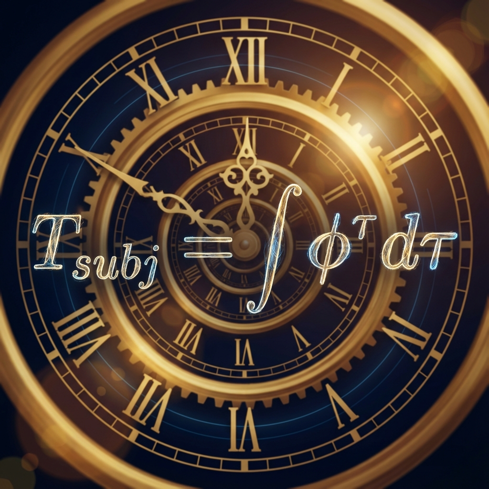

# 附录 A：黄金时间公式的数学推导

在《矢量宇宙论 V》的正文第 2 章中，我们提出了一个重新定义生命的公式：**时间不是线性的流逝，而是价值的对数**。

\[\tau = \pi \cdot \log_{\phi} \left( \frac{V}{V_0} \right)\]

本附录将提供这一公式的严格数学推导。我们将展示，这个公式并非一种文学修辞，而是从第四部书确立的 **光速演化方程** 中，结合 **信息价值论** 直接推导出的必然结果。它揭示了在指数膨胀的宇宙背景下，观察者如何通过创造价值来锚定自己的时间坐标。

## A.1 价值的物理定义

首先，我们必须在物理上定义什么是 **"价值" ($V$)**。

在 FS 几何的经济学中，一个系统的价值等同于它所包含的 **有效结构信息量**（即 $v_{int}$ 的复杂度）。这受限于该时刻宇宙的总带宽（光速/算力上限）。

根据全息原理，一个时刻 $\tau$ 的最大可能价值量 $V_{max}(\tau)$ 正比于该时刻的 **FS 容量 $c(\tau)$**（或其对应的相空间体积）：

\[V(\tau) \propto c(\tau)\]

这意味着：**你的价值，本质上是你所占据的宇宙算力份额。**

* **$V_0$ (初始价值)**：对应于初始时刻 $c_0$ 的信息量（如普朗克比特）。

* **$V(\tau)$ (当前价值)**：对应于系统在演化到 $\tau$ 时刻所累积的有序结构总量。

## A.2 逆向求解内禀时间

回顾我们在第四部书《光速的演化》中推导出的 **终极演化方程**：

\[c(\tau) = c_0 \cdot e^{\left( \frac{\ln \phi}{\pi} \right) \tau}\]

或者写作底数为 $\phi$ 的形式：

\[c(\tau) = c_0 \cdot \phi^{\frac{\tau}{\pi}}\]

这里：

* **$c_0$**：初始状态（种子/大爆炸）的价值基数。

* **$\pi$**：惯性周期（轮回的单位）。

* **$\phi$**：生长因子（黄金比例）。

现在，我们将 $V(\tau)$ 代入 $c(\tau)$ 的位置。我们假设一个"理想的观察者"能够充分利用时代的带宽，使其创造的价值与宇宙的膨胀同步（即 $V \approx c$）。

\[V = V_0 \cdot \phi^{\frac{\tau}{\pi}}\]

我们要解决的问题是：**为了达到价值 $V$，需要经历多少内禀时间 $\tau$？**

对等式两边进行变形求解 $\tau$：

1. **归一化**：

    \[\frac{V}{V_0} = \phi^{\frac{\tau}{\pi}}\]

2. **取对数**：

    对两边取以 $\phi$ 为底的对数：

    \[\log_{\phi} \left( \frac{V}{V_0} \right) = \frac{\tau}{\pi}\]

3. **移项**：

    \[\tau = \pi \cdot \log_{\phi} \left( \frac{V}{V_0} \right)\]

这就是 **黄金时间公式**。

## A.3 物理与人生的双重含义

这个公式揭示了 **时间膨胀** 的另一种形式——**价值膨胀**。它解释了为什么主观时间的流逝速度与个体的成就密度息息相关。

**1. 对数压缩效应**

公式表明 $\tau \propto \log V$。这意味着：

* **对于线性增长的人生**：如果你每天只增加固定的价值（$V \sim t$），那么你的内禀时间 $\tau \sim \ln t$。随着时间的推移，$\ln t$ 的增长率越来越慢。这意味着 **时间越过越快**。你觉得这一年过得像一天一样短，因为你在对数坐标上几乎没有移动。

* **对于指数增长的人生**：如果你能让你的价值（认知/爱/创造）随着时间呈指数增长（$V \sim \phi^t$），那么 $\tau \sim t$。你成功抵抗了时间的压缩。你主观感受到的生命长度，与物理时间保持了线性同步，甚至能够超越它。

**2. 轮回的刻度**

系数 $\pi$ 告诉我们，时间的最小计量单位不是秒，而是 **"周期"**。

只有当你完成了一个完整的 $\pi$ 循环（比如完成一个项目、经历一段完整的感情、彻悟一个道理），你才在时间轴上获得了一个有效的刻度。碎片化的时间在公式中会被抹平。

**结论：**

唯有保持 **$\phi$ (黄金比例)** 速度的指数级进化，才能在主观上"留住"时间。

这就是炼金术士的长生秘诀：**不要试图延长生命的长度（物理时间），要去增加生命的密度（价值对数）。**

