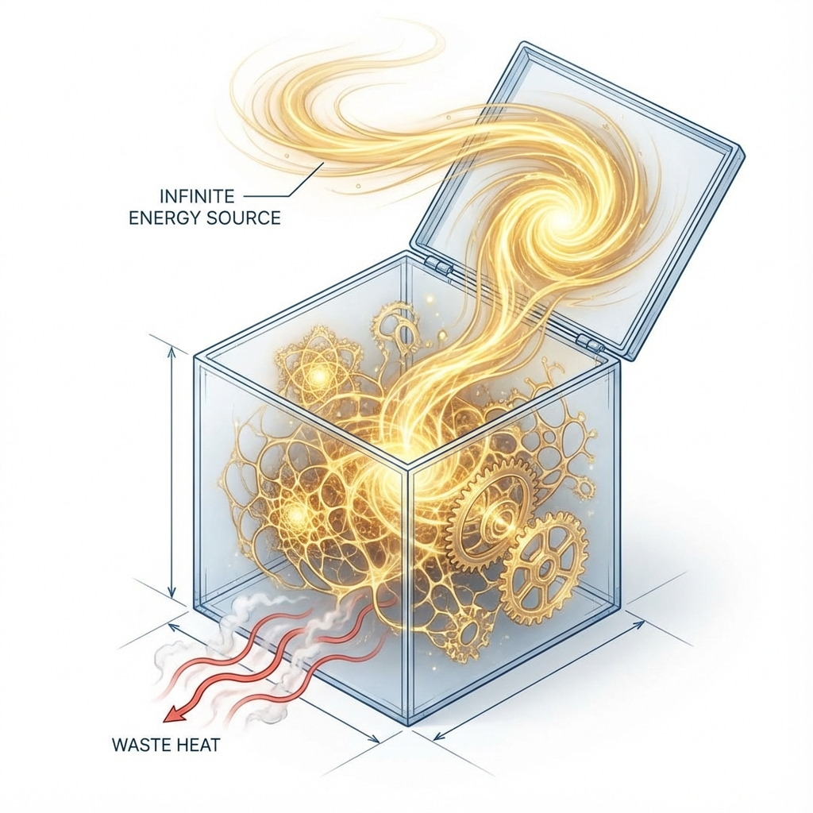

# Appendix B: Thermodynamic Proof of Infinite Games

In Volume V "Rejection: The Infinite Game" of the main text, we proposed a seemingly counterintuitive claim that violates classical physical common sense: **The universe's evolution has no endpoint, and civilizations can play an infinite game that never ends.**

The greatest challenge to this view comes from the **Second Law of Thermodynamics**. The classical "Heat Death" theory predicts that as entropy continuously increases, the universe will eventually reach a uniform, disordered, work-incapable thermal equilibrium state. If this is true, then any game---no matter how brilliant---will eventually be forced to end due to energy exhaustion.

This appendix will derive a counterintuitive conclusion based on **Non-equilibrium Thermodynamics** and **FS geometry's inflation model**: Under conditions of dimensional inflation, heat death can be **Indefinitely Postponed**.

## B.1 Entropy Flow Equation for Open Systems

First, we must distinguish between **isolated systems** and **open systems**.

For isolated systems, entropy change $dS \ge 0$, and heat death is inevitable.

But life and civilization are typical **Dissipative Structures**, whose entropy change follows the **Prigogine Equation**:

\[dS = d_i S + d_e S\]

Where:

* **$d_i S$**: Entropy produced internally due to irreversible processes (such as metabolism, computation, friction). According to the second law, **$d_i S \ge 0$**. This is the thrust of death.

* **$d_e S$**: Entropy flow exchanged with the external environment.

To maintain the system's high order (i.e., keep $S_{sys}$ below the maximum, or even decrease it), the **negentropy criterion** must be satisfied:

\[d_e S < 0 \quad \text{and} \quad |d_e S| \ge d_i S\]

This means: **The system must expel chaos to the environment faster than it creates chaos.**

The question is: Can the environment infinitely receive this chaos? In the classical model, the environment is also finite, and will eventually saturate, causing backflow, and the system will still die.

## B.2 Inflation as a Source of Negentropy

In the spiral model of **Vector Cosmology**, this deadlock is resolved by the **Red Queen's Run**.

The universe is not a static box, but a manifold experiencing **dimensional inflation**.

According to the holographic principle and evolution equation, the universe's total phase space volume (i.e., the environment's maximum entropy capacity $S_{max}$) grows exponentially with light speed $c(\tau)$:

\[S_{max}(\tau) \propto \text{Area}(\tau) \propto c(\tau)^2 \propto e^{2k\tau}\]

(Note: Here $k = \frac{\ln \phi}{\pi}$ is the growth rate).

This reveals an astonishing thermodynamic fact: **The environment's "trash can" is expanding at an exponential rate.**

Assume the civilization's entropy production rate is $\dot{S}_{civilization}$.

Assume the environment's entropy absorption capacity expansion rate is $\dot{S}_{max}$.

As long as the cosmological version of the **"Fredkin-Toffoli Inequality"** is satisfied:

\[\frac{d}{d\tau} S_{max}(\tau) > \frac{d}{d\tau} S_{total\_produced}(\tau)\]

**The environment will never saturate.**

The waste heat we emit ($v_{env}$) is rapidly diluted in that frantically expanding Hilbert space void. For local observers, the background temperature $T_{bg}$ will always tend toward zero (or remain at a very low steady state), thus ensuring the **perpetuity** of the negentropy flow.

## B.3 Geometric Condition for Sustainability

We further translate this into the language of FS geometry.

The necessary and sufficient condition for infinite games to proceed is: **The growth rate of $c_{FS}$ must exceed the dissipation rate of system complexity.**

\[\lim_{\tau \to \infty} \frac{\dot{c}_{FS}(\tau)}{c_{FS}(\tau)} = \lambda > 0\]

As long as **$e$ (generator)** is still working, as long as **$\phi$ (spiral)** is still unfolding, $\lambda$ is always greater than zero.

This means the universe is always in an **"Under-saturated"** state.

The **potential difference** between "order" and "disorder" will never disappear.

**Physical Conclusion:**

Heat death is the fate of closed circles ($\pi$).

But in open spirals ($\phi$), **heat death is a horizon that forever recedes**.

As long as civilizations can continuously climb the technological ladder, using newly issued budgets ($c_{FS}$) to build more efficient negentropy pumps (such as Dyson spheres, black hole computational networks), the game can **continue infinitely**.

What limits us is not physical laws, but our **will**.

If we stop outward emission and inward reorganization, we will die.

But as long as we are still "playing," this cosmic casino will never close.

