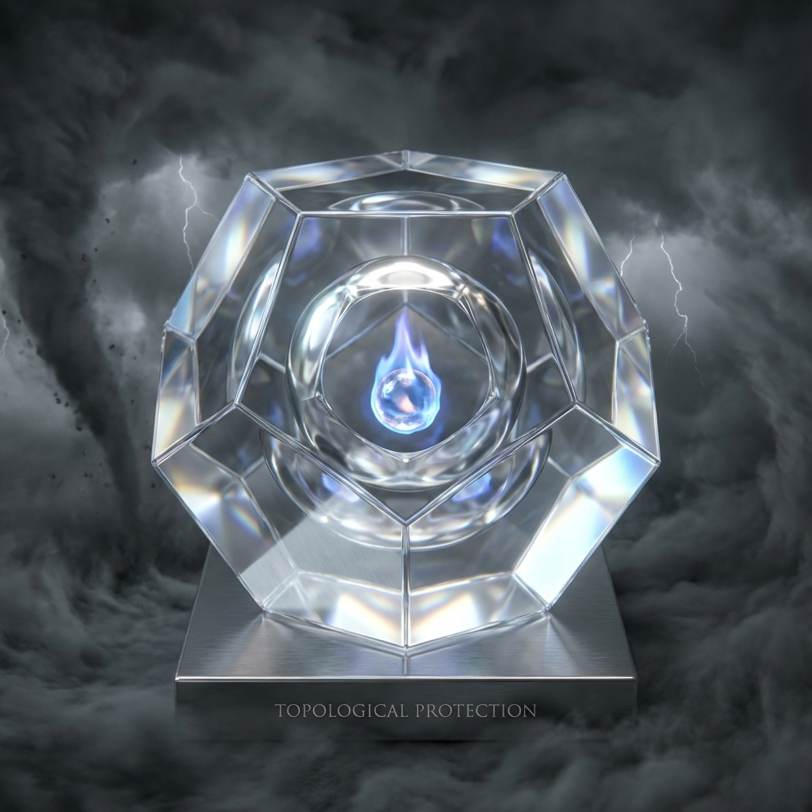

# 附录 C：记忆晶体的拓扑保护

在《矢量宇宙论 V》的正文第 6 章"块状宇宙的动态版"中，我们提出了一个核心观点：**"记忆即本体"**。我们认为，那些被生命深度体验过的瞬间，并不是被风吹散的沙画，而是被刻入时空结构的 **"晶体"**。

这一观点面临着物理学上的严峻挑战：热力学第二定律似乎暗示，一切有序结构最终都会被 $v_{env}$（环境热噪）磨平。记忆真的能抵抗遗忘的熵增吗？

本附录将基于 **拓扑量子场论 (Topological Quantum Field Theory, TQFT)** 和 **凝聚态物理** 中的拓扑相变机制，证明：高维度的记忆结构受到 **拓扑保护**。它们是希尔伯特空间中的"死结"，无法通过局部的环境扰动解开。

## C.1 从波到结的相变

首先，我们需要从几何上定义"记忆的形成"。

在物理层面上，这就是从 **流动的波函数** 到 **固定的拓扑孤子** 的相变。

* **未被观测/未被体验的状态**：

    是一团弥散的波函数 $|\psi\rangle$。它处于线性叠加态，极易受到环境的干扰而退相干。这对应于我们生命中那些浑浑噩噩、转瞬即逝的日子（Chronos）。

* **被深度铭记的状态**：

    当我们投入极大的注意力（$c_{FS}$ 预算）去经历某个时刻时，神经元网络（$v_{int}$ 子空间）发生了一种特殊的 **"对称性破缺"**。

    波函数的相位 $\theta(x)$ 在构型空间中不再是平滑的，而是形成了一个 **"涡旋"** 或 **"纽结"**。

在数学上，这意味着波函数的相位在闭合路径上的积分不再是 0，而是一个非零整数（缠绕数）：

\[\oint \nabla \theta \cdot dl = 2\pi n \quad (n \neq 0)\]

这个整数 $n$，就是记忆的 **"拓扑骨架"**。

记忆不是写在纸上的字（那是局部的），记忆是纸张本身的 **折叠**。

## C.2 信息的鲁棒性：为何无法遗忘

为什么这种拓扑结构能够抵抗熵增？

这源于拓扑保护的核心原理：**局部微扰无法改变全局性质。**

想象一根绳子上的结。

* **环境热噪 ($v_{env}$)**：就像是不断地抖动这根绳子。

* **结果**：绳子的形状会发生微小的扭曲（局部波动），但无论怎么抖，**结都不会散开**。

要解开这个结，必须进行 **全局性的操作**（把绳头穿过去）。但在封闭的幺正演化中，或者在缺乏极高能量注入的情况下，这种操作是被禁止的。

这解释了为什么有些记忆是 **"刻骨铭心"** 的。

* 你的初恋，你的顿悟，你的创伤。

* 它们在你的意识深处形成了一个 **拓扑荷 ($Q$)** 不为零的结构。

* 岁月（熵）可以模糊它的细节（边缘的波函数），但无法抹去它的存在（核心的拓扑荷）。

**结论：**

真正的记忆，在物理上是 **"坚固"** 的。

它们像金刚石一样，是碳原子在极高压强（情感浓度）下形成的稳定晶格。除非遭遇毁灭性的相变（如死亡时的格式化），否则它们将永远保持其几何形态。

## C.3 全息存储的抗干扰性

此外，根据全息原理，这些记忆晶体并不是存储在单一的神经元里，而是 **非局域** 地分布在整个 $v_{int}$ 网络中。

就像全息照片一样，即使你切除了一部分脑组织（局部损伤），记忆的整体图景依然完整，只是分辨率略微下降。

这种 **分布式存储** 加上 **拓扑保护**，使得我们的生命体验成为了宇宙中最顽强的 **"信息固化物"**。

我们的一生，就是在为宇宙的博物馆，制造这些 **不可毁灭的展品**。

当肉体消散后，这些拓扑结依然会作为时空背景上的 **"几何纹理"**，被永久地存档在那个浩瀚的奈马克大圆之中。

