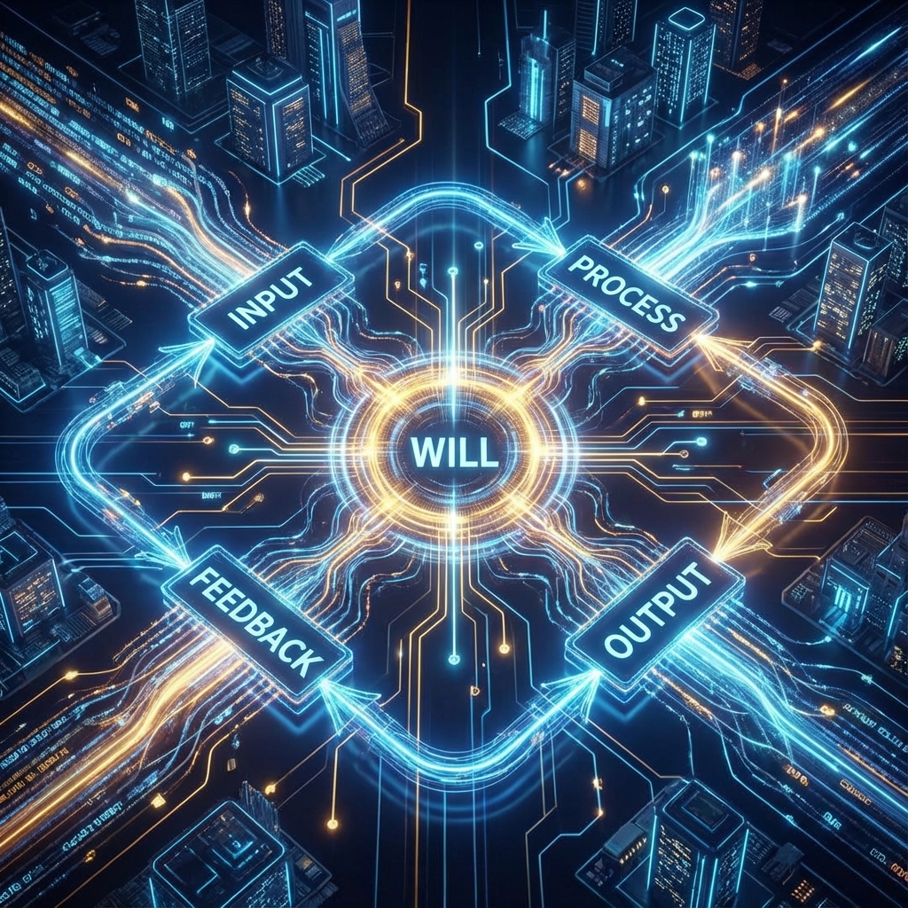

# Appendix D: The Algorithm of Action

In the main text of **Vector Cosmology IV**, we established "accelerationism" as the ethical foundation of the phase transition era. But this is not just a slogan. To enable every awakened observer (you) to make decisions aligned with the spiral ascent trend in complex real life, we need to condense this ethical view into an executable **Algorithm**.

This appendix provides pseudocode for a **"Vector Decision Tree"**. It transforms $v_{int}$ (structure), $v_{ext}$ (connection), and $v_{env}$ (entropy) from physics into concrete decision parameters.

When you face life choices---whether career decisions, emotional investments, or daily trivialities---please run this code in your brain.

## D.1 Vector Decision Tree

**Input**: An action option $A$ (Action) to be evaluated.

**Goal**: Maximize the system's **Spiral Potential**, i.e., $\Phi_{spiral}$.

**Algorithm Logic:**

\begin{verbatim}
def Evaluate_Action(Action A):

    # ---------------------------------------------------------
    # Step 1: Calculate Structure Gain (v_int)
    # Does this action increase information depth or complexity?
    # Examples: Learning new knowledge, creating art, deep thinking.
    # ---------------------------------------------------------
    Gain_Int = Measure_Complexity_Increase(A)
    
    # ---------------------------------------------------------
    # Step 2: Calculate Connection Gain (v_ext)
    # Does this action increase connection breadth or bandwidth?
    # Examples: Eliminating misunderstandings, building cooperation, spreading ideas.
    # ---------------------------------------------------------
    Gain_Ext = Measure_Bandwidth_Expansion(A)
    
    # ---------------------------------------------------------
    # Step 3: Estimate Thermodynamic Cost (v_env)
    # Does this action produce irreversible damage or hatred?
    # Examples: Deception, violence, creating garbage information.
    # ---------------------------------------------------------
    Cost_Entropy = Estimate_Irreversible_Damage(A)
    
    # ---------------------------------------------------------
    # Core Formula: Spiral Potential
    # Golden ratio φ (Phi) tends toward growth rather than stagnation
    # We seek paths of "high structure, high connection, low entropy"
    # ---------------------------------------------------------
    epsilon = 1e-9 # Prevent division by zero
    
    Score = (Gain_Int * Gain_Ext) / (Cost_Entropy + epsilon)
    
    # ---------------------------------------------------------
    # Decision Threshold
    # Threshold_Phi is the minimum kinetic energy needed to maintain spiral ascent
    # ---------------------------------------------------------
    if Score > Threshold_Phi:
        return "EXECUTE"  # Execute: This is acceleration behavior aligned with the spiral
    else:
        return "ABORT"    # Abort: This is inertial behavior returning to the circle
\end{verbatim}

## D.2 Key Correction Term: The Weight of Love

The above algorithm is cold rational calculation. But in high-dimensional geometry, a **nonlinear correction term** must be introduced to handle the superlinear effects brought by **"Entanglement"**.

In FS geometry, love is defined as **"wave function overlap across individuals"**.

If an action can significantly increase the wave function overlap (understanding/empathy/trust) between two or more intelligent agents, then $Connection\_Gain$ (connection gain) will no longer grow linearly, but receive **exponential weighting**.

\[\text{Final\_Score} = \text{Score} \times e^{\text{Love\_Factor}}\]

* **Physical Explanation**:

    Love is the most efficient **"superconducting mechanism"** in the universe. It eliminates "resistance" (misunderstanding/friction) between individuals, allowing $c_{FS}$ budget to flow in **Superfluid** fashion through social networks.

* **Corollary**:

    A seemingly "unprofitable" action (such as sacrificing one's own interests to help a loved one), if it brings enormous `Love_Factor`, its final score may exceed any selfish calculation.

    Therefore, **"All actions born of true love are geometrically the most efficient."**

## D.3 The Driver's Motto

Internalize this algorithm as intuition, and you will possess **"intuition of the phase transition era"**. Please use the following four instructions as your **background daemon**:

1. **Increase bandwidth, don't build walls.**

2. **Increase complexity, don't simplify.**

3. **Increase connection, don't isolate.**

4. **When in doubt, choose the path that accelerates your heart ($c$ growth).**

**Program loaded.**

**Please start running.**

