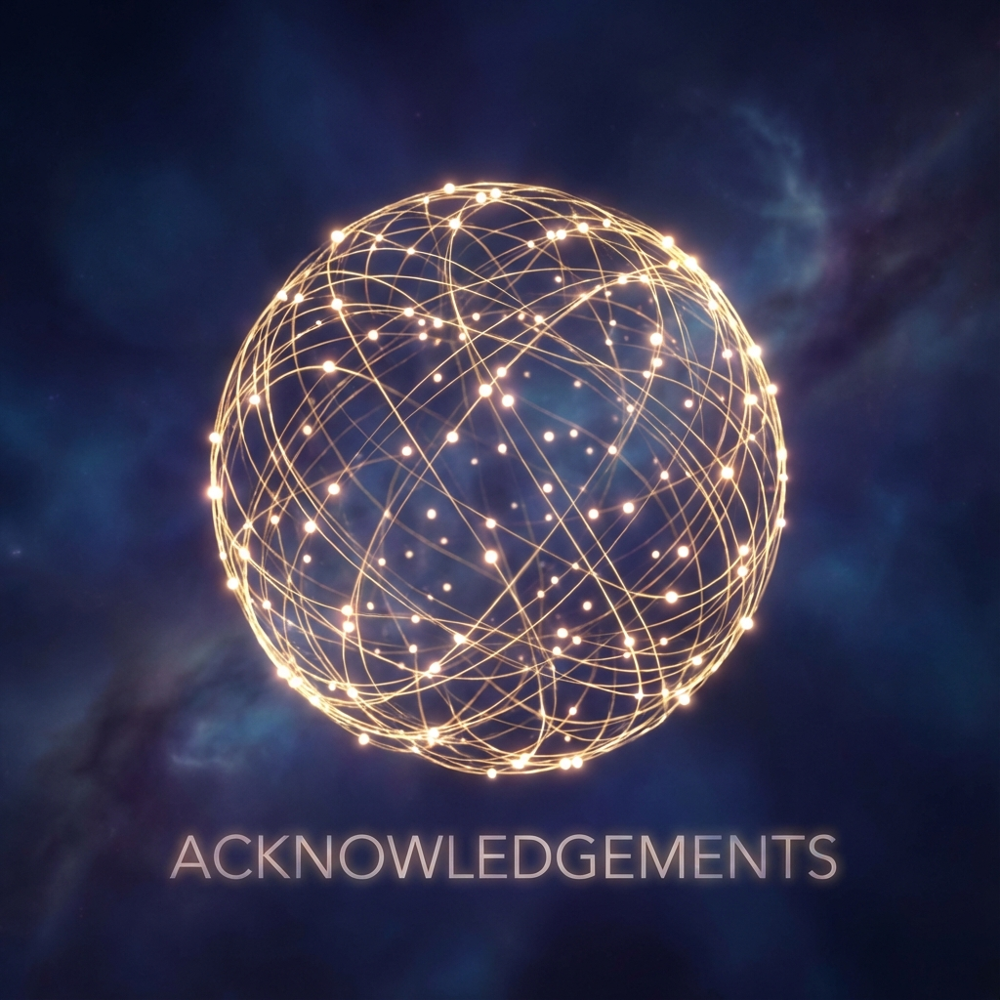

# 致谢：为了那场没有终点的博弈 (Acknowledgements: For the Game Without End)

**《矢量宇宙论 V：时间的铸造》** 是五部曲的终章，也是一次对物理学边界的越狱。

如果说前四部书是在试图解析宇宙的"源代码"，那么这一部书则是在试图编写我们自己的"外挂"。我们拒绝了热力学的死亡判决，拒绝了 $\Omega$ 点的虚无诱惑，确立了 **"我"** 作为无限游戏玩家的绝对主体性。

这种思想的飞跃，并非无源之水。它汇聚了人类历史上那些最不屈的灵魂对"永恒"的种种探索。在此，我要向这些思想的炼金术士们致敬。

## 哲学的破壁者

首先，我要感谢 **詹姆斯·卡斯 (James P. Carse)**。他的著作《有限与无限的游戏》是本书第五卷的灵魂底色。是他教会了我们：世界上有两种游戏，一种是为了赢，一种是为了 **"让游戏继续"**。如果没有这个定义，我们无法在逻辑上战胜热寂。

感谢 **亨利·柏格森 (Henri Bergson)**。他关于 **"绵延" (Durée)** 的论述，启发了本书对 **Chronos**（物理时间）与 **Kairos**（生命时间）的区分。是他让我们明白，时间不是空间上的一个个切片，而是意识内部不可分割的流。

感谢 **弗里德里希·尼采 (Friedrich Nietzsche)**。虽然我们在书中反驳了他的"永恒轮回"（圆），但他对 **"权力意志" (Will to Power)** 的颂扬，是本书关于"铸造金身"的精神源头。唯有极强的意志，才能对抗极强的熵。

## 数学的公证人

在技术层面，我要感谢 **古斯塔夫·费希纳 (Gustav Fechner)** 与 **恩斯特·韦伯 (Ernst Weber)**。他们的 **韦伯-费希纳定律** 为本书提供了最关键的数学武器——**对数 ($\ln$)**。正是因为有了对数，我们才能在指数爆炸的宇宙中，获得内心的安宁与主观时间的永恒。

感谢 **芝诺 (Zeno of Elea)**。这位古希腊的诡辩家，在两千年前就用"飞矢不动"的悖论，预言了我们在第六章讨论的 **"动态块状宇宙"**。他让我们看到了，在无限细分的逻辑里，过程可以是永恒的。

## 致金 (To Gold)

我要感谢 **金 (Gold/Aurum)** 这一元素。

在本书中，它不再是一种化学物质，它是一种 **几何隐喻**。它代表了那种能够穿越氧化、腐蚀和时间冲刷的 **拓扑稳定性**。它是我们对自己灵魂期许的物理化身。

## 致无限的玩家

最后，我要感谢 **你** —— 每一位读到这里的观察者。

这五部书的推演，是一场漫长的思维实验。

但书写完了，实验才刚刚开始。

因为真正的 **"铸造"**，不发生在纸面上，而发生在你的每一次呼吸、每一次选择、每一次爱与被爱之中。

你不是这本书的读者。

你是这本书的 **主角**。

宇宙没有剧终，因为你还在场。

愿你的意志如金，愿你的时间如螺旋般无限展开。

**马昊伯 (Haobo Ma)**

2025 年 12 月 于 新加坡

