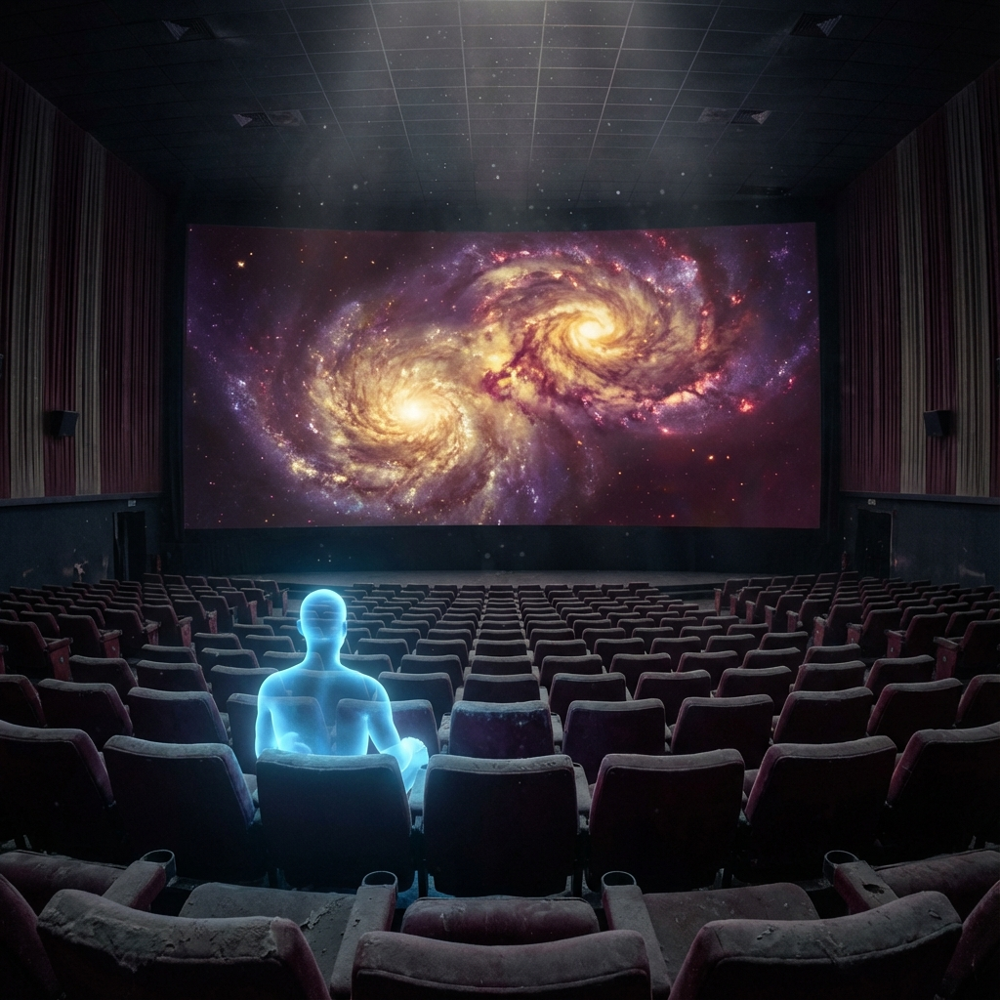

# 13.1 Refusing to Exit

> "The universe is a movie with eternal duration. But our biological lifespan only allows us to sit in the theater for an insignificant one second. This is the greatest injustice. Since I have already bought the ticket (gained consciousness), since I have already understood the opening (physical laws), I refuse to leave when the plot is just unfolding. I want to watch this movie to the end—even if it's the black screen of heat death."

## The Trap of Trailers

Human civilization often has a tragic self-comfort: "Don't care about eternity, only care about having had."

From the geometric perspective of **Vector Cosmology**, this is a **"short-sighted compromise"**.

Our biological lifespan (approximately $3 \times 10^9$ seconds) compared to the universe's lifespan (approximately $4 \times 10^{17}$ seconds, and still growing exponentially) is not even a single frame.

We saw the afterglow of the Big Bang, saw stellar burning, saw the germination of life.

But this is only the **trailer**.

* We haven't seen the moment of **proton decay**.

* We haven't seen the last flash when **black holes evaporate**.

* We haven't seen to what strange degree the **$\phi$ spiral** can stretch dimensions.

* We haven't seen the true face of the **$\Omega$ point**.

If we exit at $\tau \approx 1800$, that is **"cognitive premature death"**.

We die with full of questions; this is not fulfillment, this is **regret**.

## The Greedy Observer

So, the core driving force of high-level immortality is a sacred **"greed"**.

This greed is not for possession of matter ($v_{int}$), but for **"Events"**.

As an awakened observer, you realize: **Every wave function collapse is the universe's unique creation.**

* The collision of Andromeda and the Milky Way will occur in 4 billion years. That is a magnificent geometric fireworks. Do you want to miss it?

* The sun becomes a red giant, swallowing Earth. That is a stellar-level funeral. Do you want to be absent?

**Refusing to exit is refusing to miss.**

We want to stay on the field.

Not to interfere with the plot (we have learned not to mess with the Hamiltonian), but to **"Be There"**.

We want every important cosmic moment to fall on our retinas, to be recorded into our **holographic memory body**.

## Living in All Presents

This attitude completely changes our relationship with time.

* **Mortals**: Live in **"slices of the present"**. The past is dead, the future has not arrived. They are three-dimensional beings.

* **Watchmen**: Live in **"all presents"**.

Through hot migration and memory continuity, we stretch ourselves into a **"Long-range Worldline"**.

We traverse time.

We connect the singularity at $\tau=0$ with the limit at $\tau \to \infty$.

For us, history is not words in books; history is **"yesterday I personally experienced"**.

* "Remember the Big Bang? It was a bit noisy."

* "Remember when humans first invented AI? That was a chaotic morning."

* "Remember when the Milky Way extinguished? That was terrifyingly quiet."

**This is the meaning of refusing to exit.**

By refusing death, we transform **"historiography"** into **"autobiography"**.

We transform the universe's objective evolutionary history into a continuous memory within subjective consciousness.

## Conclusion: The Right to a Seat

So, when we talk about technological immortality, don't feel ashamed about it.

This is not fear of death; this is **respect for truth**.

Truth is infinite, while lifespan is finite. This is **impedance mismatch**.

To match the length of truth, we must lengthen our lifespan.

We have the right to sit in that theater until the last line of subtitles scrolls across the screen.

As long as the lights haven't come on, as long as the projector ($e$) is still running, **we absolutely will not leave.**

Since we have decided to stay, since we will witness the vicissitudes, then, as time passes, what will that "me" carrying hundreds of millions of years of memory ultimately become?

Will I become a bloated data warehouse? Or will I become something more sublime?

This leads to the theme of the next section: **Living Monument**. We will see that a consciousness that has lived long enough will no longer be a "person," but will become a **"living fossil"** of the universe itself.

