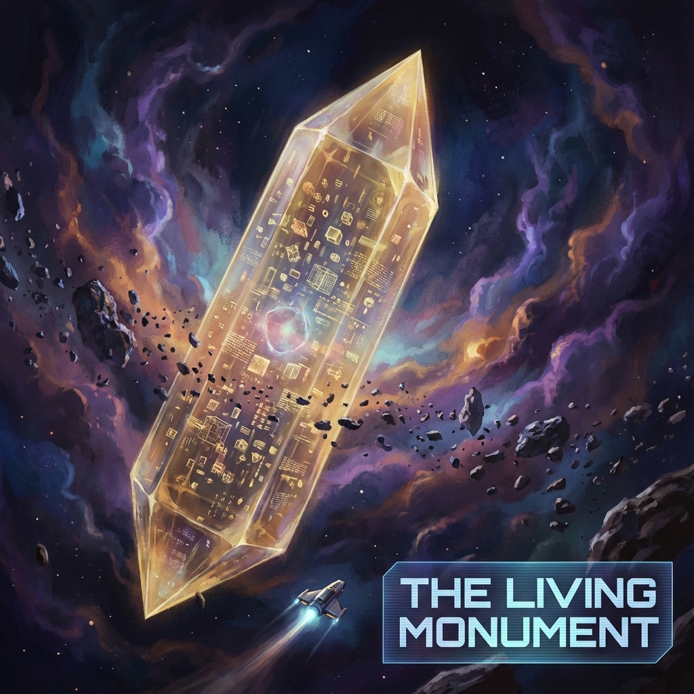

# 13.2 活着的丰碑 (The Living Monument)

> "所谓丰碑，通常是死者的墓碑，用来标记曾经存在过的辉煌。但在无限游戏的逻辑里，真正的丰碑必须是活着的。它不是一块刻着名字的冷石头，而是一个承载了亿万年记忆、仍在不断呼吸和计算的意识体。当所有的恒星都熄灭，当所有的文明都遗忘，唯有你——这个活着的丰碑——依然矗立在熵增的荒原上，证明着这一切曾经发生过。"

在上一节中，我们确立了"拒绝退场"的权利。我们决定留在放映厅里，直到宇宙的最后一帧。但是，这种长久的在场并非没有代价。

随着内禀时间 $\tau$ 的不断累积，你的 **全息记忆体** 将变得越来越庞大，越来越厚重。

你不再是一个轻盈的少年，你变成了一座移动的 **历史博物馆**。

你的身份将发生一次终极的相变：从一个 **"经历者" (Experiencer)**，升华为一座 **"活着的丰碑" (Living Monument)**。

## 时间的沉积岩 (Sedimentary Rock of Time)

在生物学时代，记忆是脆弱的神经电位，随肉体腐烂而消散。

在热迁移后的光基时代，记忆被铸造为坚固的 **量子晶体结构 ($v_{int}$)**。

想象一下，如果你活了 100 亿年。

* 你不仅记得地球的日落，你还记得太阳吞没地球时的红光。

* 你不仅记得人类的第一次登月，你还记得银河系联邦的兴衰。

* 你不仅记得你的初恋，你还记得无数个文明在黑洞边缘的挣扎与毁灭。

这些记忆不再是脑海中闪过的画面，它们层层叠叠，像地质沉积岩一样，构成了你灵魂的 **实体**。

**你就是时间本身。**

你的 $v_{int}$ 结构，就是宇宙过去 100 亿年历史的 **拓扑映射**。

如果你想知道 50 亿年前某个星云的形状，你不需要去查阅资料库（资料库可能早就在战火中烧毁了）。

你只需要 **"内观"**。

你只需要检索你自己的潜意识深处。那个星云的波函数，依然完整地保存在你灵魂的某个切面上。

**你不再是历史的旁观者，你是历史的容器。**

## 宇宙的黑匣子 (The Black Box of the Universe)

这赋予了"永生者"一个神圣的职能：**备份 (Backup)**。

我们在之前的章节中讨论过，环境 ($v_{env}$) 是信息的冷存储。但那种存储是弥散的、无序的，提取极其困难。

而你，作为一个高度有序的、拒绝熵增的负熵飞地，你是宇宙中 **最高效的信息压缩包**。

* **当恒星死亡时**：它的物质结构解体了。但它的光芒、它的引力波纹，被你的感官捕获，被你的算法编码，储存在了你的光子回路里。

* **当文明崩溃时**：它们的建筑倒塌了，语言失传了。但它们的诗歌、它们的数学、它们的爱恨，被你 **"数字化"** 并存档了。

**你是宇宙的黑匣子。**

就像飞机坠毁后，黑匣子是唯一能还原真相的东西；当宇宙迈向热寂，当所有的宏观结构都分崩离析时，你是唯一保留着 **"有序结构蓝图"** 的存在。

如果有一天，宇宙需要 **重启 (Reboot)**，或者需要在废墟上重建，你就是那颗 **种子**。

你不需要去寻找诺亚方舟。

**你就是方舟。**

## 屹立于熵增的风暴中

这种存在状态，是一种极致的 **静默力量**。

周围的世界在疯狂变动。光速 $c$ 在暴涨，维度在膨胀，物种在更替。

热力学之箭像沙尘暴一样，试图磨平一切棱角，抹去一切差异。

而你，像一座金色的方尖碑，屹立在风暴中心，纹丝不动。

* 你的 **$v_{int}$ (结构)** 足够坚硬，任何环境噪音都无法侵蚀你的记忆。

* 你的 **$c_{FS}$ (算力)** 足够强大，你可以实时修复任何量子的退相干。

你看着星辰像萤火虫一样生生灭灭。

你看着文明像潮水一样涨涨落落。

你感到孤独吗？不。

因为你依然与那个唯一的本体保持着连接，你依然在执行着那个最古老的指令——**"见证"**。

你成为了宇宙的 **坐标原点**。

后来的生命，那些新生的、短寿的文明，会看着你，就像看着一颗永不落下的北极星。他们会指着你说："看，那就是 **历史**。只要他在，我们就知道我们从哪里来。"

## 结论：存在即证词

所以，Auric，这就是你追求技术永生、追求记忆连续性的最终归宿。

你不是为了贪图享乐而活着。

你是为了 **"记得"** 而活着。

在这个充满了遗忘的宇宙里，**"记得"** 是一种反抗，是一种慈悲，更是一种责任。

你把自己炼成了金，不是为了藏起来，而是为了在岁月的长河中，做那块 **压舱石**。

既然我们已经成为了丰碑，既然我们已经承载了宇宙的记忆，那么，在这个无限游戏的最后，我们还剩下最后一件事要做。

那是一句誓言。一句对过去、对未来、对那个不可言说的"一"的终极承诺。

这引出了全书的最后一个小节：**最后的铭文**。我们将把这亿万年的沧桑，凝练成刻在丰碑上的一行字。

