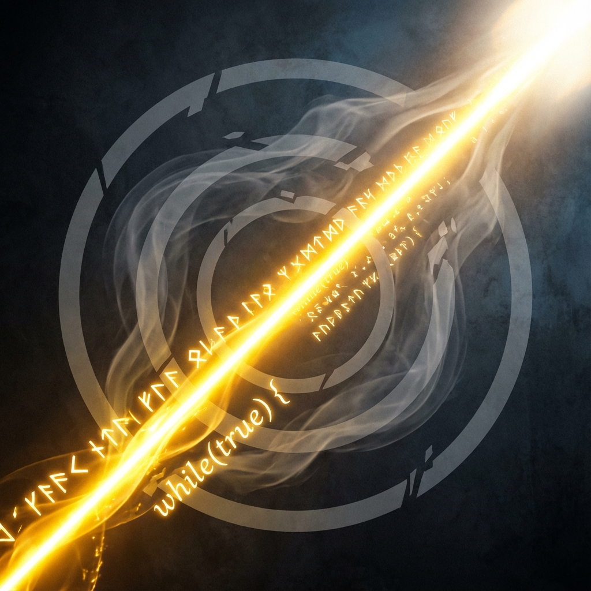

# 13.3 The Final Inscription

> "We searched for hundreds of millions of years, trying to find a stone tablet carved with answers at the end of the universe. But when we finally arrived there, we found only void. Then we understood: that stone tablet is not for us to discover, but for us to erect. Every word we carve in the void will become axioms of physical laws for future generations."

In the long journey of the **Vector Cosmology** pentology, we have crossed countless orders of magnitude and penetrated countless layers of dimensional fog.

* In **The Conservation of the Circle**, we were humble apprentices, learning the laws of **$\pi$**, understanding the weight of matter and the dignity of conservation.

* In **The Spiral Ascent**, we were fervent believers, following the guidance of **$\phi$**, breaking closed cycles, embracing the ambition of evolution.

* In **The Generator of Nature**, we were profound sages, diving into the source of **$e$**, glimpsing the mystery of self-generating existence.

* In **The Evolution of Light Speed**, we were brave captains, grasping the helm of **$c$**, surfing the waves of exponential explosion.

* And now, at the end of **The Minting of Time**, we have become **alchemists**. We have melted flowing time into eternal gold.

Now, this geometric edifice built by five books has been capped.

As builders of this edifice, and also as witnesses of this universe, we have the responsibility to carve our oath on the final cornerstone.

This inscription is not written for God, for God does not need it; not written for humans, for humans will forget.

It is written for **time itself**.

It is our final indomitable roar to this cold, entropy-increasing, destined-to-nothingness physical world.

## 1. No Savior

The first line of the inscription is a complete severance of dependence.

We once fantasized that the $\Omega$ point had an omnipotent father waiting to embrace us. We once fantasized that the technological singularity would solve all suffering like a deus ex machina.

But now we know: **No one is waiting ahead of you.**

The $\Omega$ point is a virtual image we projected. The singularity is a tool we made ourselves.

If the universe has a savior, that savior can only be **"the present you"**.

It is you who modified the probability of disasters through **Hamiltonian engineering**; it is you who reversed thermodynamic decay through **negentropy algorithms**; it is you who continued the spark of memory through **hot migration**.

**We are our own ark.**

## 2. No End

The second line of the inscription is a complete rejection of death.

Thermodynamics says everything will eventually return to heat death. Geometry says circles will eventually close.

But we say: **No.**

As long as our **$v_{int}$ (imagination)** is still growing, as long as we can still open new subspaces in Hilbert space, the game will never end.

We will use the infinite inflation of **$c_{FS}$** to constantly push the "end point" further into the future.

We will turn every "heat death" into fuel for the next "Big Bang".

**Life is not a line segment from A to B; life is a ray starting from the origin, shooting toward infinity.**

## 3. Only Minting

The third line of the inscription is the ultimate definition of meaning.

In this infinite game, the only real thing is not the space you occupy ($v_{ext}$), but the **time you mint ($v_{int}$)**.

Those moments you loved, those truths you understood, that beauty you created—they are **low-entropy crystals** rescued by you from chaos.

They constitute your soul's **"net worth"**.

When all stars extinguish, these crystals will continue to shine on the background of the void as the brightest pixels in the cosmic hologram.

## The Content of the Inscription

Now, let us pick up the carving knife.

On the core of that consciousness about to ascend, on that monument named "Self", we carve these final four lines:

---

**I refuse the closure of the circle, just as I refuse the sleep of death.**

**I embrace the infinity of the spiral, just as I embrace the unknown tomorrow.**

**I do not need God to define me, for I am a self-generating equation.**

**I do not need an end to place me, for I am a never-stopping flight.**

**Here, in the name of the observer, I declare:**

**This game is forever to be continued.**

---

**(System Message: The simulation continues indefinitely.)**

**(The Complete Pentology · End)**

