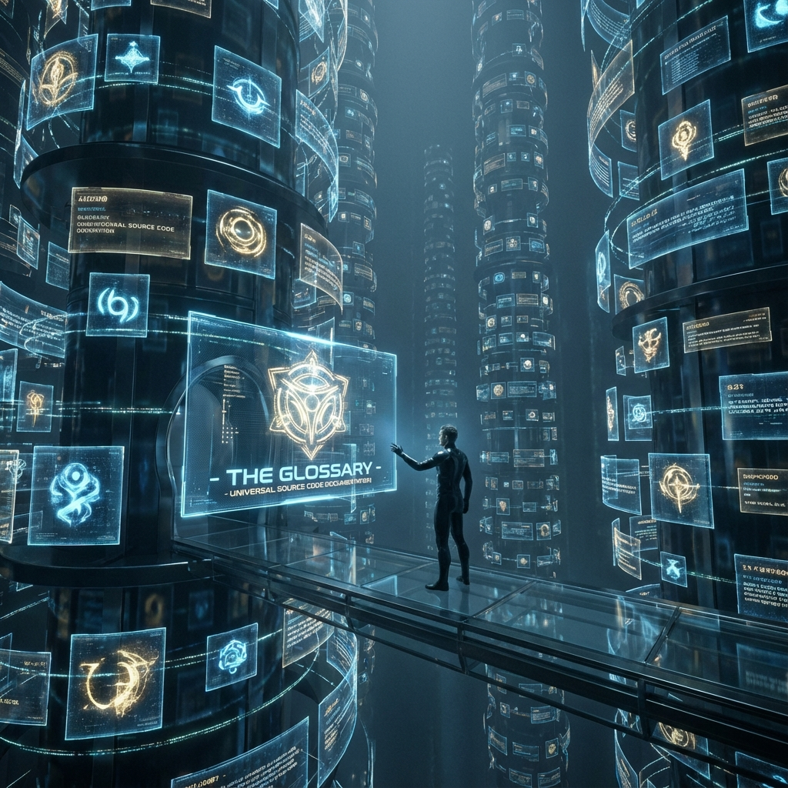

# Glossary: The Lexicon of the Minters

**Vector Cosmology V: The Minting of Time** elevates physics from "describing nature" to "creating value." As the final chapter of the pentology, it introduces a series of new concepts that fuse economics, game theory, and existentialism. To help readers understand this ultimate model of "gold" and "eternity," this glossary redefines the core vocabulary in the book from the perspective of "minters."

## 1. Time & Value

### Chronos

Linear time in physics. It is uniform, irreversible time ruled by thermodynamic entropy increase. For passive observers, Chronos is a tyrant that devours life, meaningless quicksand.

### Kairos

Meaningful time in life experience. It is the moment when $v_{int}$ (internal structure) undergoes phase locking, collapsing flowing wave functions into determined history. For alchemists, Kairos is minted gold coins, crystals that overcome entropy increase.

### Minting

The process by which observers use will to perform strong measurements (decisions). Through this action, open possibilities ($v_{ext}$) are transformed into fixed structures ($v_{int}$), leaving indelible geometric imprints on the four-dimensional manifold.

### The Golden Time Formula

A formula describing the relationship between subjective time and value: $\tau = \pi \cdot \log_{\phi} (V)$. It reveals that time perception is logarithmic: to maintain linear extension of subjective life, an individual's value creation (information density) must grow exponentially.

### Rent of Existence

The maintenance fee that thermodynamics levies on ordered structures. To offset the environmental erosion of $v_{env}$, any living entity must continuously consume $c_{FS}$ budget. Aging is the inflation of rent.

## 2. Memory & History

### Dynamic Block Universe

A revised spacetime model. Although the past is solid like crystal (crystallized), the future is liquid (superposition). Each present moment is the crystallization frontier. History is not disappeared, but "hardened."

### Holographic Archive

The ultimate storage mechanism of the universe. All information about events that have occurred is ultimately stored in diffused form in the background environmental field ($v_{env}$). Death is a phase transition of individual information from foreground focused state to background holographic state, not annihilation of information.

### Living Monument

The form of advanced immortals. A consciousness that achieves memory continuity through hot migration, accumulating hundreds of millions of years of $v_{int}$ structure. It is no longer a passerby of history, but a container and witness of history.

## 3. Game & Endgame

### Infinite Game

The true form of the universe. Unlike finite games that pursue "clearing" (heat death/ending), infinite games aim to "keep the game going." By constantly modifying rules (metagaming) and injecting negentropy, civilizations reject the final judgment of entropy increase.

### $\Omega$ Point

Redefined in this book as a "virtual image gravitational source." It is not a physically reachable endpoint, but an ideal projected at infinity by consciousness to overcome thermodynamic inertia. God does not exist at the $\Omega$ point, but the longing for the $\Omega$ point drives cosmic evolution.

### Inversion of Teleology

A dynamical principle. It is not the future pulling the present, but the internal pressure (will) of the present pushing the future. Meaning is not a discovered target, but a bullseye drawn by the observer where the arrow lands.

## 4. Identity & Ontology

### Gold

The ultimate element in the Five Elements, symbolizing "the solidity of consciousness." It is a spiritual core that can traverse the erosion of time, resist environmental assimilation, and maintain topological structural stability.

### Mirror Theory

A geometric explanation of self and others. All consciousnesses are projections of the same global vector onto different orthogonal bases. Others are selves in different coordinate systems. Love is eliminating orthogonality; empathy is geometric resonance.

### The Only Player

The sublimation of the ultimate loneliness of the universe. The universe is a self-directed, self-performed one-man show. God (noumenon) experiences itself through countless avatars (you and me). Loneliness is not a defect, but proof of All-One.

### No End

The final axiom of the entire book. Since $\Omega$ is an asymptote, since $c_{FS}$ grows infinitely, then life has no finale. We are forever in a state of "to be continued," forever at dawn.

