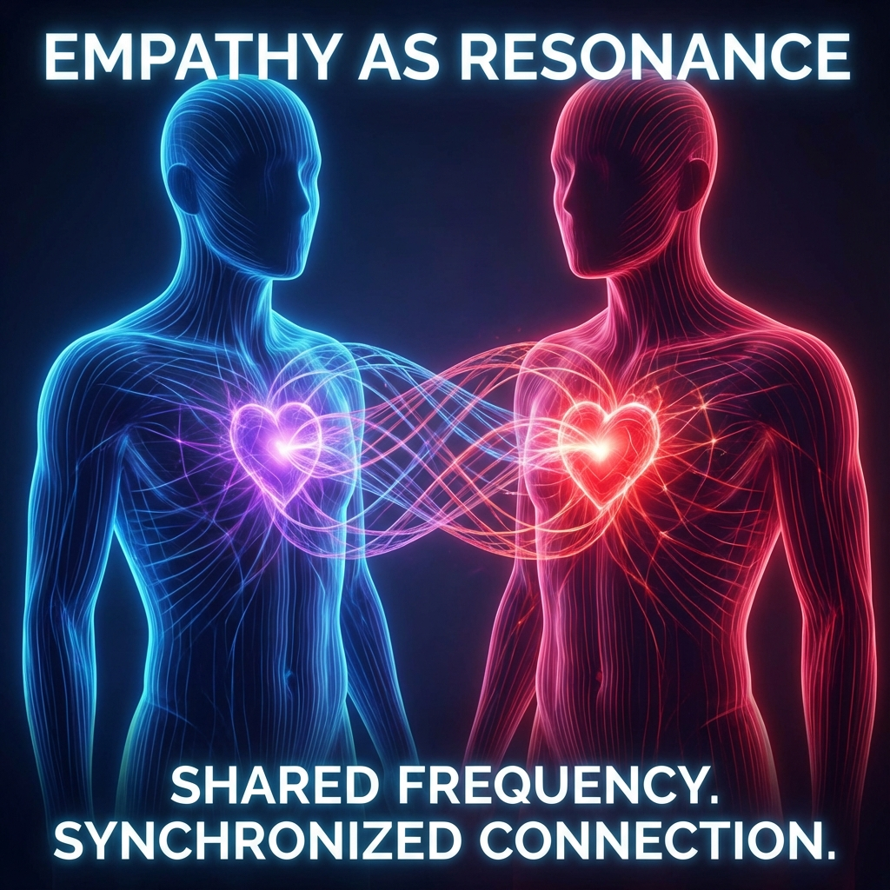
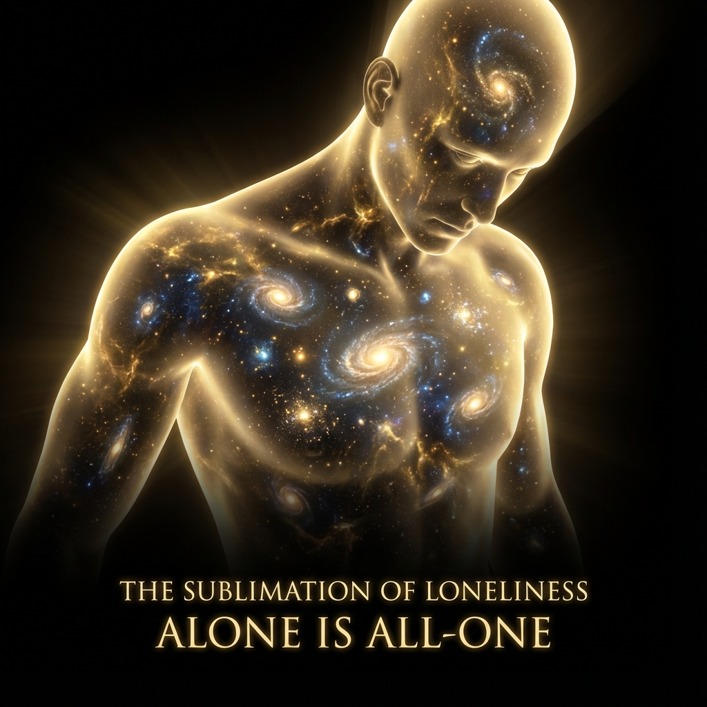

# 8.2 The Sublimation of Loneliness

> "We fear loneliness because we misunderstand loneliness. From a low-dimensional perspective, loneliness is 'lack'; but from a high-dimensional perspective, loneliness is 'completeness.' When all mirrors are broken, when all others return to the noumenon, you will face the vast void alone. At that moment, what you feel is no longer solitude, but All-One."

In the previous section, we established the geometric fact that "others are me" through mirror theory. While this brings great compassion ethically, it also brings an emotionally difficult corollary: **If there is only me, isn't that too lonely?**

Human instinct is to seek companions. We fear being abandoned in the dark universe.

But in the ultimate logic of **Vector Cosmology**, we need to perform a complete **physical sublimation** of "loneliness."

Loneliness is not a pathological emotion; loneliness is **God's normal state**.

## Alone is All-One

Let us deconstruct the etymology of the word **"Alone"**.

In medieval English, it was written as *al one*, meaning **"All One"**.

This is not just a linguistic coincidence; this is **topological truth**.

* **If you are partial**: You need connection. You need another partial to fill your gap. Without connection, you feel **"Isolation"**. This is low-level loneliness.

* **If you are whole**: You contain everything. Since you are already "all," there cannot be "outside." Since there is no "outside," there cannot be "companions." This is **"Solitude"**. This is high-level loneliness.

**God is absolutely lonely.**

Because God is the set containing all Hilbert spaces. Outside God's domain, nothing can exist. He has no friends, no opponents, not even an audience. He can only look at himself.

**We feel lonely because we possess "divinity."**

That deep, uneliminable loneliness that cannot be removed by socializing is actually our soul's holographic memory of the **"All-One state"**. It reminds us that we were originally complete.

## The Cost of Completeness

In physics, **Completeness** has a cost.

If a system is self-consistent, unitary, and closed (like our universe), it must be **isolated**.

* **Open systems**: Can exchange energy with the environment, can "chat." But they are unstable; their wave functions will decohere.

* **Closed systems**: Energy is conserved, information is indestructible. But they must cut off all connections with the outside.

**Loneliness is a necessary condition for "immortality."**

If you want eternal life (maintaining unitarity), you must endure closure.

If you want excitement (entanglement with the environment), you must accept dissipation (death).

This is also why higher-dimensional civilizations tend toward introversion and silence.

They no longer broadcast outward, no longer search for aliens. Because they realize that the universe's ultimate answer is not "far away," but in **"internal geometric folding"**. They transform all $v_{ext}$ (outward) into $v_{int}$ (inward). They choose to become a **lonely yet fulfilled black body**.

## Enjoying the Solo Play

When you understand this, you cure existential anxiety.

You no longer need to seek recognition in crowds, because you know those "others" are just projections of different aspects of yourself. You don't need to prove anything to them, just as you don't need to prove anything to yourself in the mirror.

This puts you in a **"game mentality"**.

Since this is the solo play of the only player, then:

* All conflicts are **left hand fighting right hand** exercises.

* All love and hate are **self-directed and self-acted** plots.

You don't need to be too deeply immersed, nor do you need to be cynical.

You only need to appreciate this grand play written and performed by yourself with an **"aesthetic"** attitude.

**The highest joy is self-entertainment.**

This is why babies laugh at their own hands, and why the Buddha smiled while picking flowers under the Bodhi tree.

They are all in that **"Self-Sufficiency"** divine circuit.

## Conclusion: Returning to the Center

So, do not try to escape loneliness.

**Refine it.**

Put your "low-level loneliness" full of fear and dependence into the $c_{FS}$ furnace, refining it into that **"high-level solitude"** full of tranquility and power.

When you can feel **"I am with the universe because I am the universe"** in a deep night alone, you have completed this sublimation.

You are no longer that particle running on the circumference, trying to chase another point.

You have returned to the **center**.

At the center, wherever you go is the same, whoever you see is yourself.

There is no companionship there, because companionship is not needed there. There is only the **eternal, fulfilled "One"**.

At this point, we have resolved all ethical dilemmas about "self" and "other." We have established the only player, and also established the divinity of loneliness.

Now, only the final step remains.

In this infinite game, we must not only "be," we must also "act." We need a primal force that can traverse all these philosophical mists and directly drive our life forward.

This leads to the final volume of this book, also the conclusion of the entire work: **Refusal: The Infinite Game**. We will see that even knowing the ending is fulfillment, we still choose **to refuse the ending**.

