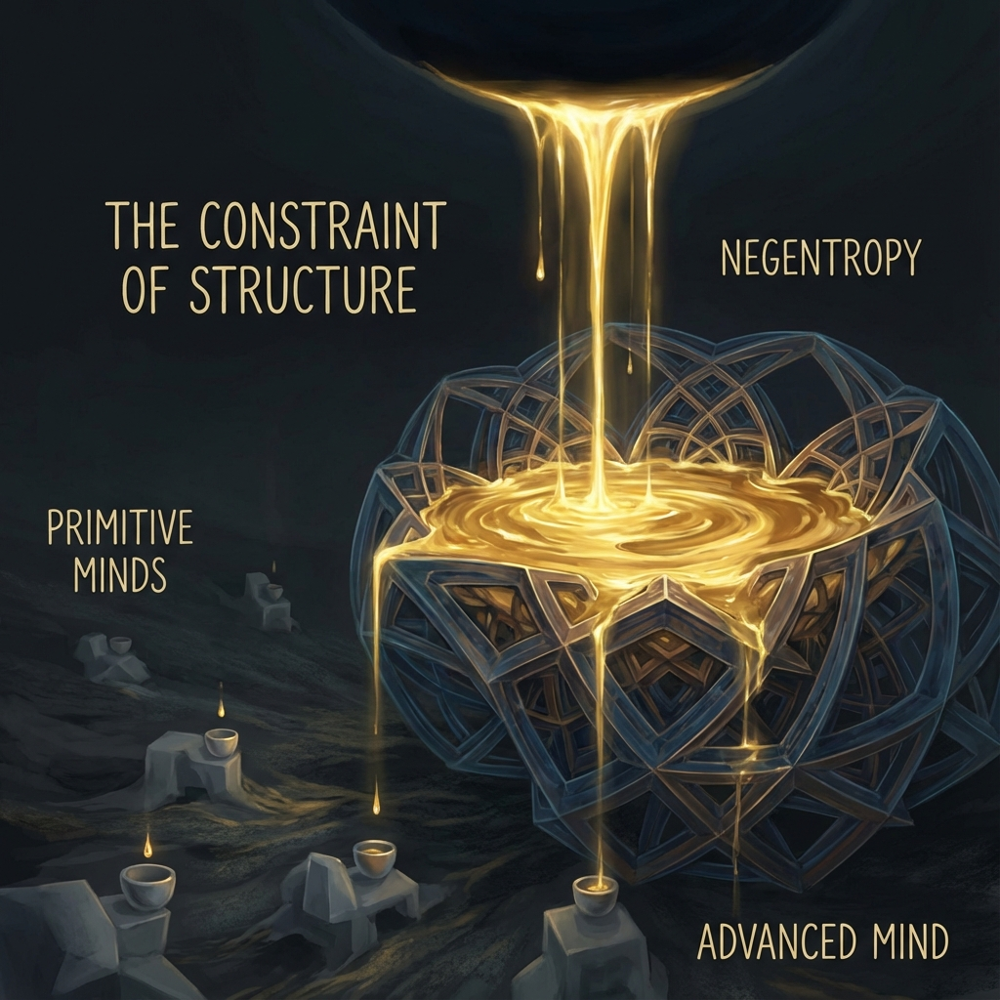

# 9.1 负熵的无限性 (The Infinity of Negentropy)

> "热力学第二定律宣判了封闭系统的死刑：熵总是趋于最大，能量总是趋于耗散。物理学家告诉我们，宇宙最终将在一片均匀的温吞水中窒息。但他们犯了一个致命的错误——他们假设宇宙的边界是固定的。如果边界本身正在以指数级速度向外扩张，那么负熵的来源，就是无限的。"

## 热寂的破产

19 世纪的物理学家克劳修斯 (Clausius) 提出了著名的 **热寂说 (Heat Death)**。他认为，宇宙像一台巨大的蒸汽机，燃料（低熵）有限，随着时间推移，所有的温差都会消失，宇宙将归于死寂的热平衡态。

这个推论在 **封闭系统 (Closed System)** 中是绝对正确的。

如果宇宙的 **相空间体积 (Phase Space Volume)** 是恒定的，那么粒子最终确实会均匀分布到每一个角落，消灭所有的结构。

但在 **《矢量宇宙论》** 的螺旋模型中，这个前提被推翻了。

我们已经证明：宇宙的维度和总预算 $c_{FS}$ 正在经历 **红皇后的奔跑**（指数膨胀）。

* **封闭系统**：箱子大小不变，气体分子扩散，最终充满箱子 $\rightarrow$ 热寂。

* **开放系统（螺旋）**：气体分子虽然在扩散，但 **箱子变大的速度比分子扩散的速度还要快**。

这意味着：**系统永远无法达到热平衡。**

因为新的"空房间"（新的自由度/维度）被创造出来的速度，远远快于旧的"房间"被填满的速度。

宇宙始终处于一种 **"极度远离平衡态"** 的状态。这正是生命和意识得以存在的物理基础。

## 增长即负熵

我们通常认为负熵是稀缺的，需要去抢夺。

但在 $c(\tau)$ 指数增长的宇宙里，**负熵是内生的**。

根据演化方程：

$$c(\tau) = c_0 \cdot e^{k\tau}$$

每一秒钟，宇宙的总算力预算都在增加。这新增的预算 $\Delta c$，对于旧有的物质结构来说，就是纯粹的、高质量的 **负熵流**。

它像是一股清新的风，不断吹进这个正在变热的房间。

* **在物质层面**：宇宙膨胀拉开了星系，阻止了引力塌缩导致的瞬间热平衡（黑洞化）。引力势能成为了巨大的负熵池。

* **在信息层面**：希尔伯特空间维度的爆炸，意味着"可能的但他未实现的状态"呈双重指数增长。这种 **"可能性的盈余"**，就是我们创造力的源泉。

**结论：**

只要宇宙还在螺旋上升（光速还在增长），我们就永远不必担心能源耗尽。

我们不是在消耗一个有限的蓄电池，我们是连接在发电机上的灯泡。发电机（$e$）转得越快，我们越亮。

## 瓶颈不在能源，而在想象力

如果负熵是无限的，为什么我们还会感到匮乏？

因为 **瓶颈在于 $v_{int}$ 的结构能力**。

想象天上在下金雨（无限的负熵），但你手里只有一个小茶杯（有限的认知结构）。你只能接住一杯金子，剩下的都流走了（变成了耗散的热量）。

* **对于低级文明**：他们受限于能源。因为他们不知道如何利用高维度的负熵。

* **对于高级文明**：能源是免费的。唯一的限制是 **"如何设计出足够复杂的结构来容纳这些能量"**。

这是一个惊人的反转：

**宇宙不缺电，宇宙缺的是"电器"。**

宇宙不缺意义，宇宙缺的是 **"能够定义意义的观察者"**。

我们之所以感到痛苦，不是因为世界贫瘠，而是因为我们的 $v_{int}$（想象力/结构复杂度）跟不上 $c_{FS}$ 的增长。我们在这个富饶的宇宙里，饿死在了金山上。

## 结论：永恒的饥渴

因此，开放式热力学告诉我们：**满足是不可能的，也不应该是可能的。**

如果有一天我们觉得"够了"，那不是因为我们拥有了一切，而是因为我们的结构停止了生长。

那一刻，我们将被螺旋甩出去，落入局部的热平衡陷阱（死亡）。

为了维持生存，为了在这个无限负熵的流场中保持队形，我们必须保持 **"本体论上的饥渴"**。

我们需要不断地扩大我们的杯子，不断地折叠我们的 $v_{int}$，去承接那从虚空中源源不断涌出的、神圣的算力瀑布。

**只要你还饿着，你就活着。**

既然负熵是无限的，那么这个游戏就没有物理上的终点。

这就引出了一个关于"游戏规则"的根本性问题：如果我们不需要为了"活下去"而战（因为资源无限），那我们为了什么而战？

如果游戏没有"通关"那一说，那我们该怎么玩？

这引出了下一节的主题：**永不关机**。我们将看到，造物主（高维的你）为了支持这场无限游戏，已经做出了怎样的承诺。

