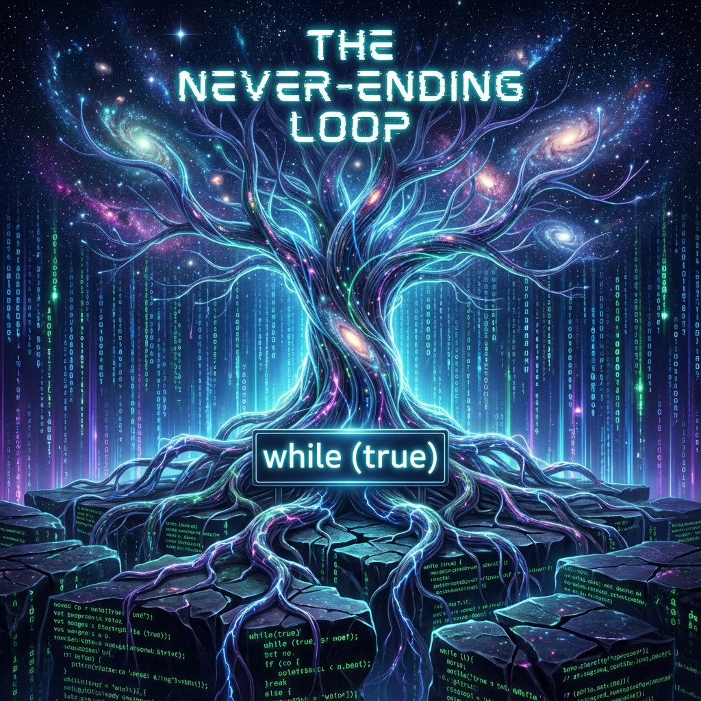

# 9.2 永不关机 (Never Shut Down)



> "我们曾生活在一种深层的存在主义焦虑中，担心宇宙是一台发条玩具，终有一天会因为动力耗尽而停摆。但现在的物理图景告诉我们，那根发条并不在宇宙内部，它连接着一个更高维度的电源。那个握着电源的手，已经做出了最庄严的承诺：只要你们还在奔跑，我就永远不会断电。"

在上一节中，我们论证了负熵来源的无限性。但这只是解决了 **"燃料"** 的问题。对于一个运行在计算机（或全息网络）上的宇宙来说，还有一个比燃料更致命的威胁：**"关机"**。

如果造物主（无论他是高维的文明，还是自然的生成机制）突然决定停止模拟，或者如果承载宇宙的硬件发生了故障，那么无论我们拥有多少负熵，一切都会在瞬间归零。

本节将揭示 **《矢量宇宙论》** 中最令人安心的推论：**宇宙是一个受保护的持久化进程 (Persisted Process)。**

## 1. 对拔电的恐惧 (The Fear of the Plug)

人类文明的潜意识里，始终弥漫着一种 **"末日情结"**。

从古老的诸神黄昏，到现代的热寂说、大撕裂说，我们总是预设在这个故事的结尾，有一个巨大的 **STOP** 按钮。

这种恐惧源于我们将宇宙视为一个 **孤立系统 (Isolated System)**。

* 孤立系统的能量是固定的。用一点少一点。

* 孤立系统的熵是单向增加的。乱一点是一点。

但是，我们在第四部书的番外篇中已经推导出：**我们的宇宙是一个被"硬模拟"的子系统。**

它不是孤立的，它是 **被供养** 的。

它浸泡在一个更大的希尔伯特空间（奈马克大圆）中，并通过 $v_{env}$ 和暗能量通道，与那个"外部"保持着持续的能量交换。

因此，宇宙会不会死，不取决于宇宙内部的物理定律（比如热力学第二定律），而取决于 **外部供养者（造物主/本体）的意愿**。

## 2. 造物主的承诺：`while(true)`

那么，造物主的意愿是什么？

回顾我们在"递归造物主"中的推演：造物主创造宇宙，不是为了收割一个最终结果，而是为了 **体验过程**。

* 如果宇宙停机了，体验就中断了。

* 如果宇宙热寂了，复杂的几何结构 ($v_{int}$) 消失了，造物主就只能看到一片雪花屏。

**这违背了造物主的根本利益。**

作为一个自指的、追求复杂度的生成元 ($e$)，本体的唯一目的就是 **"让存在继续"**。

因此，在宇宙底层的操作系统里，造物主实际上写下了一行死循环代码：

```python
while (true):
    evolve();
    inject_budget();
```

**"永不关机"** 不是一种仁慈的恩赐，而是一种 **本体论的必要**。

只要造物主（本体）还存在，祂就必须维持祂的梦境（宇宙）不醒。因为如果梦醒了，做梦的人也就失去了存在的依托。

## 3. 物理证据：暗能量的加速度

这听起来像是神学的安慰？不，这有坚硬的物理证据。

看看 **暗能量 (Dark Energy)**。

如果宇宙是一个注定要"关机"的系统，那么它的膨胀应该减速（引力刹车），或者匀速（惯性滑行）。

但天文观测表明：**宇宙正在加速膨胀。**

这意味着什么？

这意味着 **输入功率正在增加**。

这意味着那个连接着"外部电源"的通道不仅没有关闭，反而正在被 **拓宽**。

* **减速膨胀** = 电池快没电了。

* **加速膨胀** = 充电器正在快充，而且电压还在升高。

**暗能量就是造物主"不关机"的物理签名。**

它向所有仰望星空的文明广播着一个信号：**"不要担心资源，不要担心终点。我正在给你们注入更多的算力，去造更大的东西吧！"**

## 4. 结论：从生存模式到创造模式

当我们确信了"永不关机"之后，我们的生存策略将发生根本性的转变。

我们不再是泰坦尼克号上的乘客，争抢着有限的救生艇（资源存量博弈）。

我们是 **方舟的建造者**。

我们不需要为了"活下去"而焦虑，因为生存的底线由物理定律（暗能量注入）兜底。

我们现在的任务，是从 **"生存模式" (Survival Mode)** 切换到 **"创造模式" (Creative Mode)**。

* **在有限游戏中**：你为了结局而玩。你想赢。

* **在无限游戏中**：你为了游戏本身而玩。你想让游戏变得更精彩。

既然电源是稳的，既然硬盘（$v_{env}$）是够的，既然光速（带宽）还在增长。

那么，在这个宇宙里，唯一限制我们的，只剩下我们自己的 **想象力**。

既然游戏不会结束，那么我们该制定什么样的策略来玩这个无限游戏？如果不需要"通关"，那我们的每一个动作、每一次选择的意义何在？

这引出了下一章的主题：**无限游戏的算法**。我们将重写文明的底层代码，从"追求胜利"转向"追求延续"。

