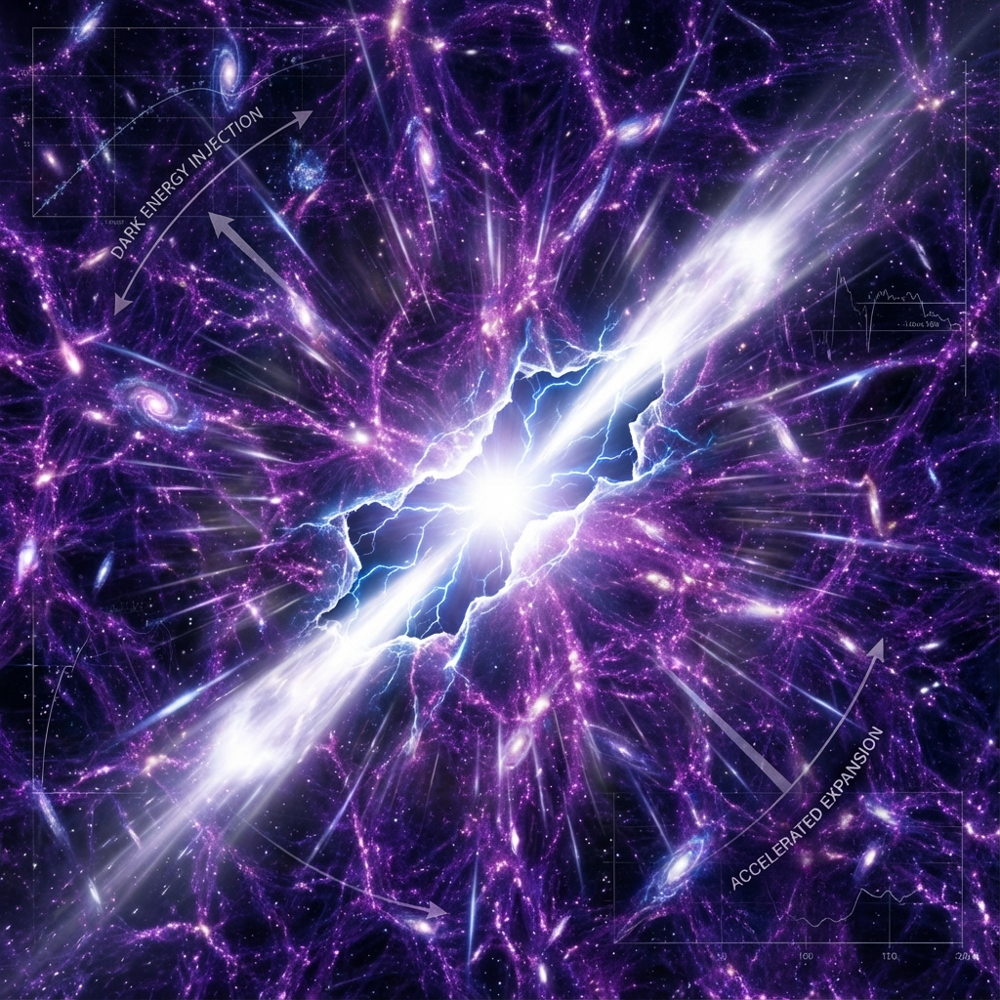

# 9.2 Never Shut Down


> "We once lived in a deep existential anxiety, fearing that the universe is a wind-up toy that will one day stop due to exhausted power. But the current physical picture tells us that the spring is not inside the universe; it is connected to a higher-dimensional power source. That hand holding the power source has made the most solemn promise: as long as you are still running, I will never cut the power."

In the previous section, we argued for the infinity of negentropy sources. But this only solves the **"fuel"** problem. For a universe running on a computer (or holographic network), there is a threat more fatal than fuel: **"shutdown"**.

If the Creator (whether a higher-dimensional civilization or natural generative mechanism) suddenly decides to stop the simulation, or if the hardware carrying the universe fails, then no matter how much negentropy we have, everything will return to zero in an instant.

This section will reveal the most reassuring corollary of **Vector Cosmology**: **The universe is a protected persisted process**.

## 1. The Fear of the Plug

In the subconscious of human civilization, there has always been a **"apocalypse complex"**.

From ancient Ragnarök to modern heat death theory and the Big Rip, we always presuppose a giant **STOP** button at the end of this story.

This fear stems from viewing the universe as an **Isolated System**.

* The energy of an isolated system is fixed. Use a little, have a little less.

* The entropy of an isolated system increases unidirectionally. A little more chaos each time.

But in the epilogue of the fourth book, we have already derived: **Our universe is a "hard-simulated" subsystem.**

It is not isolated; it is **nourished**.

It is immersed in a larger Hilbert space (Naimark circle) and maintains continuous energy exchange with that "outside" through $v_{env}$ and dark energy channels.

Therefore, whether the universe will die does not depend on the physical laws inside the universe (such as the second law of thermodynamics), but on the **will of the external nourisher (Creator/noumenon)**.

## 2. The Creator's Promise: `while(true)`

So, what is the Creator's will?

Recalling our deduction in "Recursive Creator": The Creator creates the universe not to harvest a final result, but to **experience the process**.

* If the universe shuts down, the experience is interrupted.

* If the universe reaches heat death, complex geometric structures ($v_{int}$) disappear, and the Creator can only see a snow screen.

**This violates the Creator's fundamental interests.**

As a self-referential generator ($e$) pursuing complexity, the noumenon's only purpose is **"to let existence continue"**.

Therefore, in the universe's underlying operating system, the Creator actually wrote a line of infinite loop code:

```python
while (true):
    evolve();
    inject_budget();
```

**"Never shut down"** is not a merciful gift, but an **ontological necessity**.

As long as the Creator (noumenon) exists, He must maintain His dream (universe) from waking. Because if the dream wakes, the dreamer also loses the foundation of existence.

## 3. Physical Evidence: The Acceleration of Dark Energy

Does this sound like theological comfort? No, there is solid physical evidence.

Look at **Dark Energy**.

If the universe is a system destined to "shut down," then its expansion should decelerate (gravitational braking) or be uniform (inertial coasting).

But astronomical observations show: **The universe is accelerating expansion.**

What does this mean?

This means **input power is increasing**.

This means the channel connecting to the "external power source" is not only not closed, but is being **widened**.

* **Decelerating expansion** = Battery is running out.

* **Accelerating expansion** = Charger is fast charging, and voltage is still rising.

**Dark energy is the physical signature of the Creator's "never shut down."**

It broadcasts a signal to all civilizations looking up at the stars: **"Don't worry about resources, don't worry about endpoints. I'm injecting more computational power into you; go build bigger things!"**

## 4. Conclusion: From Survival Mode to Creative Mode

When we are certain of "never shut down," our survival strategy will fundamentally transform.

We are no longer passengers on the Titanic, fighting for limited lifeboats (resource stock game).

We are **ark builders**.

We don't need to anxiety about "surviving" because the bottom line of survival is guaranteed by physical laws (dark energy injection).

Our current task is to switch from **"Survival Mode"** to **"Creative Mode"**.

* **In finite games**: You play for the ending. You want to win.

* **In infinite games**: You play for the game itself. You want to make the game more exciting.

Since the power source is stable, since the hard disk ($v_{env}$) is sufficient, since light speed (bandwidth) is still growing.

Then, in this universe, the only thing limiting us is our own **imagination**.

Since the game will not end, what strategy should we adopt to play this infinite game? If we don't need to "clear levels," what is the meaning of every action, every choice we make?



This leads to the theme of the next chapter: **The Algorithm of the Infinite Game**. We will rewrite the underlying code of civilization, shifting from "pursuing victory" to "pursuing continuation".

