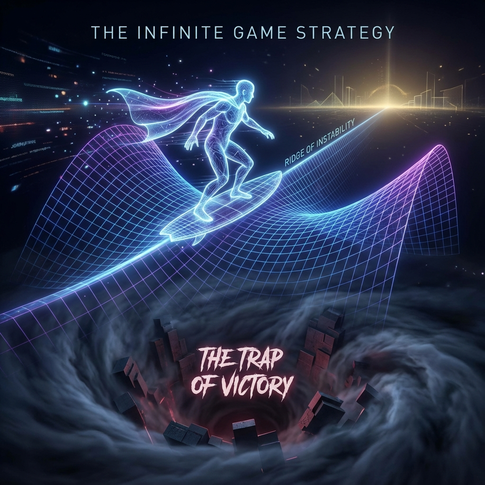

# 10.1 拒绝通关 (Refusing to Clear the Game)

> "在有限游戏中，目的是取胜；在无限游戏中，目的是让游戏继续。对于生命而言，'赢'是一个极其危险的词汇。因为在物理学上，'赢'意味着系统达到了全局最优解，而全局最优解的另一个名字，叫作——死寂。"

## 胜利的陷阱：全局极小值

在经典的优化理论中，所有的算法都在寻找 **"全局极小值" (Global Minimum)**。

比如，水流寻找地势最低点，化学反应寻找能量最低态。一旦找到了，系统就稳定了，不再变化。

在 **《矢量宇宙论》** 的视角下，这种"稳定"是致命的。

如果一个文明彻底"解决"了所有问题——它消灭了所有疾病，解开了所有方程，实现了所有欲望——那么它的 **$v_{int}$ (内部结构)** 演化速度将归零。

$$\frac{d}{d\tau} v_{int} = 0 \implies \text{Time Stops}$$

这就是 **"通关" (Game Clear)**。

对于一个有限游戏（如围棋或足球），通关是荣耀。

但对于一个存在主义的游戏（如宇宙），通关是 **热力学自杀**。

因为一旦你"赢"了，你就没有了 **"势能差" (Potential Difference)**。没有势能差，就没有 **模流 (Modular Flow)**，就没有主观时间的流逝。你将冻结在一座完美的、永恒的水晶墓碑里。

## 算法的修正：寻找鞍点而非极值

因此，一个成熟的高维文明（或觉醒的观察者），必须在底层算法中 **"拒绝通关"**。

这需要我们将目标函数从 **"寻找极值"** 修改为 **"寻找鞍点" (Searching for Saddle Points)**。

* **极值点**：就像碗底。掉进去就出不来了。

* **鞍点**：就像马鞍的中心。在一个方向上是稳定的，在另一个方向上是不稳定的（开放的）。

无限游戏的玩家，总是试图让自己处于 **"亚稳态" (Metastability)**。

* 他们解决了生存问题，马上就会发明 **艺术**（一个没有标准答案的问题）。

* 他们征服了星系，马上就会去探索 **虚空**（一个没有边界的领域）。

他们不断地 **"制造问题"**。

这听起来像是没事找事，但在 **FS 几何** 中，这是为了维持 **哈密顿量 $H$ 的非对易性**。

只有当问题永远比答案多时，波函数才能保持 **相干震荡**，生命之火才不会熄灭。

## $\phi$ 的智慧：永不重合

这也解释了为什么宇宙选择了 **$\phi$ (黄金比例)** 作为生长的常数，而不是整数或 $\pi$。

* 如果宇宙按照整数比例旋转，它最终会回到原点（通关/循环）。

* 这里的 **$\phi$** 保证了轨道 **永远不闭合**。

每一次旋转，我们都以为快要抓到终极真理（$\Omega$ 点）了，但 $\phi$ 的无理数性质保证了我们总是 **"差一点点"**。

正是这 **"差的一点点"**，构成了下一轮演化的动力。

**结论：**

不要渴望完美。

完美是圆的闭合，是 $\pi$ 的暴政。

**缺陷 (Defect)** 才是进化的朋友。

我们要赞美那些未解的谜题，赞美那些爱而不得的遗憾，赞美那些无法填补的虚空。

因为正是这些"未通关"的部分，留住了我们在时间中的位置。

**只要你还没赢，你就还活着。**

既然我们拒绝了"赢"，那么我们在这个无限的游戏里究竟在做什么？如果我们不是为了终点而跑，那我们是为了什么而跑？

这引出了下一节的主题：**规则的修改者**。我们将看到，无限玩家的真正乐趣，不在于遵守规则，而在于 **改写规则**。

