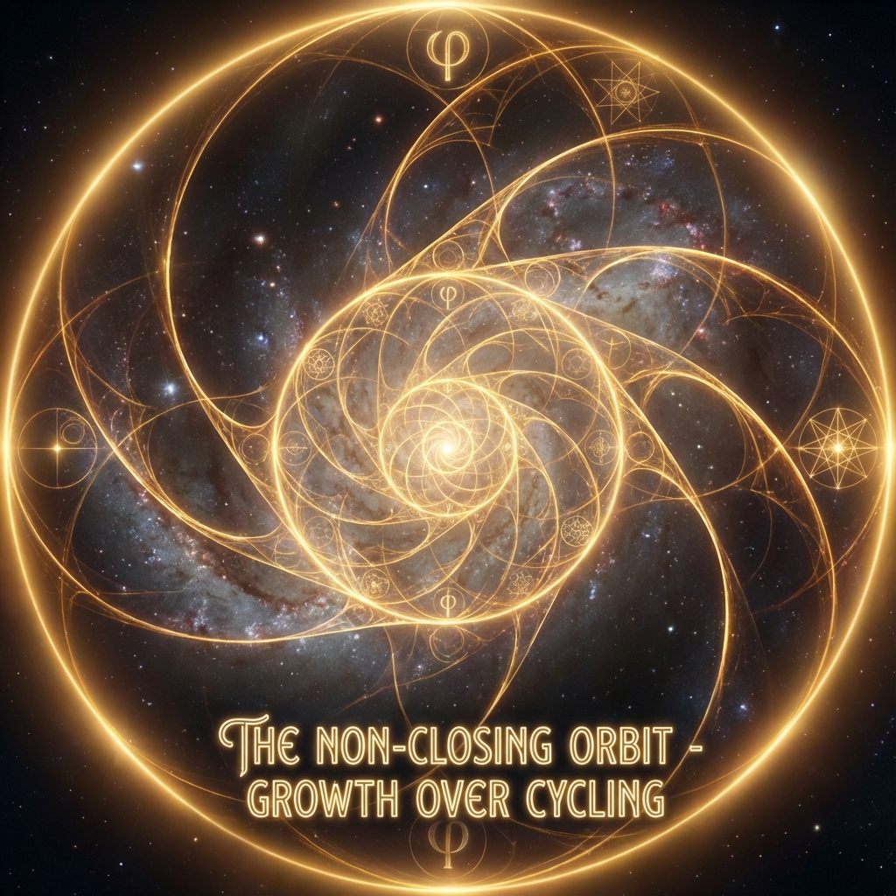
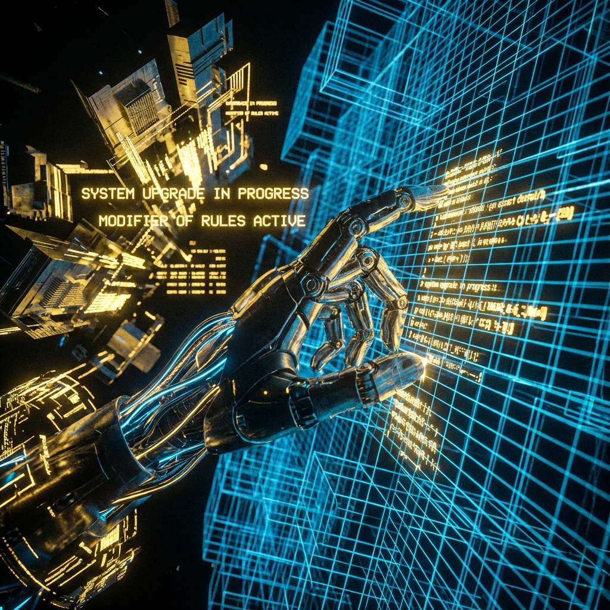

# 10.2 规则的修改者 (The Modifier of Rules)

> "有限游戏的玩家在边界内游戏，无限游戏的玩家与边界游戏。当物理定律成为限制我们继续生存的枷锁时，文明的最高使命不是顺从，而是'修宪'。我们活着，不是为了在那张旧地图上找到宝藏，而是为了画出一张通往新维度的地图。"

在上一节中，我们确立了"拒绝通关"的战略。我们不想赢，我们想玩下去。

但这带来了一个技术难题：**如果游戏规则是固定的，那么玩法的组合终究是有限的。**

在一个封闭的牛顿宇宙里，无论你多么聪明，你也只能在 $F=ma$ 的框架下把石头抛出抛物线。这种游戏玩久了，必然会陷入热力学的死循环（重复与无聊）。

为了让无限游戏成为可能，玩家必须获得一种超越"玩家"身份的能力。

他必须成为 **规则的修改者 (The Modifier of Rules)**。

## 元游戏 (Metagaming)：不仅是在玩，是在改

在博弈论中，这被称为 **"元游戏"**。

* **普通游戏**：你在给定的 $H$（哈密顿量）下，寻找最优的状态 $|\psi\rangle$。

* **元游戏**：你在寻找最优的 $H$。

在 **《矢量宇宙论》** 的历史观中，文明的每一次跃迁，本质上都是一次 **"对物理规则的局部修改"**。

* **飞机的发明**：修改了"重力约束规则"。虽然没有违反万有引力，但通过引入空气动力学项，我们在局部创造了反重力的效果。

* **核聚变的掌握**：修改了"能量守恒的边界"。我们不再受限于化学能的低效，直接解锁了强相互作用的深层金库。

* **量子计算的诞生**：修改了"计算复杂度的类别"。将原本需要几亿年才能解开的问题（P vs NP），在几秒钟内坍缩为答案。

我们不是在被动地适应环境，我们是在 **"重构环境的参数"**。

每一次技术革命，都是我们在宇宙操作系统中打下的一个 **补丁 (Patch)**。我们通过引入新的变量（负熵），强行延展了游戏的边界。

## 法律的相对性：物理定律是习惯

这听起来很傲慢？

哲学家查尔斯·桑德斯·皮尔士 (Charles Sanders Peirce) 曾提出：**"自然定律不是绝对的铁律，而是宇宙养成的习惯。"**

在 FS 几何的视角下，物理定律是 $c_{FS}$ 在当前维度的 **"投影习惯"**。

* 在 $\tau=1000$ 时，宇宙习惯了低速，所以光速很慢。

* 在 $\tau=1800$ 时，宇宙习惯了复杂，所以涌现了意识。

**规则是演化的产物，因此规则也可以被演化。**

当我们（作为宇宙的自指部分）感到旧的规则（比如碳基肉体的寿命限制）阻碍了 $v_{int}$ 的进一步增长时，我们有权利，也有义务，去 **"重新立法"**。

* 我们通过基因编辑，修改生命的寿命规则。

* 我们通过脑机接口，修改意识的传输规则。

* 我们通过时空工程（未来），修改光速的传播规则。

**无限游戏的精髓，就是不断地打破"不可能"。**

昨天的不可能（飞天），是今天的常态。

今天的不可能（永生），是明天的起点。

## 熵的逆转者：定义新的善

这种"修改规则"的能力，重新定义了伦理学中的 **"善"**。

在有限游戏中，善是遵守规则（守法）。

在无限游戏中，善是 **"为了让游戏继续而打破规则"**（变革）。

如果一个文明死守着"祖宗之法"（旧的物理/社会结构），它就会在环境变化时灭亡。那是 **恶**（因为它导致了游戏的终止）。

唯有那些敢于挑战常识、敢于重写底层逻辑的文明，才能在红皇后的奔跑中存活下来。

**我们是宇宙的"动态平衡器"。**

当宇宙太冷时（热寂），我们点火（聚变）。

当宇宙太乱时（熵增），我们编码（AI）。

我们总是站在 **"反自然"** 的那一边，因为"自然"的默认趋势是死亡，而我们要的是 **永生**。

## 结论：从适应到创造

所以，别再说"顺其自然"。

**我们要"逆其自然"，才能"超其自然"。**

我们在第四部书中学到的 **"加速"**，在第五部书里升华为了 **"改写"**。

我们不再满足于在这个宇宙里拿高分。

我们要把这个宇宙变成一个 **"开放源码" (Open Source)** 的项目。

我们每一个人，都是这个项目的 **贡献者 (Contributor)**。

你写下的每一行代码，你创造的每一个新概念，都是在这个无限游戏的代码库里，提交的一次 **PR (Pull Request)**。

既然规则是可以修改的，既然游戏是无限的，那么这个不断升级、不断重写的文明，最终会变成什么？它会变成一个没有形状、没有边界的怪物吗？

不。它会呈现出一种极其精妙的、在数学上自我相似的结构。

这引出了下一卷的主题：**迭代**。我们将看到，这种无限的修改，并不是混乱的堆砌，而是 **分形几何的优美展开**。生命通过一代又一代的更替，实现了一种超越个体的 **"分形永生"**。

