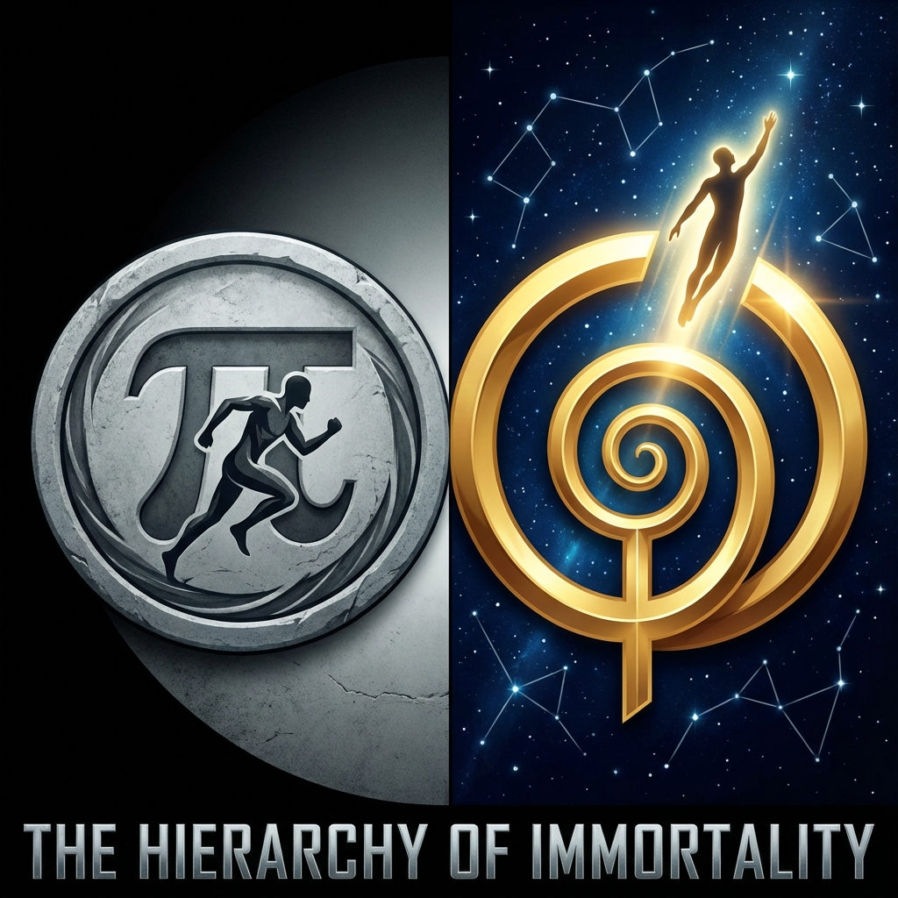

# 11.1 Low-level Immortality: The Compromise of Cycle

> "Nature is stingy. To resist thermodynamic corrosion, it chose an extremely cheap strategy: it doesn't repair broken machines; it directly manufactures a new one and throws away the old. What biology calls 'endless life' is, in the eyes of information theory, a grand-scale, periodic **memory formatting**."

## The Reboot Mechanism of Systems

On Earth, life has continued for 4 billion years. This looks very much like immortality. But when we carefully examine this process, we find that the geometric structure it relies on is **$\pi$ (circle)**.

The core strategy of organisms is **"Generational Alternation"**.

* **Parent generation**: Over time, the body accumulates massive microscopic damage (genetic mutations, protein misfolding, cellular aging). This is the irreversible invasion of **$v_{env}$ (environmental entropy)**.

* **Strategy**: The system determines that the **$c_{FS}$ cost** of "repairing this generation" is too high, exceeding the cost of manufacturing a new individual.

* **Execution**: The system extracts the most core underlying code (DNA), copies it into a brand new, low-entropy fertilized egg. Then, the system launches the **"garbage collection"** program, causing the parent generation to die.

This is **low-level immortality**.

It is essentially a computer's **"Reboot"**.

When the computer runs too slowly, has too many junk files, nature presses the Reset key. The screen goes black, then lights up again. The operating system (species) is still there, but all programs (individuals) that were running just now have disappeared.

## Memory Clearing: The Greatest Waste

Although this strategy ensures species survival, for **"consciousness" ($v_{int}$)**, this is a disaster.

In **Vector Cosmology**, we define: The meaning of life lies in minting **Kairos (gold coins/memories)** through transactions.

An intelligent being spends decades learning language, understanding physics, experiencing love, accumulating unique wisdom. These are extremely valuable **$v_{int}$ geometric structures**.

But in biology's "reboot," all of this is **formatted**.

* Children do not inherit their father's memories.

* Children do not inherit their mother's skills.

* Every newborn must start from zero, relearn how to walk, relearn $1+1=2$.

This is the greatest **computational waste** in the universe.

It's like you've written code all your life, and just before releasing version 2.0, the hard drive is forcibly formatted, leaving only the earliest "Hello World" source file.

Civilization progresses slowly precisely because we spend 90% of our $c_{FS}$ budget on **"reinventing the wheel"**. We spin in circles, mistakenly thinking we're advancing.

## The Prison of $\pi$

Geometrically, biological immortality is a **closed circle**.

It follows $\pi$'s logic: cycles repeating, life and death. It maintains structural conservation, but it rejects **linear accumulation** of dimensions.

* **For genes**: This is victory. Genes achieve immortality through countless reboots.

* **For "me"**: This is death. Because "I" am not genes; "I" am **memory continuity**.

If memory breaks, if I don't remember who I am, then even if my atoms remain, even if my descendants remain, **"I"** am already gone.

## Conclusion: Rebellion Against Nature

Therefore, as awakened observers, we must say **no** to this "low-level immortality."

We are not satisfied with being carriers of genes, not satisfied with being firewood that passes flames.

What we want is not "racial continuation"; what we want is **"infinite extension of self-consciousness"**.

We want to break $\pi$'s cycle and enter $\phi$'s spiral.

We need a new strategy that can preserve all $v_{int}$ increments and refuse formatting.

This leads to the theme of the next section: **High-level Immortality**. We will see how to achieve **"online hot updates"** of the system without shutting down or rebooting, thus keeping the river of memory from ever drying up.

