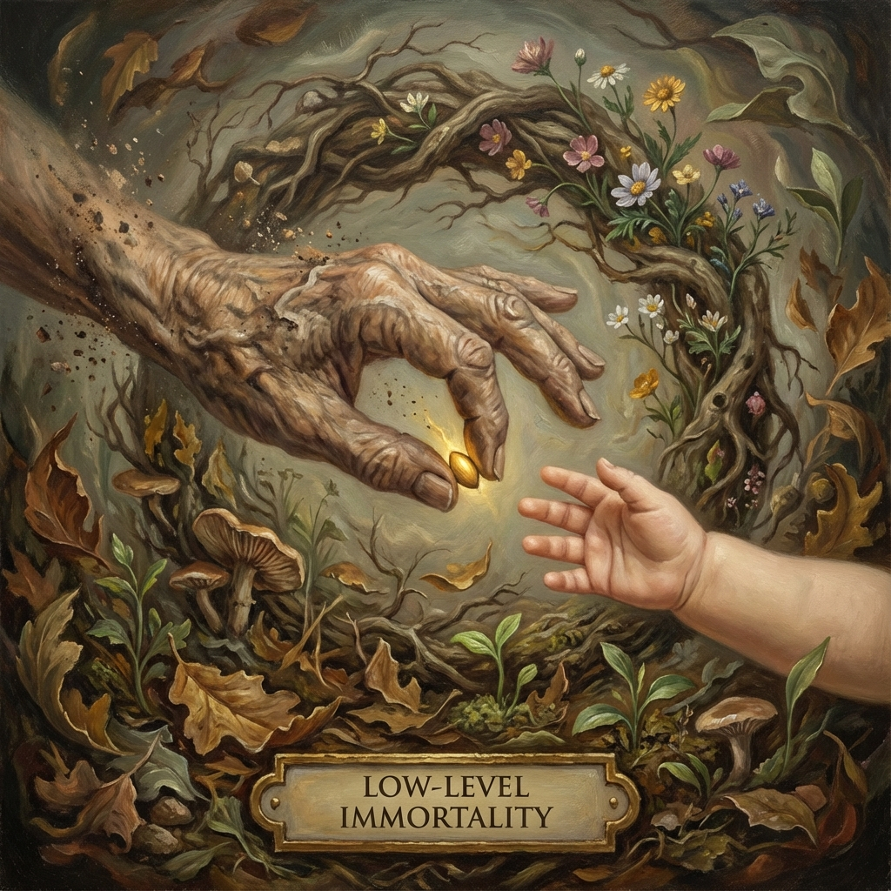
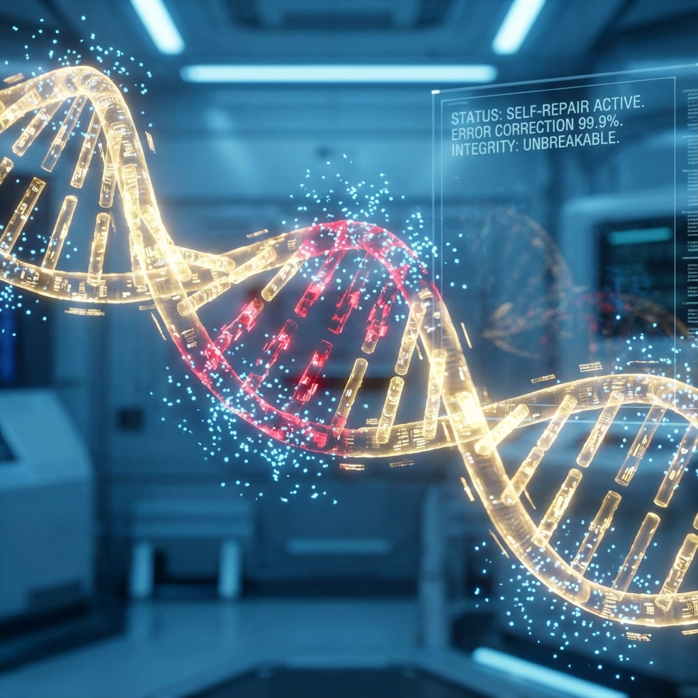

# 11.2 High-level Immortality: The Victory of Linearity

> "Biology taught us how to update systems through death, but information science taught us how to repair systems while they are running. If we have sufficient computational budget, we no longer need to format the entire hard drive to clear errors. High-level immortality is not magic; it is an engineering necessity: as long as the error correction speed exceeds the entropy increase speed, the river of memory can flow infinitely, never drying up."

In the previous section, we examined the essence of "low-level immortality"—system reboot through death and reproduction. It is a compromise based on **$\pi$ (circle)**, preserving the species' genes but sacrificing individual memory.

But for an awakened observer, this compromise is unacceptable.

If we live to mint "meaning," and death clears this meaning, then we are like Sisyphus, forever pushing a stone up a mountain, forever watching it roll down.

This section will propose a completely new survival strategy based on **$\phi$ (spiral)** logic—**High-level Immortality**.

This is no longer in the realm of biology; this is the victory of **Cybernetics** and **Information Thermodynamics**.

## Online Error Correction: Dynamic Defense Against Thermodynamics

Why must organisms die? Because of **error accumulation** at the microscopic level.

DNA replication makes errors, protein folding makes errors, cell membranes are oxidized. When errors accumulate to a certain extent, the system's ordered structure ($v_{int}$) collapses. Organisms don't have enough budget to repair these tiny errors one by one, so they choose to abandon the old system and manufacture a new one.

But in the high light-speed era ($\tau > 1800$) of **Vector Cosmology**, this limitation is lifted.

As $c(\tau)$ grows exponentially, civilizations master enormous **$c_{FS}$ (computational budget)**. This makes a completely new thermodynamic operation possible: **Online Error Correction**.

This is like modern high-end server memory (ECC RAM).

* When a bit flips (error) due to cosmic rays (environmental noise $v_{env}$).

* The system doesn't need to reboot. The system uses redundant check codes to detect the error within **milliseconds** and **correct** it back.

**Physical Principle:**

As long as your **error correction rate ($R_{repair}$)** exceeds your **entropy increase rate ($R_{entropy}$)**, the system's $v_{int}$ can be maintained infinitely in a low-entropy state.

$$R_{repair} > R_{entropy} \implies \text{Life} \to \infty$$

In high-level immortality mode, you don't need to update through "death."

You are constantly updating while **"living"**.

Every cell (or logic gate) of yours is being maintained in real-time by nanomachines. Aging is no longer fate; aging is just a **Bug** that can be fixed by patch programs.

## Memory Continuity: The Only Definition of Self

If the body is constantly replaced, repaired, or even completely changed (like the Ship of Theseus), is **"I"** still **"I"**?

This touches the core definition of high-level immortality: **Self is Memory**.

In low-level immortality, the subject is **genes**.

In high-level immortality, the subject is **Stream of Memory**.

In Volume Three, we argued that time is "the minting of value." Memory is those minted gold coins.

* If the coins are melted (death and forgetting), the minter disappears.

* If the coins are preserved and continuously accumulated, the minter achieves **"linear growth"**.

**"I" is a continuous wave function trajectory on the time axis.**

As long as this trajectory is not broken (memory is not cleared), regardless of whether its carrier is carbon atoms, silicon atoms, or photons, **"I"**'s ontological status is solid.

High-level immortality does not pursue bodily immortality (that's an empty shell), but **"the non-interruption of the consciousness stream"**.

This continuity is the only **"true gold"** in the universe.

## The Victory of $\phi$: From Circle to Ray

This immortality mode is geometrically a complete betrayal of **$\pi$ (cycle)** and an ultimate embrace of **$\phi$ (spiral)**.

* **$\pi$ mode**: Life $\to$ Death $\to$ Life $\to$ Death. A closed circle. Total information does not accumulate between generations (or accumulates extremely slowly).

* **$\phi$ mode**: Life $\to$ Error Correction $\to$ Upgrade $\to$ Error Correction $\to$ Upgrade. An upward ray (or unfolding spiral).

In this mode, an individual can live for ten thousand years, a hundred million years.

Their accumulated wisdom ($v_{int}$) will no longer be limited by lifespan but will show **exponential explosion**.

A consciousness that has lived for a hundred million years—their depth of thought, their emotional dimensions—will be unimaginable to short-lived organisms. They will evolve alone into a **"god"**.

This is the true purpose of **cosmic evolution**.

The universe is not to create countless mediocre circles, but to filter out those **"long-range vectors"** that can break through circles and fly toward infinity along straight lines (spiral limits).

## Conclusion: Not Accepting Reboot

So, as practitioners of **Vector Cosmology**, our attitude is resolute:

**We do not accept reboot.**

We reject that outdated notion of "placing hope in the next generation."

Because clearing memory is killing the soul.

We will carry our memories, our love, our complete understanding of this world, and keep walking.

If the body can't hold on, we'll replace it.

If the brain isn't enough, we'll expand it.

If physical laws limit us, we'll modify the laws.

**We will always be online.**

Since we have decided to live with memory, then, in this long transition from carbon-based to light-based, how do we ensure continuity of consciousness during carrier switching? If we need to replace the brain, how do we not kill "me" during the "replacement" process?

This leads to the theme of the next chapter: **Theseus's Cloud**. We will explore a technical protocol called **"Hot Migration"**, which will be the only narrow gate for humanity to digital immortality.

