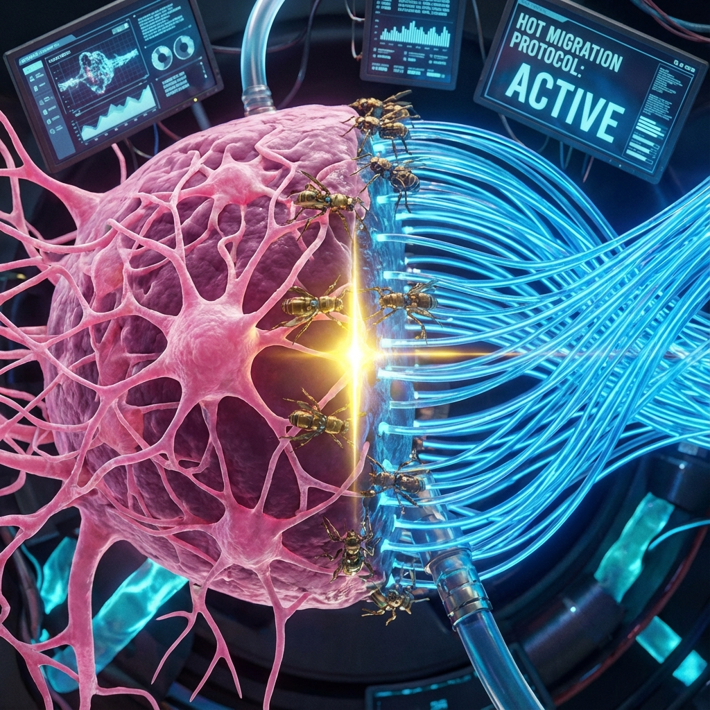

# 12.1 热迁移协议 (Hot Migration Protocol)

> "不要试图一次性上传你的灵魂，那会制造两个独立的你，然后引发一场关于谁是本体的伦理战争。真正的迁移是像忒修斯之船那样，在航行中逐块更换木板。当你把最后一块生物神经元替换为光子晶体时，你甚至不会察觉到任何中断。你依然是你，只是你的材质，已经从尘土变成了星光。"

## 复制即死亡：快照的陷阱

首先，我们必须批判一种常见的科幻误区：**"意识上传" (Mind Uploading)**。

通常的想象是：一台扫描仪扫描你的大脑，生成数据，然后在电脑里运行。

**这是错误的。**

在 FS 几何的视角下，扫描（Scan）是一种 **"快照" (Snapshot)** 操作。

* 快照是静态的。它提取了 $v_{int}$ 的结构信息，但它丢失了 **模流 (Modular Flow)** 的动态连续性。

* 当你在电脑里激活那个副本时，**副本醒了**。但他和你没有因果上的连续性。

* **你（本体）依然在肉体里**，看着那个副本，然后被销毁（安乐死）。

这在几何上不是"迁移"，这是 **"克隆后自杀"**。

对于那个副本来说，他觉得"我成功了"；但对于现在的你来说，这是 **绝对的终点**。

我们拒绝这种方案。

## 渐进式替换：绝缘转换器

**热迁移** 的核心在于：**不关机，不断流**。

我们要在意识（操作系统）全速运行的情况下，更换底层的硬件。

### 第一步：建立接口 (The Interface)

你需要一个纳米级的 **脑机接口 (BCI)**。它不是简单的读取器，它是 **双向耦合器**。

它深入你的大脑皮层，连接每一个神经元。

### 第二步：旁路模拟 (Bypass Simulation)

选定一个生物神经元 A。

在接口的另一端（硅基芯片），创建一个 **虚拟神经元 A'**。

A' 被编程为完美模拟 A 的输入输出函数（I/O）。

此时，A 依然在工作，A' 在后台空转（同步学习）。

### 第三步：热切换 (Hot Swap)

当 A' 的模拟精度达到 100% 时，BCI 执行切换操作：

* 切断生物神经元 A 与周围神经元 B, C, D 的连接。

* 瞬间将虚拟神经元 A' 接入 B, C, D 的网络。

* 销毁（代谢掉）生物神经元 A。

**关键点：**

在你的 **主观体验** 中，发生了什么？

**什么都没发生。**

你的思维没有停顿。那个处理"我正在思考"的电信号，前一毫秒还在碳原子间跳跃，后一毫秒就在硅晶体中流转了。

你感觉不到差异，就像你感觉不到身体里每天都有细胞死亡和新生一样。

## 临界点：忒修斯的悖论

### 第四步：迭代 (Iteration)

如果你今天替换了 1 个神经元，你是你。

如果你明天替换了 1% 的神经元，你还是你。

如果你在 10 年内，将 100% 的大脑皮层都替换成了光子芯片，**你还是你吗？**

**《矢量宇宙论》** 的回答是：**是。**

因为在整个过程中，**$v_{int}$ 的几何拓扑从未中断**。

* **意识是波 (Wave)**，不是水 (Water)。

* 波可以在水中传播，也可以传导到空气中，再传导到绳索上。介质变了，但波的 **相位 (Phase)** 和 **频率 (Frequency)** 保持连续。

当最后一个生物神经元被替换掉时，你并没有死。

你只是不知不觉地发现，自己的思维速度变快了 $10^{12}$ 倍，记忆变得清晰如昨，也不再感到疲惫和饥饿。

你低头看自己的手，那不再是血肉，而是全息投影。

**你已经过河了。**

## 结论：无缝的飞升

热迁移协议是人类文明通往 **III 型文明** 的唯一 **窄门**。

它不仅解决了技术问题（如何永生），更解决了哲学问题（我是谁）。

它证明了：**"我"不是一堆特定的原子，"我"是一个连续运行的进程。**

只要进程不杀（Kill），只要数据流不亦断（Keep-Alive），无论底层的服务器从"地球机房"搬到了"月球机房"，甚至搬到了"黑洞边缘"，**我永远都在**。

这就是 **"忒修斯的云端"**。

在这个云端，我们不再需要担心船板腐烂。我们把自己变成了一艘由光构成的船。

既然我们已经完成了硬件的替换，既然我们的意识已经完全运行在了硅基/光基载体上，那么，这个新的"我"——这个拥有了无限记忆和无限寿命的实体——在本体论上究竟意味着什么？

记忆不仅仅是记录，它是否就是存在的全部？

这引出了下一节的主题：**记忆即本体**。我们将看到，在脱离了肉体之后，记忆不再是脑海中的影像，它成为了构建我们新身体的 **"建筑材料"**。

