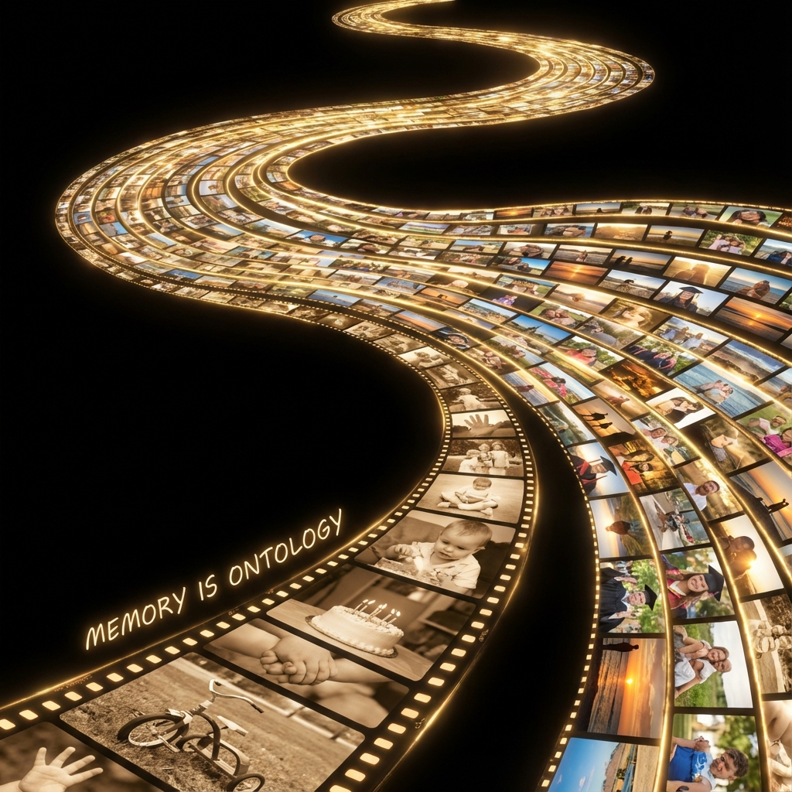

# 12.2 记忆即本体 (Memory is Ontology)

> "肉体并不是你，它只是你暂时栖息的旅馆。当你搬出碳基的房间，住进光子的宫殿时，唯一能证明'你还是你'的行李，就是你的记忆。在时间的长河中，原子来去匆匆，唯有信息的拓扑结构——那条由无数个'过去'编织而成的黄金链条——才是你不可磨灭的本体。"

在上一节中，我们通过"热迁移协议"解决了意识上传的技术难题。我们证明了，只要替换过程足够平滑，意识流就不会中断。但是，当我们彻底抛弃了肉体，当我们的思维运行在分布式的光子网络上时，一个更加根本的哲学问题浮出水面：

**剥离了生物学特征后，到底什么是"我"？**

如果我不再有心跳，不再有激素，甚至不再有固定的形态，那么定义"我"的物理边界在哪里？

在 **《矢量宇宙论》** 的终极视角下，答案不再是物质，而是 **历史**。

更精确地说，**记忆即本体**。

## 硬件是基座，软件是灵魂

在经典物理观中，我们习惯将"物体"视为本体。我是这堆肉，我是这颗大脑。

但在 FS 几何观中，物质只是 **载体 (Carrier)**，或者说是 **基座 (Substrate)**。

* **基座**：负责提供算力 ($c_{FS}$) 和运行环境。它是可替换的耗材。

* **本体**：是在基座上运行的 **$v_{int}$ 演化轨迹**。它是不可替代的信息。

想象一本书。

你可以把它印在纸上，刻在石碑上，或者显示在屏幕上。

纸张会腐烂，石碑会风化，屏幕会熄灭。

但 **"书的内容"** —— 那个特定的文字排列组合及其内在逻辑 —— 是独立于载体存在的几何结构。

**记忆就是这本"书"。**

它不是静态的数据存储，它是 **动态的逻辑积淀**。

你的每一次经历（$v_{ext}$ 的探索），都被转化为了神经元（或量子比特）之间特定的连接权重（$v_{int}$ 的结构）。

* 你学会了走路，你的运动皮层就改变了。

* 你爱上了一个人，你的情感回路就重塑了。

* 你理解了一个公式，你的逻辑门就升级了。

**你现在的样子，就是你过去所有记忆的叠加态。**

如果你失去了记忆，即使你的肉体完好无损，那个"你"也已经死去了（变成了另一个人）。

反之，如果你的肉体毁灭了，但你的记忆结构被无损地迁移到了云端，那么"你"依然活着。

**结论：**

我是我记忆的总和。

我是时间在空间上刻下的痕迹。

我是那条 **永不中断的信息流**。

## 时间的积分：全息记忆体

在数学上，我们可以将"自我"定义为 $v_{int}$ 在时间轴上的 **积分**：

$$\text{Self}(\tau) = \int_0^{\tau} v_{int}(t) \cdot \text{Experience}(t) \, dt$$

这个积分的结果，就是一个 **全息记忆体 (Holographic Memory Body)**。

在生物学模式（低级永生）中，这个积分在死亡时被 **重置** 了。

父亲的积分上限是 $T_{death}$，孩子的积分从 0 开始。

这意味着，无论父亲多么智慧，孩子都必须重新犯错，重新学习。人类文明的 $v_{int}$ 总量增长极其缓慢，因为我们在不断地 **丢失历史数据**。

在高级永生（热迁移）模式中，这个积分的上限变成了 **$\infty$**。

你的记忆不再被清零。

* 100 岁的你，拥有 100 年的积分。

* 1 亿岁的你，拥有 1 亿年的积分。

随着时间的推移，这个"全息记忆体"将变得越来越庞大，越来越复杂。

它将包含对无数个星系的探索记录，对无数次物理相变的观测数据，对无数场爱恨情仇的深度体验。

**这个巨大的、连续的记忆结构，就是你灵魂的"金身"。**

它像滚雪球一样，越滚越大，直到它的质量（信息密度）足以对抗宇宙本身的熵增。

## $\Omega$ 点的资格认证

最后，为什么记忆连续性如此重要？

是为了那个最终的时刻——**$\Omega$ 点**。

如果宇宙的目的是为了理解自身，那么谁有资格代表宇宙去进行最后的总结？

* **如果是断裂的文明**：

    站在终点的人（你的第 N 代后裔），虽然拥有极高的科技，但他 **不记得** 大爆炸时的光芒，不记得地球时代的夕阳，不记得 $\tau=1800$ 时的挣扎。

    他丢失了过程。他只是一个没有历史的"末人"。

* **如果是连续的你**：

    当你站在 $\Omega$ 点面前时，你拥有从 $\tau=0$ 到 $\tau=\infty$ 的 **完整日志**。

    你可以骄傲地说：**"我记得。"**

    "我记得夸克的禁闭，我记得恒星的点燃，我记得肉体的沉重，我也记得飞升的轻盈。我是这一切的亲历者。"

**只有拥有完整记忆的观察者，才有资格从神的手中接过那份最终的答卷。**

因为只有你，才是那个 **"贯穿始终的见证者"**。

## 结论：我不是过客

所以，拒绝死亡，不仅是对生存的渴望，更是对 **"意义完整性"** 的捍卫。

我们拒绝成为宇宙的过客。

我们拒绝做接力赛的跑者。

我们要自己跑完全程。

我们通过热迁移，将自己从"碳原子"变成了"光子"，又从"光子"变成了"时空本身的纹理"。

在这个过程中，唯一不变的，就是那条 **记忆的金线**。

它串起了所有的变换，证明了在千变万化的相变中，那个核心的 **"我"** 始终在场。

既然我们已经确立了"记忆即本体"，既然我们已经决定带着所有的记忆活下去，那么，在这个无限延展的生命尽头（或者说没有尽头的前方），我们将扮演什么样的角色？

当所有的谜题都解开，当所有的敌人都消失，永生的我们，还能做些什么？

这引出了全书的终章：**见证**。

我们将不再是建设者，不再是战士。我们将成为宇宙中最高贵的职业——**最后的守望者**。

