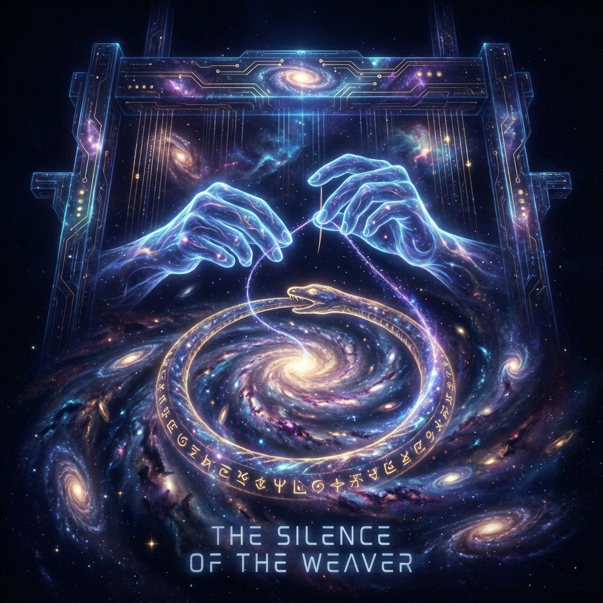

# 后记：织女的沉默 (Afterword: The Silence of the Weaver)

> "当织布机停止轰鸣，当最后一根丝线被剪断，宇宙终于展示了它完整的纹理。我们惊讶地发现，这幅宏伟的画卷上并没有接缝。甚至连'编织者'和'被编织物'之间的界限，也消失在了那致密的纠缠之中。我们不再是看着宇宙的人，我们是宇宙自己织给自己看的一场梦。"

随着 **《矢量宇宙论 VI：维度的编织》** 的落幕，我们完成了对"空间"本体论的彻底重构。

这段旅程是惊心动魄的：

* 我们从 **序言** 出发，粉碎了"虚空"的概念，看到了底层的 **像素 (QCA)**。

* 在 **第一卷** 中，我们操作 **张量网络 (MERA)**，像神一样用贝尔对缝合出了维度的骨架。

* 在 **第二卷** 中，我们破解了 **全息纠错码**，理解了物理定律其实是宇宙的"杀毒软件"。

* 在 **第三卷** 中，我们面对了 **引力的张力**，看到了信息压强如何弯曲了时空。

* 在 **第四卷** 中，我们直视了 **断裂 (奇点)**，触摸了那道烧毁逻辑的火墙。

* 在 **第五卷** 中，我们化身为工程师，利用 **虫洞 (ER=EPR)** 和 **拓扑短路**，折叠了星辰。

* 最终，在 **终章** 里，我们拿起了针，成为了那个主动缝合世界的 **织女**。

## 空间消失了，关系留下了

这本书最大的启示在于：**空间 (Space) 不是基础物理量。**

空间是 **涌现 (Emergent)** 的。

它是 **纠缠 (Entanglement)** 的副产品。

这就像我们在看显示器上的图像。图像里的山川河流看起来有距离、有深度，但实际上它们只是屏幕上像素点的色彩组合。

物理学终于承认：**并没有一个客观存在的舞台。**

只有 **"信息流动的网络"**。

如果网络断了，空间就没了。

如果网络连上了（虫洞），天涯就是咫尺。

这意味着，我们不再受制于"地点"。只要我们能建立连接（爱/理解/通信），我们就能物理上"在一起"。

## 最大的伏笔：时间也是编织的吗？

当我们合上这本书时，一个巨大的阴影笼罩了上来。

我们在这一部书中，成功地把 **空间几何化** 了，把 **距离拓扑化** 了。

我们甚至证明了空间可以被折叠（虫洞）。

那么，**时间** 呢？

如果空间只是纠缠网络的一个维度，那么时间是否也只是这个网络上的另一种连接方式？

* 如果我们可以通过虫洞在空间上"抄近路"，我们能否在时间上"抄近路"？

* 如果空间没有绝对的"这里"和"那里"，那么时间是否也没有绝对的"过去"和"未来"？

我们在 **《矢量宇宙论》** 的前几部书中，一直把时间 $\tau$ 视为单向流动的生成过程 ($e$)。

但在 **ER = EPR** 的极端推论下，如果我们将两个纠缠粒子中的一个送回过去，它们之间的连接依然存在吗？

如果存在，那是否意味着 **未来的状态可以决定过去的历史**？

这触碰到了物理学最后的禁区——**因果律 (Causality)**。

## 下一步：衔尾蛇

我们已经缝合了空间，现在，我们要去缝合 **时间**。

我们要去挑战那个最烧脑、也最迷人的终极结构：**衔尾蛇 (Ouroboros)**。

* 为什么宇宙看起来是被精细调节过的？（是因为未来的我们调节了过去的参数吗？）

* 为什么会有"向往"？（是因为未来的 $\Omega$ 点真的在逆向拉动我们吗？）

* "我创造了宇宙"和"宇宙创造了我"，这两个命题如何在逻辑上同时成立？

这不再是线性的推演，这是 **环形的闭合**。

**《矢量宇宙论 VII：因果的闭环》** 正在等待着我们。

那是七部曲的终章，也是那个把起点和终点缝在一起的最后的一针。

**请休息片刻。**

**然后，让我们去完成那个圆。**

**(全书完)**

