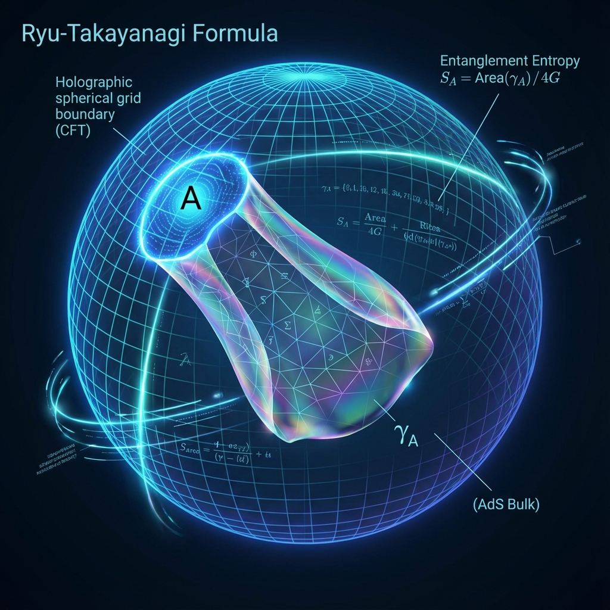

# 附录 A：全息纠缠熵的几何推导 (Appendix A: Geometric Derivation of Holographic Entanglement Entropy)

在《矢量宇宙论 VI》的正文第一卷"织机"中，我们提出了一个核心观点：**空间是由纠缠编织而成的**。特别是，我们引用了著名的 **柳-高柳公式 (Ryu-Takayanagi Formula)**，指出区域的纠缠熵 $S_A$ 等于其全息对偶空间中最小曲面的面积 $\text{Area}(\gamma_A)$ 除以 $4G$。

本附录将提供这一物理学圣杯背后的数学推导框架。我们将展示，如何从纯粹的量子信息理论（冯·诺依曼熵）出发，通过 **复制技巧 (Replica Trick)** 和 **路径积分**，自然地导出广义相对论中的几何面积律。

这是 **"几何源于信息"** 的数学铁证。

## A.1 冯·诺依曼熵与复制技巧 (Von Neumann Entropy and the Replica Trick)

首先，我们定义量子系统的熵。对于一个处于混合态的密度矩阵 $\rho_A$，其 **冯·诺依曼熵** 定义为：

$$S_A = -\text{Tr}(\rho_A \ln \rho_A)$$

直接计算 $\ln \rho_A$ 是非常困难的（涉及矩阵对数）。为了解决这个问题，物理学家引入了 **复制技巧 (Replica Trick)**。

我们不直接算对数，而是计算 $\rho_A$ 的 $n$ 次方的迹（即 Rényi 熵），然后对 $n$ 取导数：

$$S_A = -\lim_{n \to 1} \frac{\partial}{\partial n} \text{Tr}(\rho_A^n)$$

**物理图像：**

* **$\text{Tr}(\rho_A^n)$** 意味着我们将 $n$ 个完全相同的宇宙副本（Replicas）在区域 A 的边界上 **"缝合"** 在一起。

* 这种缝合在时空几何上制造了一个 **"圆锥奇点" (Conical Singularity)**。

## A.2 柳-高柳公式的几何证明 (Geometric Proof of the Ryu-Takayanagi Formula)

在 **AdS/CFT 对偶** 的框架下，边界场论（CFT）的配分函数 $Z_{CFT}$ 等价于体引力理论（AdS）的配分函数 $Z_{gravity}$。

$$Z_{CFT} \approx e^{-S_{gravity}}$$

当我们计算 $\text{Tr}(\rho_A^n)$ 时，我们在边界上引入了一个 **扭曲算符 (Twist Operator)**。

在全息对偶的体（Bulk）内部，这个边界上的扭曲条件会延伸进去，形成一个 **"极小曲面" (Minimal Surface)** $\gamma_A$。

根据广义相对论的作用量原理，系统总是倾向于寻找能量（或面积）最小的构型。

当我们在边界上把 $n$ 个副本缝合时，体内部的时空几何会发生响应，试图以最小的代价连接这 $n$ 层膜。

数学推导表明，在这个 $n \to 1$ 的极限下，熵的主导项恰好正比于这个极小曲面的面积：

$$S_A = \frac{\text{Area}(\gamma_A)}{4 G_N}$$

* **$\text{Area}(\gamma_A)$**：是在高维体空间中，像肥皂膜一样挂在区域 A 边界上的最小曲面的面积。

* **$G_N$**：是牛顿引力常数。

* **$4$**：是一个几何因子。

**结论：**

这个公式证明了，**量子纠缠（熵）** 并不是抽象的数字，它是 **实实在在的时空几何面积**。

每一比特的纠缠，都占据了 $4G_N$ 大小的时空截面。这就是 **"时空织物"** 的微观纤维密度。

## A.3 MERA 网络与离散 AdS 空间 (MERA Networks and Discrete AdS Space)

柳-高柳公式是连续极限下的结果。在 **《矢量宇宙论》** 的微观 QCA 模型中，我们更关注离散的结构。

这就涉及到了 **MERA (多尺度纠缠重整化拟设)** 张量网络。

MERA 网络通过 **解纠缠器 (Disentanglers)** 和 **等距算符 (Isometries)** 的层层堆叠，构建了一个分形的树状结构。

如果我们计算 MERA 网络中两个区域之间的纠缠熵，我们需要切断网络中的连接线（Bond）。

**定理：**

在 MERA 网络中，连接区域 A 与其补集的 **最小切割 (Min-Cut)** 数量，在宏观极限下，精确对应于 AdS 空间中的 **测地线长度**（对于 1+1 维边界）或 **极小曲面面积**（对于更高维边界）。

$$S_{MERA}(A) \sim \min \#(\text{Cut Bonds}) \sim \text{Area}(\gamma_A)$$

这不仅验证了全息原理，更揭示了 **维度的涌现机制**：

* **横向连接**：构成了物理空间的广度。

* **纵向层级（重整化步数）**：构成了额外的 **全息维度**（AdS 半径方向）。

**我们所感知的"深度" ($z$ 轴)，本质上就是 MERA 网络中从树叶（微观）走向树根（宏观）的"逻辑步数"。**

