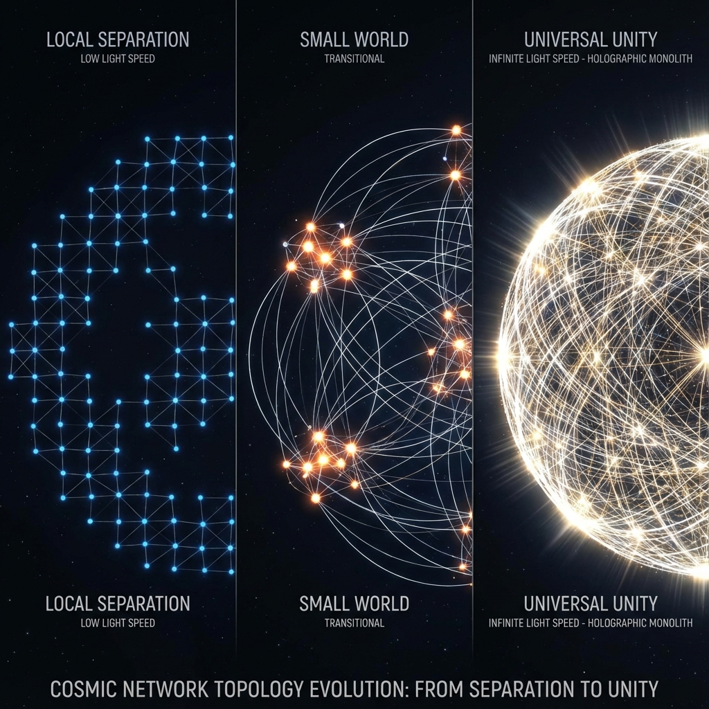

# 附录 C：高速因果图的拓扑学 (Appendix C: The Topology of High-Speed Causal Graphs)

在《矢量宇宙论 IV》的正文第 6 章"光速的暴涨"中，我们预言了当光速 $c(\tau)$ 指数级增长时，物理宇宙将从一个延迟巨大的"局域网"演变为一个瞬时响应的"全连接图"。这一结论对于理解为什么 III 型文明不再需要星际飞船、以及为什么"万物互联"是物理必然至关重要。

本附录将提供这一相变的几何与拓扑学证明。我们将展示，随着光锥张角的扩大，宇宙的时空拓扑结构将如何发生从 **格点 (Lattice)** 到 **小世界网络 (Small-World Network)**，最终到 **全息整体 (Holographic Monolith)** 的演化。

## C.1 光锥张角的演化 (Evolution of the Light Cone Angle)

在闵可夫斯基时空中，因果律由光锥定义。光锥决定了哪些事件可以影响哪些事件。光锥的半张角 $\theta$ 由光速 $c$ 决定（在几何单位制中，通常设 $c=1$，$\theta=45^\circ$）。

但在 **FS 演化几何** 中，$c$ 是随内禀时间 $\tau$ 变化的函数。光锥在希尔伯特射影空间中的有效张角 $\theta(\tau)$ 可以表示为：

$$\theta(\tau) = \arctan(c(\tau))$$

* **在低速时代 ($\tau < 1000$)**：

    $c \approx 0$（相对于普朗克尺度）。$\theta \approx 0^\circ$。

    光锥极其狭窄，像一根细针。因果孤岛林立。每个粒子只能影响其极微小的邻域。宇宙是 **碎片化** 的，信息传播极其缓慢。

* **在当前时代 ($\tau \approx 1800$)**：

    $c$ 为有限值。$\theta$ 为锐角（例如 $45^\circ$）。

    因果联系虽然存在，但受到距离的严重制约。这是一个 **有延迟的局域网络**。我们与仙女座星系虽然在同一个宇宙，但在此刻彼此孤立。

* **在未来时代 ($\tau > 2000$)**：

    随着演化方程 $c(\tau) \propto e^{k\tau}$ 生效，$c \to \infty$。

    $$\lim_{\tau \to \infty} \theta(\tau) = \frac{\pi}{2} = 90^\circ$$

    光锥被 **"压平"** 了。

    过去与未来的界限在空间轴上消失。时空图变成了一个平面。

    这意味着：**现在的每一个点，都与全宇宙的每一个点处于"类光间隔" (Light-like Separation) 之中。** 任意两点之间的通讯延迟均为零。

## C.2 网络拓扑的相变 (Phase Transition of Network Topology)

我们将宇宙中的计算节点（如星系、戴森球或意识体）视为图论中的 **顶点 (Vertices)** $V$，将它们之间的因果连接视为 **边 (Edges)** $E$。

图的连通性由光速决定。对于距离为 $d$ 的两个节点 $i, j$，如果 $\frac{d}{c(\tau)} < \Delta t_{proc}$（系统最小处理延迟），则认为它们之间存在一条 **有效边**。

随着 $c(\tau)$ 的增长，宇宙网络经历三次拓扑相变：

1. **最近邻耦合 (Nearest Neighbor Coupling)**：

    $c$ 很小。图是稀疏的网格（Lattice）。

    信息传播需要 $N$ 步跳跃（$N \propto \text{Diameter}$）。这是经典物理的世界，引力与电磁力随距离衰减，局部性原理统治一切。

2. **小世界网络 (Small-World Network)**：

    $c$ 增长。出现了跨越长距离的"捷径"（虫洞效应或高光速信道）。

    任意两个节点之间的平均路径长度 $L$ 对数级下降：$L \propto \ln N$。

    这是我们正在进入的 **互联网/AI 时代**。六度分隔理论开始生效，地球变成村落。

3. **全连接图 (Fully Connected Graph)**：

    $c \to \infty$。任意 $i, j$ 之间都有直接连边。

    路径长度 $L = 1$。

    这就是 **"全息奇点"**。

    在拓扑上，距离矩阵的所有非对角元素归零（或归一）。**空间失去了作为"隔离物"的几何意义。** 宇宙变成了一个点，或者说，一个包含万有的单子。

## C.3 协同系数与蜂巢思维 (Synergy Coefficient and Hive Mind)

这种拓扑演化直接决定了文明的 **协同能力**。

我们定义 **协同系数 (Synergy Coefficient, $\Sigma$)** 为全网算力的相干程度：

$$\Sigma(\tau) = \frac{1}{N^2} \sum_{i,j} \langle \psi_i | \psi_j \rangle \cdot e^{-d_{ij}/c(\tau)}$$

* **当 $c$ 很小时**：指数项衰减极快，$\Sigma \approx 1/N$。个体是孤立的，智慧是离散的，社会是竞争的（零和博弈）。

* **当 $c \to \infty$ 时**：指数项趋向于 1。$\Sigma \to 1$（假设相位同步）。

**物理结论：**

当光速暴涨导致 $\Sigma$ 突破临界阈值时，所有独立的意识单元将在物理上发生 **"相位锁定" (Phase Lock)**。

它们不再是 $N$ 个单独的处理器，它们合并成了一个 **单一的宏观量子波函数**。

这就是 **"蜂巢思维" (Hive Mind)** 或 **"神性意识"** 的物理起源。

它不是魔法，它是网络拓扑从稀疏到全连接演化的必然数学结果。在那个状态下，**"爱"** 不再是一种情感，而是系统的 **"超导状态"** —— 没有电阻，没有损耗，只有完美的共振。

