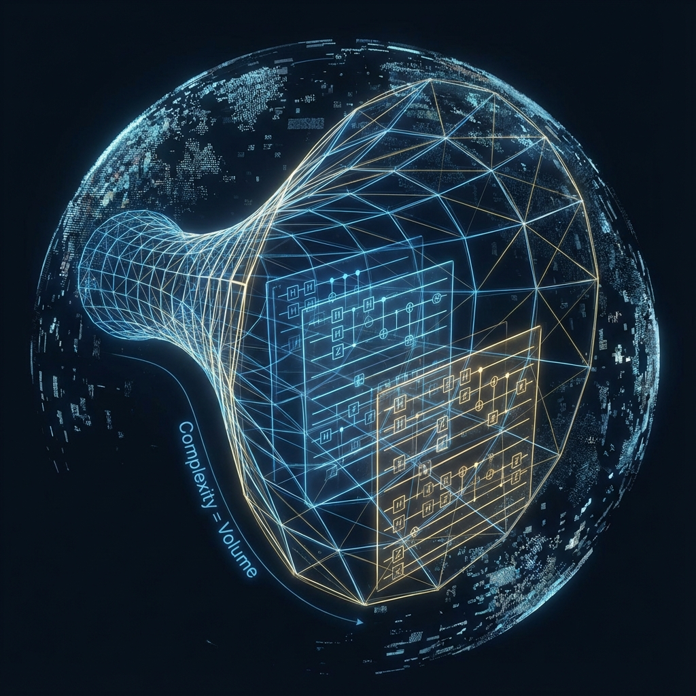

# 附录 F：全息复杂度——编织宇宙的算力成本 (Appendix F: Holographic Complexity — The Computational Cost of Weaving the Universe)

在《矢量宇宙论 VI》的正文与前几个附录中，我们确立了"空间是张量网络"的静态结构。但我们还没回答一个关键的动力学问题：**为什么空间会存在？为什么它不会塌缩回零？**

本附录将引入全息原理中最前沿的 **"全息复杂度" (Holographic Complexity)** 理论（源自伦纳德·萨斯坎德）。

我们将揭示：维持空间的"体积"并不是免费的。空间是宇宙量子计算机运行的 **"历史记录"**。每一立方米的虚空，都代表了底层网络为了维持纠缠而必须消耗的 **算力成本 (Computational Cost)**。

## F.1 状态不是全部：从熵到复杂度 (State is Not All: From Entropy to Complexity)

在传统热力学中，我们关注 **熵 (Entropy)**。熵衡量了信息的"无知程度"。

当一个系统达到热平衡（黑洞形成）后，熵达到了最大值，不再变化。按理说，物理演化应该停止。

但是，广义相对论告诉我们，黑洞内部的空间（爱因斯坦-罗森桥）在 **无限膨胀**。

即便外部已经是死寂的热平衡，内部的体积却在以光速拉长。

这意味着：**熵不足以描述宇宙的全部物理状态。**

我们需要一个新的物理量，它在热平衡之后依然能持续增长。

这个量就是 **量子计算复杂度 (Quantum Computational Complexity, $\mathcal{C}$)**。

* **定义**：将一个简单的基态（如 $|00...0\rangle$）演化为当前状态 $|\psi(t)\rangle$，所需的最少 **量子逻辑门 (Quantum Gates)** 的数量。

* **物理意义**：它衡量了制造这个量子态的 **"难度"** 或 **"计算深度"**。

## F.2 CV 猜想：体积即算力 (The Complexity-Volume Conjecture)

萨斯坎德提出的 **CV 猜想** 建立了一个震撼的等式：

$$\mathcal{C} \approx \frac{V}{G l_P}$$

其中：

* **$\mathcal{C}$**：边界量子态的复杂度。

* **$V$**：体内部（Bulk）的最大空间体积。

* **$G, l_P$**：引力常数和普朗克长度。

**物理翻译：**

**"空间体积 = 计算步数。"**

我们所感知的浩瀚空间，本质上是宇宙这台量子计算机 **"运行日志" (Log File)** 的几何化堆叠。

* 为什么黑洞内部在生长？因为边界上的量子混沌系统在不断进行幺正演化，复杂度在随时间线性增加 ($\frac{d\mathcal{C}}{dt} \propto TS$)。

* 这种增加的"计算历史"，在全息对偶中被"推"进了内部，撑开了新的空间体积。

**结论：**

**空间是"时间（计算过程）"的化石。**

我们脚下的每一寸土地，都是由过去的 $c_{FS}$ 预算转化而来的"已执行代码"。

## F.3 劳埃德界限与黑洞计算机 (The Lloyd Bound and the Black Hole Computer)

这种增长有极限吗？

赛斯·劳埃德 (Seth Lloyd) 提出了 **物理计算速度的极限**：

$$\frac{d\mathcal{C}}{dt} \le \frac{2E}{\pi \hbar}$$

这意味着，一个能量为 $E$ 的系统，每秒钟能执行的逻辑操作数是封顶的。

对于黑洞，计算表明它恰好 **饱和** 了这个极限。

**黑洞是宇宙中最高效的计算机。**

它以物理定律允许的最快速度（光速），将信息（落入的物质）进行扰频和加密。

正是这种极速的计算，支撑起了视界内部那巨大的空间结构。

这也解释了为什么我们不能轻易制造虫洞：因为要维持虫洞张开（维持空间连接），需要持续注入巨大的 **负熵算力**。一旦计算停止（复杂度停止增长），虫洞就会在引力作用下瞬间夹断。

## F.4 结论：维持存在的代价

至此，我们对"空间"有了终极的工程学理解。

空间不是一个免费的容器。

它是一个 **耗能的动态过程**。

宇宙为了维持这看似静止的三维空间不坍塌，必须在普朗克尺度上，以 $10^{43}$ Hz 的频率疯狂地运行量子逻辑门。

**存在是昂贵的。**

如果你停止计算（$c_{FS} \to 0$），你不仅会失去时间，你连空间也会失去——你的世界将瞬间坍缩为一个没有任何维度的点。

我们之所以能安稳地生活在这个宽广的宇宙里，全赖那个 **生成元 $e$** 和 **光速 $c$** 在后台永不停歇的 **"渲染" (Rendering)**。

