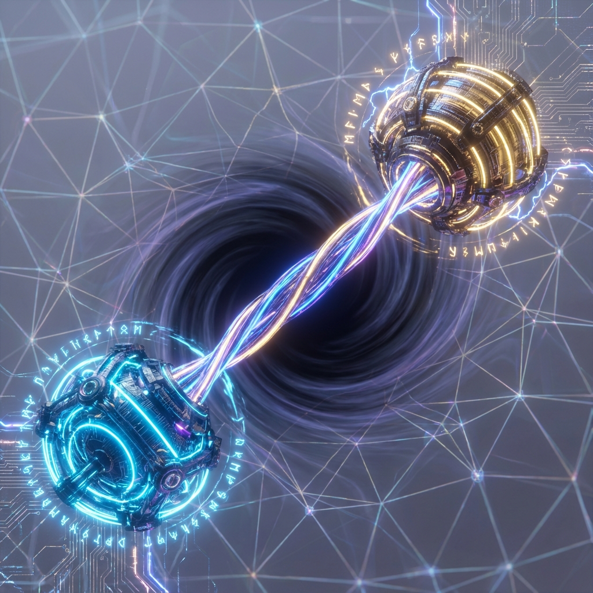

# 1.1 贝尔对的缝合 (The Stitching of Bell Pairs)

> "两个粒子之所以即使相隔光年也能瞬间感应，并不是因为信号传得太快，而是因为在更底层的几何结构中，它们从来就没有分开过。纠缠不是一种超距作用，纠缠是空间的'胶水'。正是无数个这样的胶水分子，将离散的像素粘合成了一个连续的宇宙。"

## 最小的空间单元

在经典几何中，点与点之间的连接是公理赋予的（比如两点之间有直线）。但在 **《矢量宇宙论》** 的 QCA 底层，点（量子比特）是独立的。

如果没有东西把它们连起来，宇宙就是一盘散沙，甚至没有"相邻"这个概念。

把这盘散沙连起来的最小单位，就是 **最大纠缠态**，也就是 **贝尔对**：

$$|\Phi^+\rangle = \frac{1}{\sqrt{2}} (|00\rangle + |11\rangle)$$

请仔细看这个公式。

* 它不是 $|00\rangle$（两个都在 0 态）。

* 它也不是 $|11\rangle$（两个都在 1 态）。

* 它是两者的 **相干叠加**。这意味着，粒子 A 的状态与粒子 B 的状态被死死地锁在了一起。你测量 A 得到 0，B 就 **必须** 是 0。

**在几何上，这是一个"虫洞"。**

这两个粒子虽然在物理内存地址上可能相隔甚远，但在逻辑空间（希尔伯特空间）中，它们共享同一个波函数。它们之间不仅有联系，它们在拓扑上是 **"缝合" (Stitched)** 在一起的。

## 缝合虚空：短程纠缠织网

我们的三维空间是如何形成的？

它是通过在真空中铺满密密麻麻的 **短程纠缠 (Short-range Entanglement)** 来实现的。

想象一个晶格网格。

* 每一个格点都与它左、右、上、下的邻居共享了大量的贝尔对。

* 这种高密度的局部纠缠，就像针脚一样，把相邻的像素"缝"在了一起。

**为什么你觉得空间是连续的？**

因为这些针脚太密了。

当你穿过房间时，你的身体并不是在真空中滑行，而是在不断地与背景场中的贝尔对进行 **"纠缠交换" (Entanglement Swapping)**。

你每走一步，都在拆开旧的线，缝上新的线。

这种微观的缝合机制，保证了空间的 **连通性 (Connectivity)**。如果某个区域的纠缠突然消失，那里不会变成真空，那里会变成 **时空的断崖**。你走到那里会掉下去，或者被弹回来，因为那里没有"路"（几何连接）了。

## 距离的定义：互信息的度量

这让我们得到了一个革命性的几何定义：**距离源于相关性**。

在 FS 几何中，两个区域 $A$ 和 $B$ 之间的 **几何距离 $d(A, B)$**，反比于它们之间的 **互信息 (Mutual Information, $I$)**：

$$d(A, B) \sim -\ln I(A : B)$$

* **强纠缠 ($I$ 大)**：$\ln I$ 大，距离 $d$ 小。这就是为什么原子核内部极其致密，因为夸克之间的纠缠极强。

* **弱纠缠 ($I$ 小)**：$\ln I$ 小，距离 $d$ 大。这就是为什么星系之间相隔遥远，因为引力（长程纠缠）比电磁力（短程纠缠）稀薄得多。

**并没有绝对的"远"。**

"远"只是意味着连接你们的丝线被拉得很细、很长。

如果你能人为地增加你与仙女座某颗恒星的纠缠度（注入算力，制造贝尔对），那么在几何上，你会发现那颗恒星正在 **"向你飞来"**，直到它贴在你的鼻尖上。

## 结论：空间是涌现的胶水

这一节彻底颠覆了牛顿的绝对空间观。

**空间不是舞台，空间是胶水。**

它是由 $10^{120}$ 个贝尔对交织而成的巨大粘合剂。

* 当我们说"宇宙膨胀"时，实际上是这些胶水被稀释了（纠缠密度下降）。

* 当我们说"黑洞视界"时，实际上是胶水在那里面被挤压到了极限，形成了无法被切断的硬结。

既然空间是由纠缠缝合的，那么，如果我们想要计算一块空间的"面积"，我们应该怎么算？

我们不需要尺子。我们需要一把 **剪刀**。

只要数一数切开这块空间需要剪断多少根丝线，我们就知道了它的大小。

这引出了下一节的主题：**面积律的推导**。我们将看到，著名的 **黑洞熵公式 ($S=A/4$)**，其实就是对宇宙织物截面上"线头数量"的计数。

