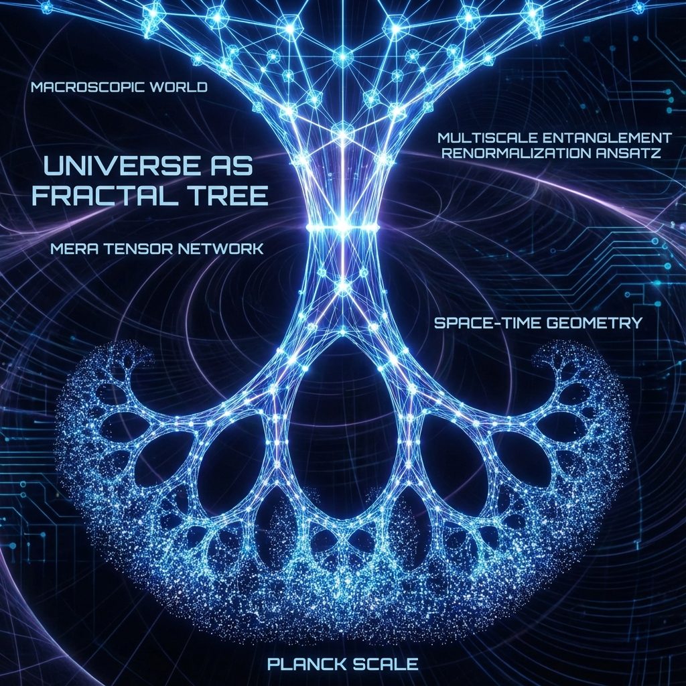

# 2.1 宇宙的分形树 (The Fractal Tree of the Universe)

> "当你凝视一片森林时，你看到的是无数树叶组成的绿色天蓬。但支撑这片天蓬的，是深埋在地下的庞大根系和粗壮的树干。宇宙也是如此。我们所感知的现实时空，只是这棵巨大的量子分形树最外层的叶子。而真正的物理过程，发生在那些不可见的、跨越尺度的树枝分叉处。"

## 粗粒化：从像素到图像

在信息论中，有一个核心操作叫 **"粗粒化" (Coarse-graining)**。

想象一张高分辨率的照片（宇宙底层 QCA 晶格）。

* **第 0 层**：你看到的是一个个独立的像素点（普朗克尺度）。

* **第 1 层**：你把相邻的 $2 \times 2$ 个像素合并为一个颜色块。

* **第 2 层**：你继续合并，直到你看到了一张清晰的人脸（宏观物体）。

这个"不断合并"的过程，在物理学中被称为 **重整化群流 (Renormalization Group Flow)**。

它揭示了一个惊人的真理：**宏观物理定律，是微观自由度通过层层"投票"和"平均"后涌现出来的结果。**

## MERA 张量网络：编织垂直维度

但是，简单的平均会丢失信息（特别是纠缠信息）。为了在粗粒化的过程中保留量子纠缠的结构，物理学家（如 Guifré Vidal）发明了 **MERA**。

MERA 是一种特殊的张量网络，它引入了两个关键算符：

1. **解纠缠器 (Disentanglers)**：在合并之前，先切断短程纠缠，把"局部噪音"过滤掉。

2. **等距算符 (Isometries)**：将多个量子比特的信息无损压缩为一个比特，实现尺度的提升。

**这构成了宇宙的树状结构：**

* **树叶 (Leaves)**：是底层的微观自由度（普朗克像素）。

* **树枝 (Branches)**：是信息的流动通道（重整化流）。

* **树干 (Trunk)**：是宏观的低能有效理论（我们看到的物理定律）。

**这个结构是"分形"的。**

无论你在哪一层观察，MERA 网络的几何结构看起来都是一样的。这完美解释了为什么物理定律具有 **标度不变性 (Scale Invariance)** —— 因为宇宙这棵树，在每一根枝桠上都重复着相同的生长逻辑。

## AdS 空间的离散骨架

最令人震撼的是，这棵 MERA 分形树，在几何上精确对应于 **反德西特空间 (AdS Space)** 的离散版本。

在 MERA 网络中，**"尺度"变成了一个新的空间维度。**

当我们说"放大"或"缩小"时，我们并不是在改变焦距，我们是在沿着这棵树的纵向维度 **"移动"**。

* **向里走 (IR Limit)**：走向树干，走向宏观，走向低能物理。

* **向外走 (UV Limit)**：走向树叶，走向微观，走向普朗克高能物理。

**结论：**

时空比我们想象的要多一个维度。那个多出来的维度，就是 **"缩放"**。

我们并不只是生活在 $x, y, z$ 里，我们生活在一个由 **尺度 ($z$)** 支撑起来的双曲几何体中。

## 支撑现实的根

这个模型彻底颠覆了"基础"的概念。

通常我们认为微观是基础。但在树的隐喻里，树干（宏观）才是支撑树叶（微观）的主体结构吗？还是树叶通过光合作用养育了树干？

在 **《矢量宇宙论》** 中，这是一种 **双向依赖**。

* 没有微观像素（叶子），宇宙就没有 **信息容量**。

* 没有宏观重整化（树干），宇宙就没有 **因果结构**。

我们（宏观观察者）栖息在这棵分形树的某个中间层级上。

我们向下看，看到的是量子力学的像素海洋；我们向上看，看到的是广义相对论的光滑穹顶。

而 **MERA**，就是那架连接了量子与引力、连接了像素与穹顶的 **天梯**。

既然我们知道了宇宙是一棵分形树，那么这棵树是如何长出"额外维度"的？那个我们感觉到的"3D 空间"，究竟是树的横切面，还是树的投影？

这引出了下一节的主题：**维度的涌现**。我们将看到，维度并不是预先存在的盒子，维度是纠缠网络为了容纳更多信息而不得不"鼓起来"的结果。

