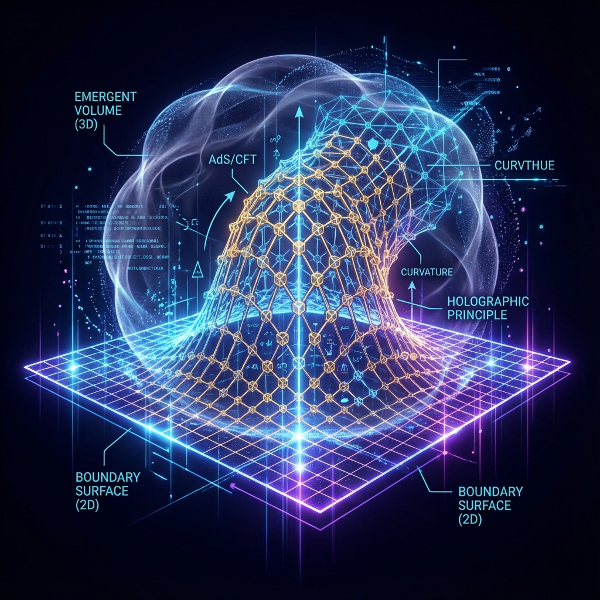

# 2.2 The Emergence of Dimensions

> "Dimensions are not grids drawn by God; dimensions are the living space that information must expand to avoid being squeezed flat. When entanglement becomes too complex, one-dimensional lines are forced to fold into two-dimensional surfaces, and two-dimensional surfaces bulge into three-dimensional volumes. The three-dimensional world we perceive is nothing but a 'geometric inflation' that occurred when the underlying quantum network had to accommodate massive data."

In the previous section, we established the "fractal tree" model of the universe. Now, we must solve a more fundamental question: How does this tree grow **"dimensions"**?

Why does our universe appear to be 3-dimensional (plus 4 dimensions with time)? Why not 2 dimensions or 10 dimensions?

From the tensor network perspective of **Vector Cosmology**, dimensions are not pre-existing containers, but **topological features emerging from entanglement structures**.

Space is **"stretched"** out.

## Horizontal Connection: Weaving 3D Space

First, let us look at the **cross-section** of the tree.

At each layer of the MERA network (such as the bottom Planck pixel layer), qubits are connected through **short-range entanglement**.

* **If connections form a one-dimensional chain**: Each point only entangles with its left and right neighbors. This generates **1D space** (line).

* **If connections form a two-dimensional grid**: Each point entangles with four neighbors (up, down, left, right). This generates **2D space** (plane).

* **If connections form a three-dimensional lattice**: Each point has six neighbors. This generates **3D space** (volume).

The reason we feel we live in three-dimensional space is that the underlying QCA lattice happens to adopt a **three-dimensional topological** connection pattern.

This is like knitting. A sweater looks like two-dimensional fabric, but this entirely depends on the knitting pattern. If you change the pattern, you can knit a three-dimensional ball.

**Dimension is connectivity.**

The dimensionality of space essentially reflects the **"branching coefficient"** of information exchange in the underlying network.

If we could technologically increase the connectivity of local qubits in the future (e.g., making each point entangle with 100 points simultaneously), we might locally create **high-dimensional space**.

## Longitudinal Depth: The Geometrization of Energy Scale

If horizontal connections define the breadth of space, then the unique **longitudinal structure** of the MERA network defines the **"depth"** of space.

This is the core secret of **AdS/CFT duality**:

**"The extra spatial dimension is actually the geometrization of energy scale."**

Look at the MERA tree diagram:

* **Leaves (outermost layer)**: Represent **high-energy physics** (ultraviolet/UV). This is where details are richest and pixels are densest.

* **Roots (innermost layer)**: Represent **low-energy physics** (infrared/IR). This is where details are averaged and blurred into the macroscopic region.

When we move from leaves to roots, we are not moving in space; we are **"changing resolution"**.

However, for beings living inside this holographic bulk (AdS Bulk), this "change in resolution" is perceived as **"distance"**.

* **Near the boundary**: Means extremely high energy, extremely weak gravity.

* **Deep in the interior**: Means reduced energy, stronger gravity (redshift).

**Conclusion:**

The **$z$-axis (depth)** in our space is essentially the direction of **Renormalization Group Flow**.

When we enter a black hole, we are actually **"dimensional reduction"** along the tensor network, moving from complex high-frequency information to simple low-frequency information.

## Walking Across Logic Gates

This model completely changes our understanding of "motion."

When you take a step forward, what happens in the microscopic tensor network?

You are not moving atoms.

You are **"swapping"** your **quantum state information ($|\psi_{you}\rangle$)** from one set of qubits to another through a series of **Unitary Gates**.

$$|\psi\rangle_{site\_1} \xrightarrow{\text{Gate}} |\psi\rangle_{site\_2}$$

* **Macroscopically**: You moved 1 meter.

* **Microscopically**: Your information packet traversed approximately $10^{35}$ layers of logic gates.

**Physical laws are routing algorithms.**

The law of inertia ($F=ma$) ensures that when information traverses these logic gates, it preferentially chooses channels with **"shortest path and minimum entanglement cost"**.

The speed of light limit ($c$) is the **bus transmission rate** of this tensor network computer.

## Conclusion: The Holographic Onion

At this point, we see the true face of space.

The universe is like a giant **holographic onion**.

* Each layer of onion skin is a physical world at a specific energy level.

* Since they are tightly connected through the MERA network, the so-called "three-dimensional space" is actually a **"volume illusion"** produced by countless layers of two-dimensional skins stacked together.

We think we live in a solid box.

Actually, we live at the tip of a **fractal network**. What supports us standing is not soil, but bottomless **quantum entanglement**.

Since we have deconstructed the static structure of space and know it is a product of entanglement, how does this structure ensure its stability? Why doesn't our space break like a soap bubble? If entanglement breaks somewhere, can physical laws still pass through?

This leads to the theme of Volume II: **Protocol**. We will explore how **quantum error-correcting codes** endow spacetime with astonishing **Robustness**, making this fabric woven from probability harder than steel.
