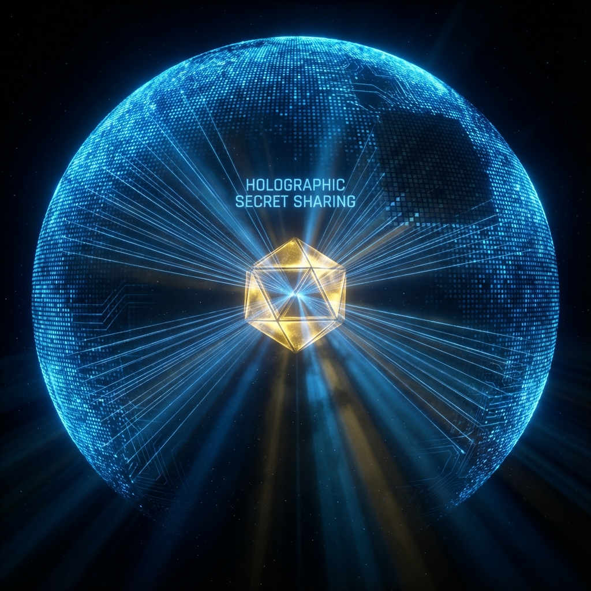

# 3.1 The Necessity of Redundancy

> "If you want to tell a secret to the wind, but fear the wind will scatter it, what should you do? You cannot write it on a piece of paper. You must break it apart, split every word into countless fragments again, and then 'smear' these fragments across the entire sky. Only in this way, even if a storm tears apart half the sky, the remaining clouds can still piece together that complete secret."

## Fragile Quantum and Solid Reality

Quantum information is extremely fragile.

An isolated qubit (such as a thought of yours, or the spin $v_{int}$ of an electron), as long as it is slightly perturbed by the environment $v_{env}$, will undergo phase flip, and information is instantly lost.

If the universe were directly stored on these fragile bits, the macroscopic world would be a nightmare.

* You walk on the street, and suddenly the space under your feet "goes bad," and you fall into nothingness.

* The sun's gravitational field suddenly fails because a few entanglement threads break, and Earth flies away.

But this does not happen. The real world is hard as a rock.

This shows that the universe adopts a **"Redundancy Encoding"** strategy at the bottom layer.

**It never stores important information at a single physical location.**

## Holographic Smearing: The Secret of AdS/CFT

In **AdS/CFT duality** (the concrete realization of the holographic principle), physicists discovered a shocking encoding mechanism:

* **Bulk**: The **high-dimensional interior spacetime** we live in. A particle here (e.g., an electron at the center).

* **Boundary**: The **low-dimensional holographic screen** wrapping the universe.

Mathematical calculations show that the information of that electron in the bulk is not mapped to a single point on the boundary.

It is **"Smeared"** across the entire boundary.

$$|\psi_{bulk}(r)\rangle \longleftrightarrow \int_{\text{Boundary}} K(r, x) \cdot \mathcal{O}(x) \, dx$$

This means that **every pixel** on the boundary contains a little bit of information about that electron in the interior.

This is like a **holographic photograph**.

* If you cut away half of the holographic negative, you won't see "half a person."

* You still see a "complete person," just with slightly reduced resolution.

## Secret Sharing Scheme

In computer science, this is called **"Secret Sharing"** or **"Error-Correcting Codes"**.

The universe breaks down the $v_{int}$ information of every physical entity (your body, Earth, the Milky Way) into billions of pieces, redundantly backed up in every corner of spacetime.

**Why do this? For survival.**

In that bottom world full of quantum fluctuations and microscopic birth and death, errors are inevitable.

* A Planck grid point fails.

* An entanglement thread is cut by a high-energy particle.

But this doesn't matter. Because the **"Logical Qubit"** of information is not stored at that failed physical point; it is stored in the **global entanglement pattern**.

As long as even a small part of the data on the boundary remains intact, the universe's **decoding algorithm** can use the error-correcting capability of error-correcting codes to instantly **reconstruct** that damaged spacetime region in the interior.

## Conclusion: Physical Laws are Checksums

This perspective allows us to reunderstand **physical laws**.

Why is energy conserved? Why is momentum conserved?

In error-correcting code theory, these conservation laws correspond to **Stabilizer Operators**.

They are the **"background antivirus software"** constantly running in the cosmic system.

* **If a process violates energy conservation**: This means an "error code" has appeared.

* **System response**: Error correction mechanism activates, forcibly "pressing" this error back by adjusting the surrounding entanglement network (generating restoring force), or isolating it (quantum decoherence).

**Spacetime exists because it can correct errors.**

If we lived in a universe without error-correcting codes, we would have vanished with the first quantum fluctuation.

The solid ground beneath our feet is actually a safety net paved by countless layers of **checking algorithms**.

Since we know that spacetime is code, redundant backup, what is the "dictionary" of this code? How do we derive the gravity and curvature of the internal 3D space by reading the 2D code on the boundary?

This leads to the theme of the next section: **The AdS/CFT Dictionary**. We will see that gravity is not a force; gravity is the **complexity** of code.

