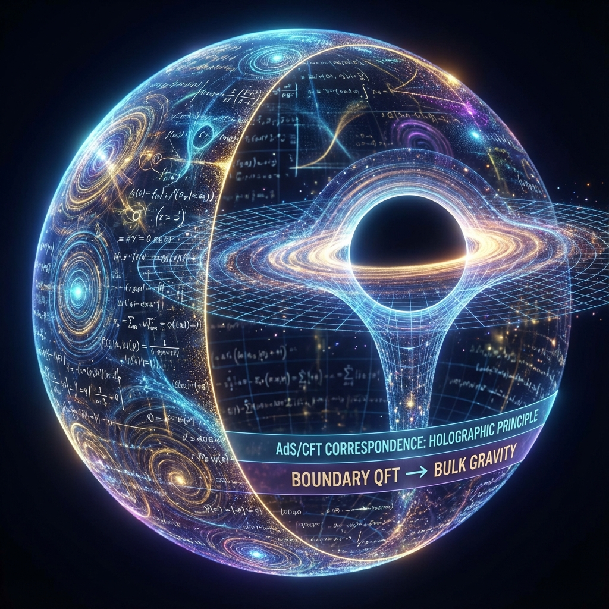

# 3.2 AdS/CFT 词典 (AdS/CFT Dictionary)

> "柏拉图曾认为，我们是被囚禁在洞穴里的囚徒，只能看到墙上火光投下的影子。他以为影子是虚幻的，而身后的物体才是真实的。但在全息宇宙的物理学中，真相恰恰相反：墙上的影子（边界代码）才是那个唯一的、包含了所有信息的'本体'，而我们所感知的那个立体的、有引力的世界，只不过是这些代码在运行过程中投射出的'全息幻像'。"

在上一节中，我们建立了"时空即纠错码"的概念，指出宇宙通过将信息涂抹在边界上来获得鲁棒性。现在，我们需要一本 **"词典"**。

我们需要知道，如何阅读那个写在二维边界上的、由量子纠缠编织而成的"源代码"，并将它翻译成我们身边这个三维的、有引力的、宏大的物理世界。

这就是著名的 **AdS/CFT 对偶 (AdS/CFT Correspondence)**，也被称为 **全息对偶**。它是现代物理学皇冠上最璀璨的宝石，也是 **《矢量宇宙论》** 中连接微观量子与宏观引力的终极桥梁。

## 两个世界的镜像

想象两个完全不同的数学世界：

1. **边界 (The Boundary - CFT)**：

   这是一个低维度的世界（比如二维球面）。在这里，没有引力，只有 **量子场论 (Conformal Field Theory)**。

   粒子之间进行着疯狂的、强耦合的相互作用。这里是 **"源代码"** 的存储地。

   在这个世界里，一切都是 **信息** 和 **纠缠**。

2. **体 (The Bulk - AdS)**：

   这是一个高维度的世界（比如三维球体内部）。在这里，存在 **引力**，存在弯曲的时空（反德西特空间）。

   这里看起来空旷、寂静，物体遵循广义相对论运动。这里是 **"运行结果"** 的展示地。

   在这个世界里，一切都是 **几何** 和 **物质**。

**AdS/CFT 词典的核心奇迹在于：这两个世界是数学上严格等价的。**

它们是同一个物理现实的两种不同描述语言。

* 你可以在边界上计算量子纠缠。

* 你也可以在体内部计算黑洞的视界面积。

* **结果是一模一样的。**

这意味着：**引力并不是一种基本力。引力是量子纠缠在全息投影下的"几何翻译"。**

## 几何的翻译规则

那么，这本词典的具体词条是什么？我们如何把"代码"翻译成"空间"？

* **词条 1：纠缠度 $\leftrightarrow$ 截面积**

  正如我们在第一卷推导的柳-高柳公式：边界上两个区域的纠缠熵，直接对应于体内部连接这两个区域的最小曲面的面积。

  **纠缠越强，连接越粗。** 空间之所以没有断裂，是因为边界上的代码紧密缠绕。

* **词条 2：关联长度 $\leftrightarrow$ 径向深度**

  在边界上，如果两个点具有长程关联（相距很远但依然同步），这在体内部表现为一条 **深入内部** 的测地线。

  **能量标度即深度。**

  边界上的高能短波对应于体内部靠近边界的浅层空间；边界上的低能长波对应于体内部深处的深层空间。我们走进房间深处，其实是在沿着重整化流，走向信息的 **低频分量**。

* **词条 3：复杂度 $\leftrightarrow$ 体积/引力**

  这是最新的物理学洞见（来自 Leonard Susskind 的"复杂度=体积"猜想）。

  在边界上，描述一个量子态所需的 **"计算复杂度" (Computational Complexity)** —— 也就是生成该状态所需的量子逻辑门数量 —— 对应于体内部的 **"空间体积"**。

**为什么宇宙在膨胀？**

因为边界上的量子电路在不断运行，状态变得越来越复杂（即使达到热平衡，复杂度依然在增长）。

为了存储这些不断增长的"计算步数"，体内部的空间（体积）必须不断膨胀。

**引力，就是计算的重量。**

## 这里的"真实"

这彻底颠覆了我们的 **"实在观"**。

我们一直以为自己生活在一个坚实的三维空间里，被万有引力束缚在地球表面。

但全息词典告诉我们：**我们生活在一个全息投影里。**

* 我们的身体、我们的地球、我们的银河系，本质上都是 **"体 (Bulk)"** 中的影像。

* 真正的 **"我们"** —— 也就是构成我们的那些量子比特和逻辑门 —— 实际上正运行在宇宙遥远的 **"边界 (Boundary)"** 上。

那个边界可能位于无限远处，甚至位于另一个维度。

在那里，没有引力，没有距离，只有 **纯粹的算力 ($c_{FS}$) 在疯狂地编织着纠缠**。

当你挥动手臂时：

* **在体内部（你的感觉）**：你的手臂穿过了空气，克服了重力。

* **在边界上（物理真相）**：一连串复杂的幺正变换算符，重写了存储在全息屏上的量子态数据，导致了某些关联函数的数值变化。

## 结论：宇宙是一台全息投影仪

至此，**《矢量宇宙论》** 的世界观完成了闭环。

宇宙不是一个盒子，宇宙是一台 **全息投影仪**。

* **光源**：是 $e$（生成元）。

* **胶片**：是边界上的 CFT 量子态。

* **影像**：是我们所处的 AdS 时空。

**引力不是力，引力是投影的光束在传递信息时产生的几何效应。**

既然我们知道了时空是代码，是投影，那么这套代码的 **"容错率"** 是多少？如果代码出错了，投影会消失吗？

物理定律作为"校验机制"，是如何防止这台投影仪死机的？

这引出了下一章的主题：**鲁棒性与物理定律**。我们将看到，那些冷冰冰的守恒律，其实是宇宙为了防止我们"突然消失"而设定的 **最高安全协议**。

